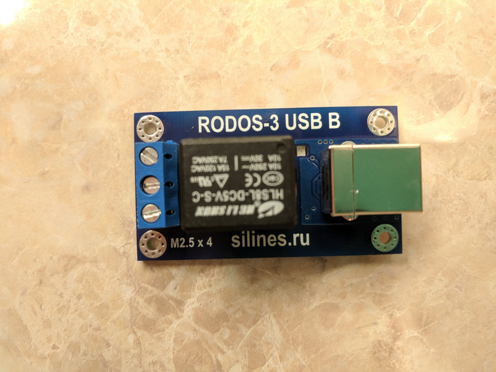

### USB-реле для управления нагрузкой по 220v

Для автоматического запуска тестов на устройствах (от обычного систменого блока
до отладочных плат) нужно было устройство для автоматической перезагрузки SUT.
Про устройства типа PDU (Power Distribution Unit) я в курсе, но нужно то же
самое для настольного применения.

После некоторых поисков остались такие варианты:

- JTAG-кабель (например [JTAG Olimex](https://www.olimex.com/Products/ARM/JTAG/_resources/ARM-USB-TINY_and_TINY_H_manual.pdf))
имеет возможность послать сигнал перезагрузки. Из минусов: кабель может быть
дорогой и не все устройства имеют JTAG разъем. [Больше информации](http://openocd.org/doc/html/Reset-Configuration.html).
- "Пилот" с управлением по USB ([Defender DFS-701](https://www.ixbt.com/peripheral/defender-dfs-701.shtml)), похоже что
не продается 
- EG-PMS2-LAN, управление питанием по сети, не продается https://energenie.com/item.aspx?id=7416
([купить](https://www.oldi.ru/catalog/element/0493144/))
- реле для управления питанием:
  - `USB` готовое реле: [RODOS-3b](https://silines.ru/rodos-3b), [MP709 - USB РЕЛЕ](http://olimp-z.ru/mp709), [USB - РЕЛЕ 1.0](http://dvrobot.ru/238/256/1114.html), [MP515](https://masterkit.ru/shop/1931906), [USB-реле](https://robot-electronics.co.uk/products/relay-modules/usb-relay.html)
  - `USB` [firmware](https://github.com/u1f35c/usb-relay-firmware), [купить реле](https://www.ebay.com/itm/USB-Control-Relay-Board-PC-Smart-Controller-USB-Control-220V-Switch-Module/271963524875?hash=item3f524a0f0b:g:awUAAOSw9N1V1u6b:rk:1:pf:0)
  - `USB` собрать самому на базе ATTiny [схема](https://the.earth.li/gitweb/?p=energenie-attiny.git;a=blob;f=README.md;h=504c322e0368458cdc189792dc1b918bff57a134;hb=a1b18b29238c880ecefb578a460bcdb81aa5433c)
  - `Ethernet` [Ethernet-реле](https://robot-electronics.co.uk/products/relay-modules/ethernet-relay.html)
  - `Ethernet` [DIN Relay IV](https://dlidirect.com/products/din-relay-iv)
- управление питанием маломощных устройств, которые могут получать питание по
USB, с помощью [uhubctl](https://github.com/mvp/uhubctl). Минусы: USB максимум
5V может отдать, у нас бывает больше 5V.
- серия устройств
[NetPing](http://www.netping.ru/products/upravljaemye-rozetki-ip-pdu). Минусы:
дорого и наличие сети усложняет инфраструктуру.

### Инструкция

Я остановился на [RODOS-3b](https://silines.ru/rodos-3b). Для сборки купил
[корпус](https://www.chipdip.ru/catalog-show/plastic-cases?page=4), вилку и
[розетку](https://www.chipdip.ru/product/sq1806-0031) 2П+З 16А 250В на кабель,
кусок провода [ШВВП 2.0 x 5](https://www.chipdip.ru/product/shvvp-2x0.5). После
сборки получился удлинитель с реле. Провод к реле подключал в разъёмы `N.O` и
`COM` (см. [инструкцию](https://silines.ru/documentation/RODOS/RODOS-3.pdf)),
чтобы большую часть времени реле было разомкнуто. В идеале хотелось бы встроить
реле в розетку, наподобие
[такой](https://www.ozon.ru/context/detail/id/32503720/), но нет гарантии, что
места внутри под реле хватит.



Подключаем устройство по USB и проверяем, что оно появилось в системе:
```
$ lsusb 
...
Bus 001 Device 017: ID 20a0:4173 Clay Logic 
...
$
```

Выполняем поиск устройства с помощью управляющей программы:
```
$ sudo ./RODOS3
Поиск устройств...
RODOS-3 ID: 7621
Найдено RODOS-3: 1
$
```

По умолчанию, для доступа к USB устройству нужны права суперпользователя. Чтобы
избежать этого нужно создать файл с правилом для udev:
```
$ cat /etc/udev/rules.d/60-rodos3.rules
SUBSYSTEM=="usb", ATTRS{idVendor}=="20a0", ATTRS{idProduct}=="4173", MODE="0666"
```

Перезагрузить правила:
```
$ udevadm control --reload-rules
```

И физически переподключить устройство. После этого можно управлять устройством
под обычным пользователем.

По умолчанию программа от производителя может делать только `ON` и `OFF` для
устройства. Поэтому в моей версии есть небольшой патч, который добавляет опцию
`--reset`.

На плате iMX.6 при перезагрузке с помощью кабеля питания не происходит правильной
реинициализации сетевой карты, U-boot пишет: `No ethernet found.`.
Чтобы этого избежать можно добавить в `bootcmd` команду `reset`:
```
=> printenv
...
bootcmd=tftp Komset/kos-image; bootelf 0x12000000; reset
...
=> setenv bootcmd 'tftp Komset/kos-image; bootelf 0x12000000; reset'
=> saveenv
```

### Описание инфраструктуры для тестирования на отладочных платах:

- https://elinux.org/images/b/b5/Herd_Your_Boards.pdf
- https://elinux.org/images/0/09/Building_a_Bards_Farm.pdf
