ВИДЕТЬ В ДЕРЕВЬЯХ ДОСКИ,
В ГОРНЫХ КРУЧАХ ДОРОГИ,
В ЛУЧШЕМ ВОЗРАСТЕ – ВОЗРАСТЕ СИЛЫ –
ТКАТЬ ЖЕЛЕЗО, И КАМНИ МЕСИТЬ,
И УКРАШАТЬ ЗЕМЛЮ ЧЕЛОВЕЧЕСКОЙ КРАСОТОЮ –
РАБОТАТЬ!

ПОЛЬ ЭЛЮАР

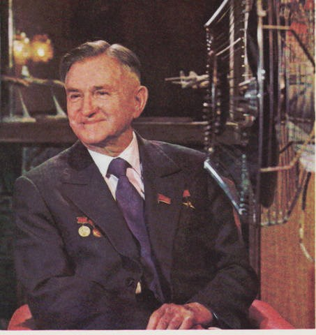

### ОТ МОДЕЛИ К САМОЛЁТУ

1919

В годы гражданской войны, когда молодая Республика Советов яростно отбивалась
от наседавших на неё со всех сторон империалистов и контрреволюционеров всех
мастей, наша авиация состояла почти исключительно из старых самолётов,
купленных еще царским правительством у иностранных фирм.

Красные военные летчики летали на «Фарманах», «Вуазенах», «Ньюпорах»,
«Моран-Парасолях», «Сопвичах» и других еле живых самолетах, которые они,
ежедневно рискуя жизнью не только в боях с врагом, но и просто во время полета,
выразительно называли «гробами».

Действительно, эти самолёты летали просто чудом. Десятки раз битые, наспех
залатанные, с ненадежными двигателями, они часто служили причиной аварий и
катастроф.

И всё-таки красные лётчики летали на них на разведку, вступали в воздушные бои
с противником, обладавшим более совершенной техникой, и одерживали победы
благодаря мужеству и мастерству, беззаветной преданности идеям революции.

Я и мои друзья, двенадцати-тринадцатилетние ребята пробирались на аэродром и с
замиранием сердца разглядывали удивительные машины. Скоро мы перезнакомились с
лётчиками и механиками и собрали рядом на свалке много частей самолётов и их
деталей.

Мы строили небольшие модели самолетов «собственной конструкции», выпускали даже
рукописный журнал.

Лётчики между боевыми вылетами просматривали «журнал», давали советы,
поддерживали в нас желание, когда станем взрослыми, работать над укреплением
советской авиации, строить, создавать.

Как-то раз один из лётчиков эскадрильи отправлялся на стареньком «Фармане-30» в
опасный и трудный полёт. Нужно было по заданию командования перелететь выступ
фронта, доставить важное сообщение.

Вместо бензина самолёт был заправлен смесью различных горючих.
Видавший виды мотор «Сальмсон», давно уже не дававший полагавшихся ему 160
лошадиных сил, долго чихал и не заводился.

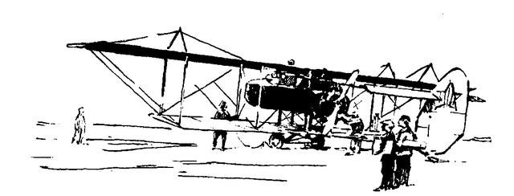

Наконец после нескольких хлопков он затрясся, загудел, самолёт покатился по
траве, подпрыгивая на кочках, тяжело оторвался и, медленно набирая высоту,
развернулся на юго-запад. Самолёт уходит всё дальше и дальше, а товарищи, сняв
пилотки, стоят неподвижно и всё смотрят и смотрят ему вслед. Вот он уже еле
виден. Только маленькая точка в небе над широкой степью. А товарищи всё не
расходятся. Выдержит ли самолёт? Не сдаст ли мотор? Долетит ли?

Мы возвращаемся домой молча. В нас зреет желание строить надёжные быстрокрылые
самолёты. И мы с друзьями – Колей и Мишей – принимаемся за новую модель.

### БОЛЬШАЯ ДВЕРЬ И МАЛЕНЬКИЙ ПРОСЧЁТ

1924

Было лето 1924 года.
В небольшом зале Саратовского индустриального техникума мы заканчивали
постройку планёра для предстоящих в Крыму Вторых всесоюзных планёрных
испытаний.

Времени оставалось мало. Испытания были назначены на 1 августа, потом
перенесены на 15-е, а у нас ещё не всё было готово. Немногочисленная компания
молодых ребят развивала бешеные темпы. Спешно обтягивали крылья бязью,
налаживали управление, устанавливали колёсное шасси.

Отъезд был назначен на 12 августа. С недоделками решили расправиться в дороге.
Двенадцатого в 6 часов вечера к воротам подъехала прозаическая, запряженная
пегой кобылой подвода. Поезд отходил в восемь. Мы отчаянно торопились:
укладывали инструмент и кое-какие материалы, разбирали для перевозки планёр.
Наконец, взявшись вшестером за фюзеляж с центропланом, потащили его к выходу.

Из зала в коридор вышли благополучно, Пронесли наше сооружение по коридору,
завернули к входным дверям, опрокинули набок и… о ужас! Размах центроплана был
больше высоты двери. Бросились отворять вторую створку. С замиранием сердца
наклонили фюзеляж, чтобы пройти с центропланом по диагонали – не идёт! Не
хватало каких-нибудь десяти миллиметров. Стыковые узлы и крайние нервюры
упирались в плинтусы дверной рамы. Стрелка уже подходила к 7 часам. До вокзала
езды минут сорок, потом погрузка. Времени оставалось в обрез. Что делать?
Собравшись духом, мы зажмурились и дружно навалились на планёр. Раздался
жалобный треск, но зато, едва не свалившись с крыльца, мы очутились на улице с
нашим детищем в руках…

В сгустившихся сумерках на нас уставились жёлтые глаза паровоза. Долговязая
фигура в кепке, сверкнув белками, молча скинула нам на платформу кусок
заскорузлого, видавшего виды брезента. Провожающие прокричали последние
напутствия, и мы тронулись, медленно обгоняя протянутые руки друзей, в заветную
страну планеристов, в далёкий, таинственный Коктебель.

Я проснулся ночью от страшного кошмара: мне снилось, что центроплан был ещё на
20 миллиметров длиннее.

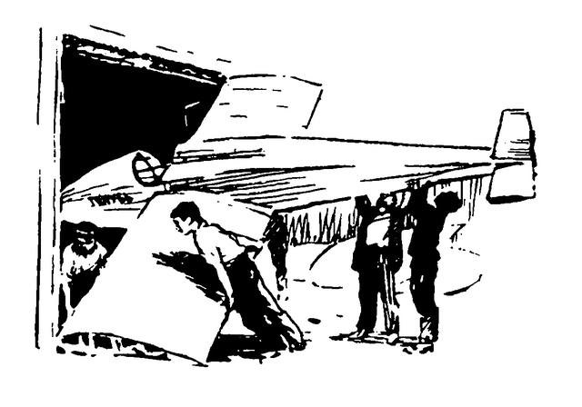

### В КОКТЕБЕЛЬ!

После тринадцати дней пути через Балашов, Лиски, Харьков, проведённых на голых
досках простой двухосной железнодорожной платформы, почти под беспрерывными
дождями, от которых не спасал дырявый-предырявый брезент, накинутый на всё наше
хозяйство, мы с Женей Броварским были так же веселы и неугомонны, как и в
начале путешествия. Больше того! Мы веселели и наливались энергией с каждым
днём, приближавшим нас к заветной цели, к сказочному Коктебелю, где уже в
прошлом году состоялись Первые всесоюзные планёрные испытания. Чтобы просохнуть
после очередного небесного душа и немного размяться, мы на ходу соскакивали с
платформы и бежали по бровке наперегонки с поездом, небыстро ходившим в эти
первые годы после гражданской войны. В Мелитополе нашу платформу прицепили к
эшелону с харьковскими планёрами.

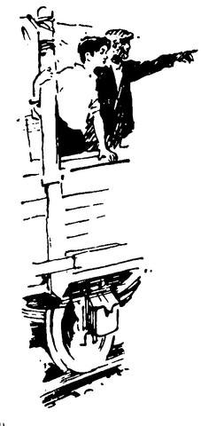

С восхищением и завистью и не без некоторого смущения за свой хотя и с любовью,
но кустарно сделанный «Голубь», рассматривали мы планёры, построенные
«по-самолётному». У них была чудесная трёхслойная фанера толщиною в один
миллиметр, которую они называли «диктом», - мы в Саратове не могли найти тоньше
трёх.

У них был авиационный лак «эмалит», пахнущий грушевой эссенцией, - наш «Голубь»
был обтянут бязью, ничем не пропитанной. У них было… Эх, да чего только не было
у этих богачей, у этих счастливчиков, которые могли каждый день видеть самолёты
и, может быть, даже украдкой трогать их рукой…

Наконец потянуло запахом гниющих водорослей: мы приближались к Сивашу. Эшелон,
неспешно постукивая на стыках и подолгу останавливаясь на каждом полустанке,
неотвратимо двигался на юг.

Мы, то есть Женя Броварский, планёр и я, уже совсем просохли. С удивлением
вглядывались мы в облака, с утра теснившиеся по южной стороне горизонта.
Харьковчане считали, что это видимые издалека первые отроги Крымских гор. Нам
же, жителям великой Русской равнины, такое предположение казалось совершенно
невероятным. Ведь до гор еще не меньше ста километров! Услужливая мысль
подсказывала всё новые и новые соображения, казавшиеся упрямо сопротивляющемуся
сознанию приемлемее простой и очевидной истины: да, это горы, далёкие горы!

В сумерках мы подъезжали к Джанкою с чувством робкой боязни, что восхитительное
видение растворится, как призрак в беспощадных лучах утреннего солнца…

Первой мыслью пробуждения, с силой удара возвращавшей к действительности, была:
а горы? Где они?

Слева – ослепительный, мерцающий блеск залива. А впереди – вот они! Громады
волнистых, тонущих в дымке, заслоняющих друг друга хребтов. Синие, серые,
сиреневые и палевые в лучах утреннего солнца, застывшие в безмолвной угрозе
тёмные зубчатые скалы. Мы стояли, держась за стойки креплений, и смотрели,
смотрели, впитывая эту торжественную неизведанную красоту.

Подскакивала на стыках платформа, встряхивая нас от пяток до затылка,
постукивали колёса, рука ощущала шершавую кору берёзовой стойки, плечо –
крепкое плечо друга. Степь обдавала волнами полынного зноя, а видение не
исчезало.

Так мы и ехали стоя, пока за рыжей спиной ближайшей возвышенности не скрылись
последние вершины неведомого края.

### ВТОРАЯ ЖИЗНЬ

1924

Выгрузка! Тихая Феодосия наводнена планеристами. На маленьком железнодорожном
дворе теснятся нанятые в окрестных селениях, запряженные серыми волами мажары,
прекрасно приспособленные для перевозки кукурузы и сена. Но для планёров…

Их борты утыканы по всему периметру длинными заостренными прутьями. Везти на
них наши хрупкие аппараты – всё равно, что нести барабан на вилах!

Грузимся последними на последнюю мажару: грузимся в четыре этажа, создав
невероятное сооружение из кольев, верёвок, частей планёра и досок. Наша
«Эйфелева башня», угрожающе покачиваясь на ухабах, медленно трогается в путь.
Мы виснем на верёвках, привязанных к самой высокой точке нашего сооружения, и
разбегаемся в стороны, прилагая отчаянные усилия, чтобы удержать его от
опрокидывания.

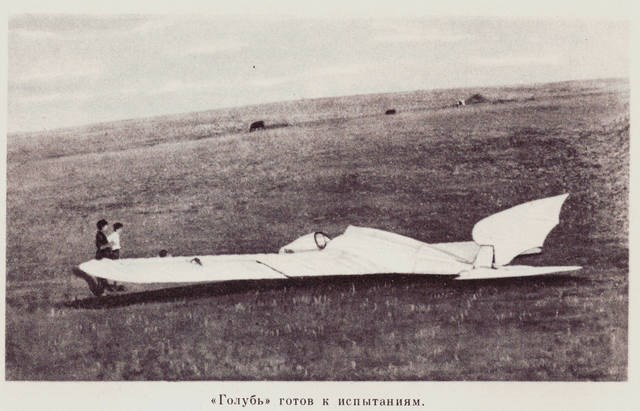

Лагерь планеристов разбит на пологом склоне Кара-Оба, близ Старого Крыма.
Только те планёры, которые пройдут здесь предварительные испытания, будут
удостоены техкомом великой чести – летать. Не просто планировать со склона в
долину, а парить над Узун-Сыртом, парить минутами, а быть может, и часами…

...Скорее, скорее! Планёр имеет жалкий вид. Простой желтый картон, придававший
форму передней кромке крыльев, в дороге под дождями совершенно размок и обвис.
Быстро снимаю обтяжку с крыльев и, кстати, переделываю носки профиля крыла НЕЖ,
придавая им большую кривизну, расчерчиваю совмещенный плаз носков нервюр,
перевожу контуры, накалывая шилом на фанеру; вырезаю и приклеиваю к полкам
нервюр новые носки и обшиваю переднюю кромку крыла миллиметровой фанерой,
выпрошенной у москвичей.

Мой помощник женя Броварский придаёт мне бодрости, заглядывая время от времени
в палатку, ахая и поражаясь энергии и работоспособности нашей команды.

Наконец «Голубь» начинает походить на планёр. Но управление!.. Оно сделано из
деталей и материалов, не внушающих большого доверия. Ручка – из дуьового бруска
с дюралевыми накладками. Вал управления – из дюймовой водопроводной трубы…

В краткую минуту между двумя приступами бешеной работы, с вареным вкрутую яйцом
в кармане, ломтем ячменного хлеба в одной руке и кистью винограда в другой, я
иду по лагерю, жуя на ходу, и осматривая другие планёры. Их, кроме нашего, еще
47! Тут и «Москвич Лучинского и Чесалова, планёр лёгкой, изящной конструкции, и
солидный КПИИР (Киевского политехнического института), и необыкновенная
бесхвостая «Парабола» Черановского, и «Одна ночь» с трехгранным фюзеляжем.

А вот в стороне от лагеря в неглубокой балке остатки «Комсомольца». Несмотря на
категорическое запрещение техкома, лётчик Клементьев нашёл несколько
сорвиголов, которые не то чтобы запустили, а скорее столкнули с обрывистого
южного склона построенный им лёгкий учебный планёр в бездну, навстречу сильному
порывистому ветру. Через несколько минут хрупкое сооружение, не выдержав
перегрузки, сложив крылья, рухнуло вниз, навсегда похоронив под обломками
своего создателя и пилота…

Скручены, согнуты, разбиты лёгкие полупрозрачные крылья. Под ними клубок
расчалок, труб и сосновых планок, еще недавно составлявших скелет умного,
тонкого созданного человеком сооружения. Сиротливо лежит в стороне почти целое
оперение. Здесь же и управление, счилой удара почти вырванное из кабины
планёра. Машинально пробую вытащить его из кучи обломков. Тяну сильнее.
Свистнула нечаянно освобожденная и тут же свившаяся в кольцо тонкая стальная
проволока. Да ведь это находка!

Я побежал за ключом и плоскогубцами, и через несколько минут управление было у
меня в руках. К вечеру оно с небольшими переделками было установлено на
«Голубе». А спустя два дня наш планёр, получив разрешение техкома, сделал под
управлением лётчика Зернова несколько крошечных прыжков на пологих склонах
Кара-Оба.

Так началась вторая жизнь управления погибшего «Комсомольца».

### У КОГО НЕ КРУЖИТСЯ ГОЛОВА

1929

Когда Валерий Павлович Чкалов был вынужден из-за своих чересчур смелых полётов
перейти на работу в ленинградский осоавиахим, его имя уже было легендарным.

Мы, молодые планеристы, лётчики и «конструкторы», с огромным уважением,
интересом и даже трепетом взирали на мощную фигуру Валерия Павловича. Из уст в
уста передавались рассказы об его невероятной смолости, великолепном лётном
мастерстве, полётах под невскими мостами, железных нервах, мужестве и отваге.

Как-то раз, зайдя в самый большой и высокий зал аэроклуба-музея, я застал
оживлённую группу друзей-планеристов. Тут были Петров и Халутин, братья Лосевы,
Флоря и Паша Цыбин, среди которых находился и Валерий Павлович... Он весело и
непринуждённо разговаривал с молодёжью. Речь шла о том, что у лётчиков должны
быть очень хорошо тренированные органы равновесия.

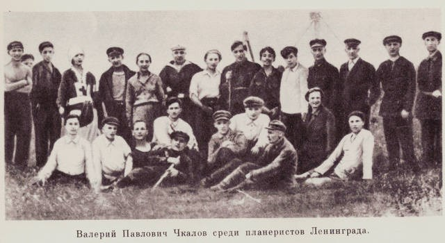

- Вот пожалуйста, - сказал Валерий Павлович, - хотите себя проверить? Станьте
  под этой люстрой, поднимите голову, смотрите на нее не отрываясь и сделайте
  десять оборотов вокруг себя, а потом выйдите в дверь. Только и всего! Мы
  понимали, что это задача не такая уж простая, но нам, молодым, здоровым,
  уверенным в себе ребятам, казалось, что это сделать всё-таки можно.

Начали пробовать. Отличный планерист Клебанов крутился-крутился, сделал все
десять оборотов, но потом его понесло в сторону, он пошел как-то боком, боком,
держась за стенку, и в конце концов в дверь не попал. Некоторые другие даже не
могли сделать десять оборотов. Я после десяти оборотов выписал такую фигуру,
что самому стало смешно. После всех этих «экспериментов» Валерий Павлович стал
посреди зала, поднял голову, взглянул на люстру, сделал двадцать оборотов, а
затем твёрдым шагом направился к двери, взялся за ручку и вышел из зала. Мы
были потрясены…

С тех пор я не раз видел, как под люстрой в пустом зале украдкой крутился
очередной кандидат в Чкаловы.

Разумеется, Валерий Павлович стал кумиром нашей молодёжи. Когда он появлялся на
планёрной станции в Дудергофе, все собирались вокруг него, без конца слушая его
рассказы, расспрашивали его о полётах, об авиации, а он усаживался, огромный,
могучий, на наши лёгенькие деревянные сооружения и показывал нам, как надо
летать. Наверное, так выглядел бы Илья Муромец верхом на жеребёнке. Наши лёгкие
планёры в его руках казались игрушками и жалобно поскрипывали под его тяжестью.

Опытный, прославленный лётчик среди нашей молодёжи был совсем «своим». Он также
вместе с нами таскал планёры на гору, разбирал и собирал их, а иногда смеха
ради поднимал наш учебный планёр одной рукой.

Я помню фотографию, где среди целой ватаги мальчишек идёт улыбающийся Валерий
Павлович и несёт на плече лёгонький «ОКА-III», а ребята только поддерживают
планёр за крылья.

Таким он и запомнился нам навсегда.

### СО ШТОПОРОМ НА ХВОСТЕ

1929

- Что это у вас? Плоскогубцы? Киньте их мне в голову! Они мне нужны!

Так я познакомился с сергеем Павловичем Королёвым, человеком железной воли и
неиссякаемого юмора.

...Красавец планёр «Коктебель», созданный им совместно с Сергеем Николаевичем
Люшиным стоит на старте северного склона Горы.

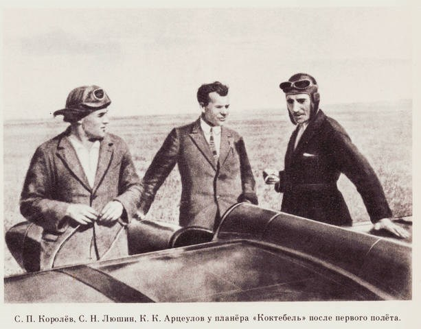

- Держите крепче, - еще раз наставляет меня, садясь в кабину планёра Сергей
  Павлович, - и смотрите не отпускайте, пока я не крикну «старт!».

Ветер не сильный, всего 4 – 5 метров в секунду. При таком ветре выпарить с
пологого северного склона нелегко. Надо хорошо запустить планёр, сообщить ему
достаточную начальную скорость, чтобы сделать первый разворот вдоль склона не
только без снижения, но по возможности даже с некоторым набором высоты.

Наша небольшая группа ленинградских планеристов прибыла на слёт без своих
планёров – постеснялись, решили, что рано нам в калашный ряд. Приехали учиться
и учились, с головой уйдя в работу, помогая тем, у кого планёры были. Помогали
собирать, разбирать и ремонтировать «машины», как гордо называли мы планёры, и,
конечно, в согласии с лозунгом «Любители авиации – под хвост!» вытаскивали их
на Гору, устанавливали на старт и запускали с амортизатора…

- Десять… Двадцать… - отсчитывает десятки шагов растягивающая амортизатор
  команда из шести дюжих ребят на каждом конце.

Я лежу под оперением и одной рукой держу за головку стальной полуметровый
штопор от походной палатки, наполовину ввернутый в сухое каменистое тело Горы,
а другой – хвостовой трос планёра, обёрнутый несколько раз вокруг этого
штопора. Загнать штопор в почти сплошной камень не так-то просто. По многу раз
начинаешб ввёртывать его воротом в расселину. Сделаешь три-четыре оборота – и
штопор упирается в известковую плитку. Вытащишь его и начинаешь всё сначала.

Наконец штопор ввёрнут, ввёрнут не очень надежно, но время идёт, медлить больше
нельзя.

Сквозь стебли сухой травы мне видно только блестящее серое брюхо планёра и
где-то далеко-далеко – алые крылья, отливающие весёлыми фиолетовыми бликами
отраженного в них безоблачного неба.

Планёр подрагивает, скрипят под лыжей камни, хвост гудит, как гитара, дрожит и,
приподнимаясь над сухой колючей травой, всё сильнее натягивает трос,
закреплённый на штопоре.

- Тридцать! – штопор отклоняется, раздвигая верхний слой камней. Я изо всех сил
  стараюсь удержать его. Но что может сделать распластанный на усыпанном
  камнями склоне парень, даже если его за ноги удерживают двое таких же ребят?
  А команды «старт!» всё ещё нет! Усилие растёт, и, хотя я до предела напрягаю
  все мускулы, меня начинает волочить по земле. Чувствую, что если немедленно
  не отпущу троса, то или взлечу с планёром в воздух, как камень, пущенный из
  пращи, или останусь без рук.

- Сорок!

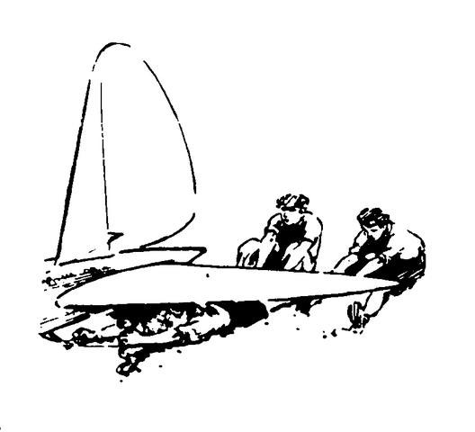

Разжимаю пальцы, и штопор мгновенно вырывается из земли, обдав меня пылью,
каменной крошкой и комьями сухой земли. Планёр, пробежав несколько шагов,
приподнимает нос и прыгает в воздух. Красивый разворот вдоль склона – и
длиннокрылый «Коктебель» чётко вырисовывается тёмно-красным силуэтом на
бледно-голубом осеннем небе.

Поднимаемся, стряхиваем с себя землю и отдираем от комбинезонов сухие колючки.
Я потираю затёкшие руки с глубокими отпечатками троса. Мы стоим и смотрим,
зачарованные, как стройный «Коктебель» уходит вдоль склона на восток, медленно
набирая высоту. Вот тонкий силуэт наклонился и, чертя по горизонту узкими
крыльями, делает разворот навстречу ветру. Силуэт приближается, растёт. Уже
можно различить красный цвет планёра, поблёскивание крыльев и едва заметные
движения элеронов. Наконец он с гулким шелестом проносится в вышине мимо нас.

Но что это? За хвостом планёра, выписывая немыслимые пируэты, мотается… штопор!
Не удержав и не успев вовремя отдать конец стартового троса, я послал
запутавшийся в нём штопор в полёт вместе с планёром…

Сергей Павлович летал больше четырёх часов и не подозревал, что за хвостом
болтается такой «довесок».

Только после посадки, рассматривая большую дыру в оперении, пробитую
злополучным штопором, пообещал мне «в следующий раз» оторвать плоскогубцами мои
покрасневшие от стыда уши.

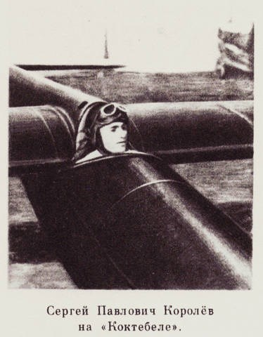

### КОСТЫЛЬ И КОСМОС

1930

Стремление уменьшить до предела вредное сопротивление заставляло нас тщательно
«зализывать» планёр, убирать с наружной поверхности все выступающие части.

В 30-м году мы еще не решались накрыть голову лётчика обтекаемым фонарём. Нам
казалось, что пилот, не обдуваемый наружным потоком воздуха, перестанет
«чувствовать» планёр. Мы закрывали крышкой кабину так, что только голова
оставалась снаружи. За головой ставился обтекатель, который являлся как бы её
аэродинамическим продолжением. Очень скоро были оставлены колёса. Планёры стали
садиться на деревянную, иногда окованную сталью лыжу, которая хорошо
вписывалась в наружный контур обтекаемого фюзеляжа.

У нас между лыжей и каркасом гондолы «Города Ленина» была для смягчения толчков
при посадке проложена развёрнутая и надутая воздухом велосипедная камера.

Но вот костыль, к сожалению, был необходим для того, чтобы руль поворота,
установленный на конце длинной балки, не ложился своей нижней кромкой на землю.

Не долго думая, я сделал костыль убирающимся. Это был сравнительно простой
механизм, и в полёте костыль полностью примыкал к обтекаемому контуру хвостовой
части балки.

Во время подготовки к полёту нашего планёра к нам своей характерной
неторопливой походкой подошёл Сергей Павлович Королёв.

- Ну это зря. Ты это, друг, переборщил, убирать костыль, к чему это?
Сергей Павлович был старше и намного опытнее меня, тем не менее я заупрямился:
- Почему же не убрать, если можно убрать? Зачем же оставлять лишнее
  сопротивление?

Сергей Павлович отнёсся к этому, как к чудачеству. Чего греха таить, мы зато
как к чудачеству относились к работе Сергея Павловича с ракетными двигателями.
Мне довелось видеть на станции Планёрная под Москвой его опыты полётов на
планёре, снабженном небольшим жидкостным реактивным двигателем, который он и
его друзья мастерили сами в своём ГИРДе.

Нам, планеристам, которые мечтали об очень маленьких, очень экономичных
моторах, казалось чудовищным ставить на планер прожорливый реактивный
двигатель, который был в состоянии работать всего секунды, сжигая при этом
огромное количество топлива.

Где нам было тогда предвидеть, во что эти работы выльются через десятилетия?
Нужны были и гений, и целеустремлённость Королёва, чтобы различить в этом
скромном начале космические дали будущего.

Сергей Павлович отнёсся тогда к убирающемуся костылю с иронией, в этом он
ошибся. Зато нам, молодым конструкторам, и в голову не приходило, что
реактивный двигатель в его руках сделает возможным выход за пределы земной
атмосферы, достижение планет, покорение космоса!

Мы видели только одно: большой, внушавший нам страх расход горючего. Теперь-то
мы знаем, что эмоции и догадки полезны только в самом начале всякого большого
дела. Потом для успеха нужны расчеты, а в конце – холодный ум, точные действия
и железный порядок.

Но что у нас было тогда, кроме эмоций?

### НИКОГДА НЕ ГОВОРИ «НИКОГДА»!

1932

Только откроешь глаза – и сна как не бывало! Солнце и волны уже плетут
мерцающую сеть на потолке веранды дачи Адриана. Скрежет гальки, струящейся в
навалах неутомимого прибоя , сразу до краев наполняет новый день быстрым бегом
времени. После крепкого сна без сновидений, какой знает только хорошо уставшее
мускулистое тело, чувствуешь такой прилив сил, что кажется: стоит только
вытянуть перед собой руки, оттолкнуться от крыльца – и полетишь над пенными
гребнями волн к далекому дымно-розовому скалистому мысу Киик-Атлама.

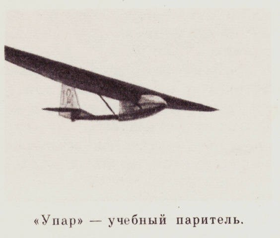

… Добродушный газик старательно намолачивает километры, оставляя за собой
повороты петляющей по склонам горы дороги. Ленивый западный ветер. Парить
нельзя, но зато можно делать учебные полеты, а нам только это и нужно.
Инструктирует лётчик Бородин. Его спокойная речь, неторопливые жесты вливают в
учлёта так необходимую ему веру в обыденность происходящего.

Негромко, как бы обращаясь к глубине сознания новичка, готовящегося к полёту на
«Упаре», даёт он точные, предельно сжатые указания.

Смотреть, как «работает» новая конструкция, для её создателя полно невыразимого
интереса.

Вот планёр тронулся и побежал по земле, скользя по ковылю и мелким камням
подкованной сталью лыжей. Амортизатор еще сокращается. Скорость быстро
нарастает. Крылья всё с большей силой встречают прозрачный утренний воздух, и
планёр, связанный с ними подкосами и расчалками в одну жёсткую ферму,
отрывается от земли.

Планёр в воздухе. Он продолжает набирать высоту, пока ослабевший амортизатор не
срывается с крюка. С глухим дробным стуком падает толстый чёрный шнур на землю,
разгоняя кузнечиков и ящериц.

Пилот успокаивает планер, делает разворот направо и проносится совсем близко от
меня. Крылья и оперение жёлто просвечивают на солнце. Сквозь тонкую обтяжку
виден весь скелет крыла – каждая нервюра, каждая расчалка и раскос. Ещё пара
плавных разворотов – и планёр садится в сотне метров от нас. Я с завистью
смотрю на счастливчика, вылезающего из кабины. Как и многие конструкторы, я
летать как следует не умею, так как тренироваться из-за недостатка времени
приходится от случая к случаю, урывками.

Вот уже восемь лет, как я строю планёры! И для чего? Для того, чтобы стать
конструктором? Нет! Для того, чтобы летать! Я строю и стролю, стал инженером,
главным конструктором завода, рассылающего планёры по всему Советскому Союзу, а
«подлетнуть» удаётся редко, очень редко. Нет, никогда мне не научиться летать!

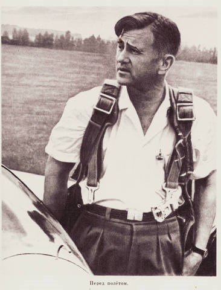

Эх, паря, паря! Расчерчивал ли ты когда-нибудь, лёжа на животе, плазы?
Обтягивал ли ты крылья упрямо сопротивляющимся перкалем? Работал ли рубанком,
скорчившись и наступив ногой на ускользающую рейку, когда другие купались,
загорали, бегали по золотому песку. Искал ли ты среди старого авиационного
хлама подходящую детальь? – Чуть улыбающийся Бородин вопросительно смотрит на
меня. И, не дождавшись ответа (нужно ли спрашивать!), велит поставить «Упар»
против ветра и прицепить кольцо амортизатора.

- Ты какое упражнение делал последнее? Развороты проходил? Нет? Ну садись. Для
  первого раза пролетишь по прямой. Следи за углом и кренами. Направление держи
  вот на тот светлый бугорок, видишь?

Можно иметь воловьи нервы и всё-таки испытывать радостную дрожь возбуждения
перед первым полётом на своей новой машине.

Я сижу в кабине «Упара» за рулями своего любимого создания, которое вздрагивает
и гудитот мелких рывков растягиваемого стартовой командой амортизатора. Всё
продумано, всё рассчитано. Каждый раскос, каждая косынка поставлены на своё
место так, чтобы они работали, как надо. Каждый гвоздик забит в то место, где
ему нужно быть. Каждый рычаг вырезан, согнут, сварен так, чтобы в итоге
получилось удивительное и в то же время такое простое целое – планёр. Такое
простое, что и на Суздальской Руси, и в древней Элладе, и в еще более древней
Индии нашлись бы и мастера, и подходящие материалы, чтобы построить планёр,
способный пролетать сотни километров и часами парить в вышине. Не хватало для
этого «немногого» - знания, как это сделать. Два-три тысячелетия понадобилось
человеку, чтобы дойти до этого несложного на первый взгляд взаимного
расположения частей дерева, полотна и немногих кусков металла, которое мы
называем теперь коротеньким словом – планёр.

- Двадцать четыре, двадцать пять… - отсчитывает шаги стартовая группа.
- Старт! – командует Бородин.

Я нажимаю ручку самопуска. Спинка сиденья сильно давит в спину. Короткий
разбег, два-три удара по хребту Горы – и планёр в воздухе. Плотный тёплый ветер
дует в лицо. Земля проваливается, кажется, что сразу вырастаешь над всем.
Свистят расчалки. Небольшое движение ручкой от себя – планёр переходит на
планирование и летит, мягко повинуясь малейшим движениям рулей. Исправляю
небольшой крен, и вот уже набегает земля – надо садиться. Выбираю ручку на
себя. Планёр приземляется почти без толчка и после небольшого раздумья медленно
наклоняется на левое крыло. Отстёгиваю пояс, снимаю переднюю часть кабинки,
встаю и, не отходя от планёра, оглядываюсь назад.

Вижу, что пролетел метров полтораста.

- Ну что ж, Олег, - говорит Бородин, - полет неплохой, нужно только
  внимательнее следить за кренами. Вот пропущу ещё трёх ребят и выпущу тебя на
  развороты.

Вот так раз! Год не летал, и после одного полёта по прямой – сразу на
развороты!...

Лишний раз убеждаюсь, что лётчики по отношению к нашей конструкторской братии
делятся на две группы. Одна считает нас полукалеками, лишёнными каких бы то ни
было лётных способностей. Другая, наоборот, считает, что конструктор сам всё
знает и учить его, стало быть, нечего. Раз построил планёр, не объяснять же
ему, в какую сторону двигать ручкой! Даже как-то неудобно…

В итоге и те и другие предоставляют нашего брата самому себе, вместе с полной
возможностью свернуть шею при очередном упражнении.

По-видимому, из-за этого конструктор Антон Коваленко даже поставил своеобразный
рекорд: разбил в мелкие щепки самый большой планёр слёта – своей же конструкции
красавец ДР-3 с размахом крыльев 22 метра. Антон отделался сломанной ногой, но
сколько было дров! Лётчики – сторонники теории «неполноценности» конструкторов
– горестно качали головами. Сторонники теории «Зачем их учить?» недоуменно
разводили руками…

Наконец наступило долгожданное мгновение. Закончив осмотр новых планёров, я
подошёл к старту на северном склоне. Группа Бородина, состоящая из
двадцатилетних ветеранов и сорокалетних любителей, делала зачётные
пятнадцатиминутные полёты для получения звания пилотов-парителей. Через пять
минут я уже сидел в кабине «Упара».

- Старт! – Планер почти без разбега оторвался от склона и окунулся в прохладные
  сумерки. Скрежет, толчки, усталость, всё шершавое, угловатое, утомляющее
  осталось на земле. Кругом только воздух, поющий шелест потока, плавные
  колебания в упругой среде, скорость, высота, преодоление силы тяжести,
  упоение полетом…

Осторожный разворот направо – и планёр летит вдоль склона, медленно набирая
высоту. Кроме меня в воздухе никого нет. Тишина. Только хлопает на крыле
незастёгнутый второпях лючок.

Восходящий поток слабый. Изо всех сил тянусь вверх, скобля высоту. Вдруг ухо
улавливает какое-то изменение в шуме. Почти автоматически даю ручку немного от
себя – шум восстанавливается. Оказывается, это было замедление в хлопаньи
лючка. Как только скорость увеличивалась, он снова стал хлопать с прежней
частотой – примерно два-три удара в секунду.

Вот замечательный указатель скорости для «Упара», на котором нет ни одного
прибора!

Разворачиваюсь над стартом. Ещё одна восьмерка вдоль склона. Ветер спадает,
сгущаются сумерки. Снова захожу над посадочным «Т» и вижу, что мне машут белым
флажком: садись! Как быстро прошли 15 минут! Даю себя снести к середине склона
и, развернувшись против ветра, медленно снижаюсь, стараясь угодить прямо к
группе на старте. Ещё не совсем остановившийся планёр хватают за подкосы.
Бородин поздравляет меня.

- Скорость немного маловата, но в общем для начала ничего, летать будешь.

Мы дружно тащим планер на стоянку.

Какой он лёгкий! Пожалуй, я мог бы взять его на плечо. И вообще до чего
здорово! И ребята хорошие. И вечер ласковый. И хочется построить планёр ещё
лучше?

### НА ВОЛНЕ

1932 - 1950

30 декабря 1950 года американец Ивэнс, отцепившись от самолёта на высоте около
трёх с лишним кило¬метров, поднялся до 12 832 метров над уровнем моря. Этот и
ряд других великолепных полётов наших друзей из Польши и Чехословакии помогли
нам до конца осознать открытие нового способа парения «на волне». Воздушные
волны были обнаружены планеристами, без конца и без устали искавшими по всему
земному шару места с особенно мощными восходящими потоками.

Как это иногда случается, учёные, в данном случае метеорологи, начали спешно
строить и подгонять теоретическую базу под неопровержимый факт, влетевший в
науку, как пахнущий травой и потом футбольный мяч и окно тихой библиотеки. До
этого мы прочно свыклись с мыслью, что ветер, встречая гору, создаёт восходящий
поток, соизмеримый с её высотой. Достигнув, например, над Узун-Сыртом при
хорошем «южаке» силою 8-10 метров в секунду 200-250 метров высоты, мы считали,
что находимся уже на «потолке». Самые совершенные; «рекордные» планёры, хорошо
обтекаемые и с большим размахом крыльев, поднимались на 50-100 метров выше
примитивных «Упаров». Наиболее опытные пилоты выжимали за счёт своего
мастерства ещё несколько десятков метров высоты. Остальное было делом случайной
удачи. Но неужели наши лётчики, сделавшие тысячи полётов, облетав все закоулки
северо-восточных отрогов Крымской яйлы, никогда не натыкались на волну? В 1929
году лётчики Юмашев и Кошиц на планёрах «Скиф» и «Гриф» забрались на высоту
более полутора километра и долго кружили вместе над Коктебельской долиной. В
тот же день Венслав на «Жар-птице» достиг 980 метров, а молодой паритель
Козлов - 1200 метров высоты.

Для объяснения таких неожиданных явлений всегда было наготове одно дежурное,
бездумное слово «термик». Никто не пытался тогда охватить мысленно всё сложное
единство движения насыщенных влагой неустойчивых воздушных масс, сталкивающихся
в своём беге с широким горным хребтом. Это столкновение порождало, как мы
узнали много лет спустя, судорожные всплески восходящего потока, отмеченные
порою на километры выше и далеко по ветру от горной гряды лёгкими
чечевицеобразными облаками, точно ступенями, ведущими в бесконечные просторы
неба.

Вот уже неделю только и разговоров что о «трубе».

—  Летишь-летишь, ходишь, щупаешь, отворачиваешь в долину, npобудешь тут и там
всё нормально, ничего особенного. И вдруг в каком-то одном месте «труба»!
Начинает подымать, да так здорово! Tpиста метров, четыреста, и всё подымает и
подымает! Пятьсот, семьсот - конца нет. Чудеса, да и только! Захлёбываясь от
восторга, передают друг другу планеристы.
—  А ты ещё не пробовал? Вот попадёшь —  узнаешь. Эх и здорово! Здорово то
здорово, да как в неё попасть, в эту загадочную «трубу»? Как её найти? Никаких
видимых границ у «трубы» нет. Когда и где она надумает появиться, неизвестно.
Ясно одно: нужны настойчивость и терпение, нужно без конца отворачивать от
склона, тыкаться, как слепому щенку, носом почаще навстречу потоку, уходить в
долину - может, и повезёт...

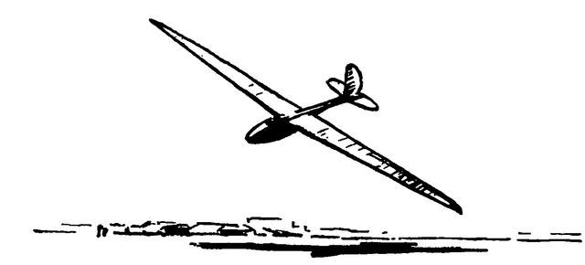

В воздухе тесно. Восходящий поток вдоль крутого южного склона не очень широк.
Приходится соблюдать «правила движения» на этой своеобразной воздушной улице:
расходиться направо, обгонять слева. Мне, правда, обгонять не приходится.
«Упар», как большой лопух, тихонь¬ко плывёт вдоль склона, реагируя на малейшие
перемены ветра. Позвякивает крючок, которым пристёгнут обтекатель кабины к
спинке сиденья.

— Ыоеыы... оауеаыюуу...— доносит¬ся откуда-то с наветренной стороны. Ну,
конечно, это Молчанов пользуется обстановкой, чтобы поспорить с судьбой, давшей
ему такую неподходящую фамилию. На земле соседи по комнате ему петь не дают,
так как он отчаянно фальшивит. Теперь подвернулась возможность наверстать
упущенное и погорланить вовсю. Раздолье!

Испугавшись, что забияка, разевая рот навстречу ветру, зажмуривает глаза, я
осторожно обхожу сторонкой его летящий пулей светло-серый «Скиф».
Разворачиваюсь в сотый раз против ветра и вдруг... чувствую, что всё
изменилось. Стараюсь понять это странное ощущение: точно попал в другую
атмосферу, в другой мир. «Упар» замирает, погружаясь по элероны в эту
шелестящую струю, вызывающую мелкую дрожь всего планёра. Высота быстро растёт.
Раздвигаются горизонты. «Труба»!

Планёр не летит, а висит в потоке необыкновенно устойчиво и спокойно. Почти
затаив дыхание, не двигая ни ручкой, ни педалями, я весь от¬даюсь во власть
этой огромной стихийной силы, возносящей лёгкий «Упар» всё выше и выше. Вынимаю
из нагрудного кармана комбинезона самодельный высотомер. Тонкая стрелка на
размеченной карандашом шкале показывает более 550 метров. Значит, над гребнем
Горы около 350. Так высоко я ещё ни разу не забирался!

600 метров. Вся русая коса Горы видна как на ладони. Из-за Кара- Дага и
Сюрю-Кая начинают выступать один за другим горбатые хребты Крымской яйлы. Слева
в лучах солнца плавятся волны залива. Прозрачно голубеет на горизонте далёкий
выступ мыса Меганом.

750 метров. Ко мне приближаются редкие облака. Становится прохладно. Подъём
продолжается, а поток всё так же струится, шелестит в крыльях, всё такой же
необыкновенный, почти неземной. Чувства обострены так, что кажется — жизнь
удваивается.

900 метров. За плечами кудрявого Агармыша появляются в дымке не-знакомые горы,
испещрённые прихотливыми тенями облаков. Бегут дороги. В глубоких долинах мирно
ютятся опушенные садами белые домики селений. Как хороша земля! И как она
далека... Видят ли мой планёр мои друзья? Мной овладевает спортивный азарт.

950 метров. Холодно. Светло. И радостно до чёртиков. Дальше планёр не идёт.
Разворачиваюсь направо, иду вдоль склона к Коклюку на высоте около 1000 метров.
Высота всё та же. Возвращаюсь к месту подъёма — 950. Ставлю планёр носом к
ветру. Далеко впереди и вверху тонущий в солнечной лазури крестик. Еле видно.
Кто же это? Широкие концы крыльев, как будто красный фюзеляж. Неужели Е-3? Вот
забрался! Пожалуй, ещё на тысячу метров выше!

Долго хожу взад и вперёд над Горой не теряя, но и не набирая высоты. «Держит»
везде, но выше не поднимает. Наконец становится совестно. Мой напарник Юдин,
наверное, уже лопается от нетерпеливо желания в свою очередь попасть «трубу».

Мелькает мысль: а не полететь ли по ветру на дальность? Высота у меня около
1000 метров. Скорость ветра примерно равна скорости планёра. Если махнуть по
ветру, то при качестве планёра около 14 можно с высоты одного километра
пролететь по ветру вдвое больше, то есть не 14, а 28—30 километров. Не
попытаться ли? Но тут я с досадой вспоминаю, что при мне нет не только
удостоверения участника слёта, но и ни одной копейки денег! Сяду где-нибудь в
степи или на Арабатской стрелке, и не на что даже телеграмму отправить! А
главное - надо много решимости, чтобы дать себя снести с наветренного склона,
где мы привыкли всегда находить надёжный восходящий поток, на подветренный, где
для планериста всё равно что пропасть. Если бы ещё была за склоном кучёвка!
Правда, есть какие-то странные облака. Да разве это облака? Всего два-три
лёгких полупрозрачных чечевицеобразных облачка, маячащих выше меня и далеко по
направлению ветра над долиной за северным склоном, точно две плоские ступеньки,
ведущие в бесконечные просторы неба. Да разве такие облака держат?! И, подумав
ещё раз, что лететь на дальность – авантюра, которая может закончиться ночёвкой
холодной октябрьской ночью в голой степи, я решительно иду на снижение, туда,
где на старте ждёт меня мой истосковавшийся по воздуху напарник.

### КОГДА ЛОМАЕТСЯ УЗЕЛ

1933

Где предел упрощения конструкции? Этот вопрос сильно занимал нас в пору
широкого развёртывания массового планёрного спорта. Страна только становилась
на ноги и набирала силы. Не хватало всего: стали и дерева, ткани для обтяжки
крыльев и фанеры, электроэнергии и угля и даже бумаги для чертежей. Нужно было
экономить на всём. Внимательно и любовно «обсасывали» мы каждый узел, изгоняли
каждый лишний грамм материала. Видоизменяли контуры листовых деталей так, что,
укладывая рядом, их удавалось штамповать из листа практически без всяких
отходов. И всё-таки конструкция нашего основного. изделия — учебного планёра
Ус-4 — не казалась нам достаточно экономной.

Был задуман новый, предельно простой планёр.

Начали с того, что положили в основу схему построенного в Ленинграде планёра
OKA-III, состоящую из минимума элементов: крыльев, лыжи и хвоста на балке. Из
конструкции выбрасывался каждый лишний бол¬тик, каждый лишний шуруп и кусок
металла, каждая лишняя планка и кница.

После длительной и едкой перепалки с главным инженером завода, таким же молодым
и малоопытным человеком, как и я сам, в сердцах решаю оставить в важнейшем узле
крепления несущей расчалки к крылу всего один болтик — полболта поставить уже
было невозможно. Поцапавшись с ним ещё по поводу шарнира ручки управления,
сиденья (из одной дощечки!) и других деталей, я ушёл в КБ злой и до предела
заряженный энергией конструктивного упрощения... Наконец планёр готов. Как
тогда всё было просто! Я заявил, что планёр буду испытывать сам, и с утра
вытащил его с помощью друзей — конструкторов Емельянова, Грошева и Сиркена — на
близлежащее поле. Никаких статических испытаний, никаких заключений ЦАГИ,
никаких продувок — ничего! Только непреоборимое желание строить,
совершенствовать, двигаться вперёд.

Разбег. Упругий ветер кидается в грудь, в лицо. Тяну ручку на себя, планёр
отделяется от земли, и вдруг — крак! Слышится треск, правое крыло поднимается,
а земля плавно поворачивается и принимает на пашню остатки планёра с пилотом в
разодранных штанах, барахтающегося среди обломков своего сверхупрощённого
детища.

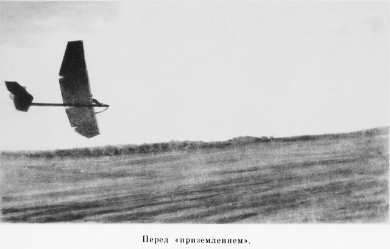

### БУМАГА И ПАЛЕЦ

1933

Хотя Планёрный завод и выпускал учебные планёры Ус-4 сотнями,
удовлетворительного качества и по невысокой цене, на сердце у нас было не
совсем спокойно. Площадь крыльев планёра была около 16 квадратных метров,
оперения — 5 квадратных метров. Обтяжка их мадаполамом производилась с двух
сторон. Расход ткани при самом экономном раскрое составлял около 50 квадратных
метров на штуку.

В те годы любая ткань была остро дефицитной, а из мадаполама шились простыни,
мужские сорочки и многое другое.

Как только мы узнали о существовании крафт-бумаги, первой мыслью было
опробовать её как заменитель ткани для обтяжки наших планеров. У нас было два
«подопытных» планёра типа Ус-4: ИП-1 и ИП-2, на которых мы испытывали профили
крыльев ЦАГИ - П. П. Красилыцикова.

Эти планёры и решено было обтянуть крафт-бумагой.

Бумагу мы предварительно размачивали в воде и ещё влажную наклеивали казеиновым
клеем прямо на деревянный каркас. Для большей прочности по нервюрам наклеивали
ещё полоски белой, более тонкой, бумаги. На фоне тёмно-красной крафт-бумаги это
выглядело довольно щегольски.

Бумажная обтяжка быстро высыхала и натягивалась, как барабан, без единой
морщинки, без обычных для тканевой обтяжки прогибов между нервюрами.

После высыхания мы покрывали её масляным лаком. Крыло блестело. На планёрный
слёт новенькие ИП-1 и ИП-2 прибыли красивые, как игрушки.

Распакованные крылья осторожно положили на рейки. Сбежалось много народа. Всем
нравились гладкие вишнёво-красные крылья с белыми полосками. Планеристы жадно
расспрашивали про крафт-бумагу. Одни восторгались, другие скептически
покачивали головами.

Не успели мы вынуть из ящика пилотскую гондолу с балкой, как на уголке крыла
таинственным образом появилась дырка. Небольшая. Полукруглая. Подозрительно
похожая на след от пальца.

Мы сердито оглянулись, ища чересчур любопытного планериста, но все как ни в чём
не бывало продолжали дискуссию о применимости бумаги, причём руки были заняты
энергичной жестикуляцией, с виду исключавшей возможность их использования для
слишком прямолинейных опытов.

Когда через 15 минут планёр был собран, мы с негодованием обнаружили в обтяжке
ещё несколько дырок явно экспериментального происхождения.

К счастью, ставить заплаты на бумагу с помощью того же казеинового клея было
нетрудным делом, и скоро ИП-1 стоял на старте, готовый к по-лёту.

В последний момент, когда уже прицепили к крюку амортизатор, такая же изящная
дырка обнаружилась на руле поворота — части планёра, наиболее близкой к
любознательной толпе, собравшейся подивиться на первый полёт «бумажного»
планёра. Витя Емельянов тут же, уже с некоторой злостью, залепил очередную
дырку. Наложив кружок, он встал с угрожающим видом около оперения и принял позу
витязя с банкой клея в одной руке и кистью в другой. ИП-1 взмыл с южного склона
и сразу пошёл на парение.

Пилот отозвался о планёре хорошо: «Качество, пожалуй, даже выше, чем у
серийных, летает отлично».

Так началась краткая, полная борьбы лётная карьера ИП-1 и ИП-2. Как мы ни
охраняли планёр от чересчур любопытных планеристов, ничто не помогало. Утром и
даже в перерыве между полётами появлялись всё новые и новые полукруглые дырки.

Бумага и клей были непрерывно в ходу. Мы уже носили в карманах пачки аккуратно
нарезанных кружочков, а банку с клеем стали прятать за спинку сиденья пилота.
Гладкая, блестящая поверхность крыльев стада вскоре напоминать усеянную
кратерами поверхность Луны.

Исчерпав запасы малиновой крафт-бумаги, мы перешли на заплатки серого, жёлтого,
коричневого и белого цветов.

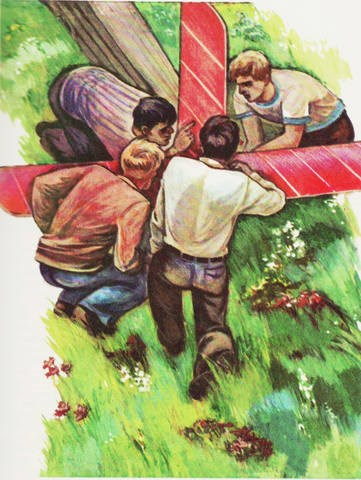

Вскоре, завидев ещё издалека Витю Емельянова или пилота планёра, рыскавшего по
Горе в поисках бумаги, планеристы стали прятать всё, что могло послужить
заплаткой ненасытному бумажному молоху. А на слёт прибывали всё новые
планеристы с планёрами, обтянутыми мадаполамом, бязью, перкалем. И без того
тяжёлая жизнь ИП-1 и ИП-2 становилась невыносимой... Когда мы под конец
отправляли домой жалкие, напоминавшие верблюжьи скелеты, остатки наших двух
планёров, я начал понимать, что успех новой, даже самой разумной технической
идеи зависит ещё и от отношения к ней. С тех пор жизнь приносила этому всё
новые и новые доказательства...

### НОВАЯ ФИГУРА

1934

Лётчик Бородин пригласил меня полетать с ним и поучиться высшему пилотажу на
двухместном планёре Ш-5. С утра над Москвой моросил дождик, было грязновато.
Являюсь на Центральный аэродром в синем комбинезоне, старых башмаках, каких не
жалко, и кепке. Поднимаемся на две тысячи метров за самолётом П-5. Инструктор
на переднем, я на заднем сиденье. Бородин отцепляется и после небольшой прямой
слышу:

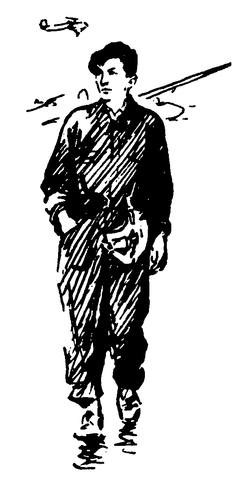

— Переворот, следи за моими движениями.

Держусь пальцами за ручку и легонько опираюсь ногами на педаль. Бородин
прижимает планёр, набирает скорость, потом плавно берёт ручку на себя. Планёр
задирает нос. Затем педаль уходит в крайнее отказное положение. Ш-5 вращается
вокруг своей оси и, как только лётчик даёт обратную ногу, чётко выходит из
пикирования, изменив направление полёта на 180 градусов. Ловко, красиво,
увлекательно!

- Повторяем переворот ещё раз! — Ещё такой же переворот, и вот мы снова летим
  навстречу солнцу.
- Понял? Теперь делай сам!

Высота 1800 метров. Разгоняю Ш-5, беру ручку на себя и, как только горизонт
скрывается за серебристым носом кабины, нажимаю левую педаль до отказа. Планёр
вращается. Вижу впереди землю, надо выходить из пике и давать обратную ногу. Но
не тут-то было! При резком нажиме на педаль старый башмак застревает между
какими-то предательскими деталями конструкции кабины Ш-5. Ослабляю нажим на
правую половину педали и дёргаю левую ногу, пытаясь вырвать её из капкана.
Трах! Подошва с треском отрывается и, по «закону вредности», прочно заклинивает
ножное управление в крайнем отказном положении. Между тем Ш-5 продолжает
вращаться, проделывая какую-то новую фигуру высшего пилотажа вроде косого
перемещающегося штопора.

Помощь Бородина, решившего вмешаться и надавившего, своей богатырской ногой на
правую педаль, превращает злополучную подошву в гармошку.

Кое-как планёр выведен в горизонтальный полёт. Бородин кричит мне что-то,
по-видимому, не очень лестное, но я плохо слышу его, так как, согнувшись вдвое
и нырнув головой под приборную доску, спешно выколупываю остатки башмака из
замысловатых тайников Ш-5. Наконец бренные останки подошвы и башмака летят за
борт. Уф! Я облегчённо разгибаю спину, ставлю левую ногу в одном носке на
педаль и кричу:

- Всё в порядке!
- Начинаем снова! — отвечает Бородин.

### ЗАСТЁГИВАЙ ШЛЕМ

1935

Три одноместных Г-9 расположены веером за самолётом П-5. Готовимся к взлёту
строем на буксире. День на Тушинском аэродроме летний, светлый, слегка
ветреный. Плывут по полю и взбираются, перекатываясь через высокий зелёный
берег Москвы-реки, округлые изумрудные тени облаков.

На буксире в строю я лечу впервые, поэтому меня берут центральным: пилотировать
проще. Всё готово; каждый пилот поднимает руку, самолёт-буксир прибавляет газ
и, медленно стронувшись, начинает выбирать слабину тросов. Их изгибы постепенно
исчезают. Натягиваясь, они приминают и косят траву, отрывая жёлтые головки
одуванчиков, отскакивающие в сторону от напряжённо гудящего троса. Стальная
нить, натянувшись, дёргает мой Г-9, который немного кланяется от рывка и снова
опускает хвост. По тросу, как по натянутой струне, передаются все звуки, все
шорохи, гул работающего двигателя на резонирующий, как гитара, фанерный фюзеляж
Г-9. Взмах флажком, П-5 даёт полный газ — и трос приподнимается над травой.
Соседние Г-9, слева и справа от меня, также оживают. Спину прижимает к сиденью:
мы начинаем разбег. Толчки, сухой скрежет металла по усыпанной галькой земле,
хлёсткие щелчки травы по бортам фюзеляжа, скорость нарастает, ветер ударяет в
лицо. Ещё секунда-две — планёр начинает отзываться на рули и, увлекаемый
самолётом, подпрыгивает, два-три раза чиркает лыжей о землю, и вот мы в упругом
весёлом воздухе. Боковым зрением вижу мелкие нырки и покачивание своих соседей.
К моменту отрыва они приблизились ко мне, но после взлёта, чтобы избежать
столкновения, с небольшим креном отваливают в стороны.

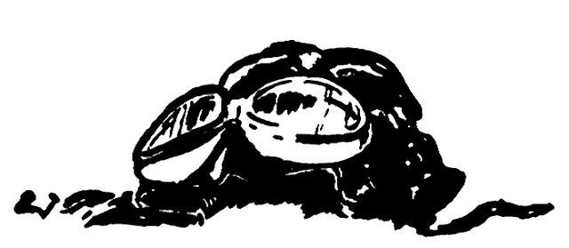

Земля уходит вниз, скорость нарастает, сверкнула под нами излучина Москвы-реки,
проносятся село Крылатское, знакомый лесок... Но что это? П-5 раздваивается, а
прохладный ветер забирается в волосы. Лётный шлем, надувшись, как пузырь,
увлекает защитные очки. Сдвинувшаяся оправа резко уменьшает поле зрения.
Мгновение лечу почти вслепую, не видя ни обстановки, ни приборов. Этого
допускать нельзя: легко не только вызвать рывки на тросе, неприятные для
лётчика, но и порвать трос или, что хуже всего, столкнуться с соседями. А
отцепляться и прерывать полёт и жалко, и стыдно. Во что бы то ни стало надо
устранить помеху.

Продолжая управлять планёром правой рукой, быстрым решительным движением левой
сгребаю с головы злополучный шлем вместе с очками. Поток воздуха со скоростью
150 километров в час с силой ударяет в ничем не защищённое лицо. Глаза
мгновенно застилаются слезами. Еле вижу самолёт, но ничего не поделаешь; таращу
глаза, утираю левой рукой слёзы, безудержно текущие из глаз в уши. Беру ручку
управления в левую руку, утираюсь правой. Так проходят мучительные минуты.

Высота 500 метров. Скорость по-прежнему 150 километров в час. По-степенно слёзы
высыхают, видимо, иссякает источник. Странно, но глаза начинают
приспосабливаться к бешеному ветру, дующему в лицо. Проходит ещё минут десять,
и, наконец, сцепщик машет рукой: отцепляйтесь!

Тяну на себя кольцо буксирного замка, Щелчок — и я перехожу на свободный полёт
с подъёмом для погашения скорости. Самолёт проваливается и уходит вправо. Шум и
свист ветра быстро стихают.

Г-9 спокойно планирует на скорости 70 километров в час. До чего хорошо! Подо
мной знакомая до мельчайших подробностей зелёная гладь просторного аэродрома,
пёстрая от теней облаков; знакомые здания Планёрного завода. Вот дом, в котором
я живу. Вот берёзовая роща, аллеи парка и нелепое, в форме топорной чайки,
здание Центрального аэроклуба. Надо мной лёгкие белые пушистые облака, уходящие
в бесконечность за синий горизонт. Один из двух планёров Г-9 пристраивается ко
мне. Пилот дружески машет рукой. Идём вместе на посадку.

Выхожу из планёра, держа в руке злополучный шлем с очками. Товарищи смеются: у
меня от глаз до ушей белые разводы высохших слёз.

### ИСПЫТАНИЕ НА ПРОЧНОСТЬ

1935

Пришёл на Планёрный завод молодой столяр Витя Емельянов. Начал шустрый
комсомолец с работы в цехе по третьему разряду; через год пере¬кочевал в
конструкторское бюро, где чуть не каждый конструктор создавал свой планёр; а
ещё через год сконструировал хороший тренировочный планёр КИМ, успешно летавший
на слёте. В 1935 году он уже создал замечательный двухместный рекордный
паритель «Стахановец» — новое слово в планёростроении.

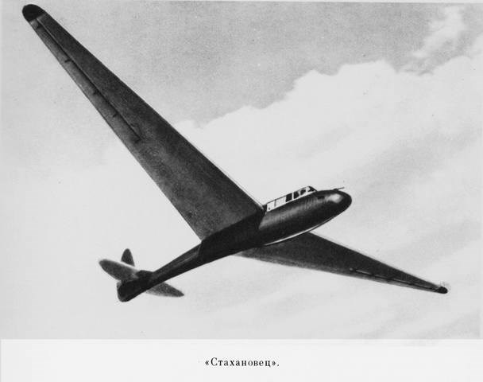

Чтобы обеспечить обзор второму пилоту, Виктор смело сдвинул центроплан назад; а
концы крыльев вперёд. Планёр получился с обратным продольным «V», нисколько,
как оказалось, не ухудшившим его лётных качеств. Однако вначале новая схема
планёра вызывала некоторые сомнения. Достаточно ли прочна заделка скошенного
крыла? Не ухудшит ли продольное «V» устойчивость и управляемость аппарата?

Испытание планёра на прочность путём нагружения конструкции до разрушения мы
сделать не могли: он был построен только в одном экземпляре. Да на маленьком
полукустарном заводе, хотя и ухитрявшемся выпускать в пору расцвета свыше двух
тысяч планёров в год, не было для этого нужного оборудования.

Решили испытать «Стахановец» прямо в воздухе, в полёте. П-5 затянул нас с
Виктором Ильченко тысячи на полторы метров над Тушинским аэродромом. Ильченко
сделал несколько разворотов налево и направо, всё более и более крутых, и,
наконец, разогнавшись, пошёл на петлю. Планёр поднимает нас, перегрузка
нарастает, видно, как изгибаются длинные жёлтые крылья.

Выдержит или не выдержит? Ну, конечно, выдержит! Не первый планёр делаем, есть
уже некоторый навык. Проверяем друг друга, вся работа идёт на виду. Всё должно
быть в порядке. А всё-таки?

Крак! В момент самой большой перегрузки слышится сухой треск. Конструкция,
собранная на клею из сосновых планок и фанеры и обтянутая полотном, напряжена
почти до предела.

Перегрузка спадает. Планёр на спине. Переходим из состояния, близкого к
невесомости, в пикирование. Крылья ведут себя нормально. Никаких вибраций.
Только при выходе из пикирования слышится опять сухое потрескивание. Это
отдельные второстепенные детали конструкции, не несущие значительных нагрузок,
но получающие большие деформации при нагружении всего крыла, кое- где сдают по
клею.

Не бойся, Витя! Уж ты-то знаешь, как разводить крепчайший клей!

Повторяем петлю ещё раз. Ильченко доволен, доволен и я. После хорошей «обтяжки»
планёр уже не издаёт никаких потрескиваний, никаких звуков, кроме мощного
шипенья и свиста в моменты увеличения скорости. Он отлично слушается рулей. На
радостях Ильченко загибает крутой разворот с набором высоты. Хороша машина!
Теперь главная задача, чтоб она попала на слёт в Коктебель!

На земле оба Виктора жмут друг другу руки, поздравляя с новой победой. Есть
первоклассный двухместный паритель! Я вылезаю с заднего сиденья, скидывая
путаницу парашютных лямок, разгибаю спину и вытягиваю затёкшие ноги.

Молодец, Витя, ты умеешь не только разводить клей!

### МЫ ЛЮБИЛИ ПОСМЕЯТЬСЯ

1936

Чем больше совершенствовалась организационная структура Осоавиахима, чем больше
появлялось отделов и подотделов, тем больше осложнялась жизнь и лётная работа
планеристов.

Каждый отдел и подотдел старательно сочинял инструкции, правила и методические
указания. А какие же инструкции, правила и указания бывают без ограничений,
запрещений и пределов?

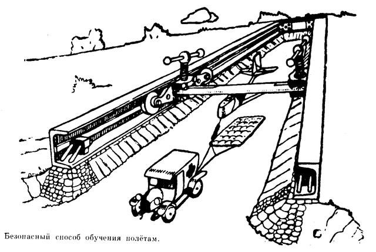

Аэродромная служба указывала, где нельзя летать. Медицина — кому нельзя летать,
лётная часть — как нельзя летать, а техническая — на чём нельзя летать.
Планеристы, привыкшие к большой самостоятельности и инициативе, взвыли.

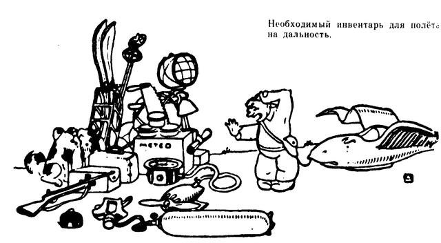

Бороться против чрезмерной осторожности, за расширение возможностей летать и
строить становилось всё труднее и труднее. И вот в ход было пущено весёлое
оружие смеха, метод преувеличения, доведения до абсурда.

В журнале «Самолёт» стали появляться карикатуры, едко подчёркивающие чересчур
суровые ограничения, высмеивающие боязливых организаторов. Не щадили и самих
себя. Разве можно жить без шутки, работать без юмора, спорить без улыбки?

### ДЕДОВСКАЯ САМОДЕЯТЕЛЬНОСТЬ

1912

Роясь в коллекции старых авиационных документов, натыкаюсь на заметку из газеты
1912 года:

> ПЛАНЁР-ОПАСНАЯ ИГРУШКА
>
> Ученикам гимназии Мая не разрешено летать на планёре. Серьёзная
> воздухоплавательная забава, подъём на планёре находится под запретом. Находится
> под запретом в Петербурге, где имеется всероссийский аэроклуб, где стараются
> поддерживать интерес к отечественному воздухоплаванию.
>
> В гимназии Мая не так давно образовался ученический воздухоплава-тельный
> кружок, который не ограничился пустячными рефератами по авиации, а задался
> целью приступить к действительной работе.
> 
> На первых порах юные воздухоплаватели решили полетать на планёре. Ученики
> собрали необходимую сумму и под руководством студента г. Вёкшина, который два
> года подряд удачно поднимался на планёре системы Шовьера в окрестностях Риги,
> приступили к постройке планёра, от которого один шаг к аэроплану.
> 
> Скоро планёр был готов. Осталось выбрать наиболее ровное место для занятий с
> подъёмом воздухоплавательной игрушки. Гимназисты остановились на местечке
> Горская. Тут имелся большой плац, удобный для подъёмов планёра.
> 
> За разрешением воздухоплаватели обратились к местному становому приставу, но он
> ответил отказом, ссылаясь, что это зависит от мини-стерства внутренних дел и
> училищного начальства.
>
> Пробовали было ученики обратиться к директору гимназии, который ото¬слал их к
> попечителю учебного округа.
>
> Зная наперёд, что из ходатайства ничего не выйдет, юные воздухоплаватели
> отложили исполнение своей мечты до осени, когда они окончат школу. Жаль
> напрасных трудов молодёжи.
>
> Аэронавт

А мы-то иной раз жалуемся на трудности! Ах, ДОСААФ плохо помогает! Ах, ЦАГИ не
содействует! Ах, завком помещения не выделяет! Ах! Ах! А зато сколько путей для
активного организатора! Только не хныкать надо, а уметь пользоваться всеми
возможностями да вспоминать иногда добрым словом наших дедов, которым в самом
деле приходилось туго, ох как туго!

И всё-таки ни становые приставы, ни царские чиновники-бюрократы, ни
бесхребетный директор гимназии не смогли помешать народным талантам двигать
вперёд через рогатки технику и науку.

Не смогли и власть удержать, к счастью для нас.

### ПОД ОБЛАЧНОЙ ГРЯДОЙ

1936

Погода! Распределив работу и обойдя цехи завода, иду на аэродром. Там меня ждет
тренировочный, еще мало облётанный планёр Бс-5.

У-2 быстро поднимает меня на 800 метров. Почувствовав восходящий поток, я
отцепляюсь и начинаю кружиться под небольшой облачной грядой. Вариометр
показывает подъем 1,5-2 метра в секунду. Пухлые с сахарно-белым нутром облака
клубятся, растут на глазах, то возникают, то тают в синеве неба, располагаясь в
основном довольно правильными грядами по направлению господствующего ветра - с
северо-запада на юго-восток. Между грядами – просветы почти чистого неба в
несколько километров шириною. Я прилепляюсь к гряде, тянущейся от аэродрома по
направлению к станции Первомайская, где находится знаменитая МПШ – Московская
планёрная школа.

По ветру в противоположную сторону лететь рискованно: можно быстро пройти сотню
километров, но зато уж почти наверняка не доберёшься домой. Кружась под
отдельными облаками гряды и перескакивая от одного к другому, я медленно
продвигаюсь вперёд, против ветра. Часа через полтора вижу с
полуторакилометровой высоты здания школы: два небольших ангара и избушку на
извилистом краю крохотной долины, пышно именуемой «склоном». Около них
разноцветные крестики планёров. Слева от меня появляется Г-9. Петли, бочки,
вертикальные виражи, перевороты следуют друг за другом головокружительным
каскадом. Планёр вспыхивает серебром, попадая из тени облаков на яркий
солнечный свет. На километр ниже разворачивается на посадку оранжево-серый
двухместный Ш-5.

Решаю перейти под соседнюю гряду. Расчёт простой: качество планёра около 15.
Значит, для того, чтобы пройти пяток километров, отделяющих соседнюю гряду от
моей, придётся потерять в планирующем полёте около 350 метров высоты. Конечно,
между восходящими потоками должны быть и нисходящие. Значит, потеря высоты
будет больше, может быть, даже вдвое. Но что значит потерять 700 метров, имея
высоту 1500?

Останется еще 800 метров; достаточно, чтобы выпарить. Решительно разворачиваюсь
и с шиком прохожу прямо над центральным ангаром МПШ. Между облачными грядами
атмосфера спокойна. Бс-5 идёт, как в масле. Чуть-чуть свистят расчалки. Фонарь
защищает лицо от ветра. Солнце припекает левую щёку. Однако расстояние до
намеченной цели – соседней гряды – сокращается медленно. Стрелка высотомера
настойчиво маленькими толчками приближается к цифре «1000».

Гряда еще далеко. Неужели я ошибся в оценке расстояния? Как бы не засесть!
Может, вернуться к «своей» гряде, такой надёжной, такой уютной? Оглядываюсь
назад – нет, я где-то примерно посредине между грядами.

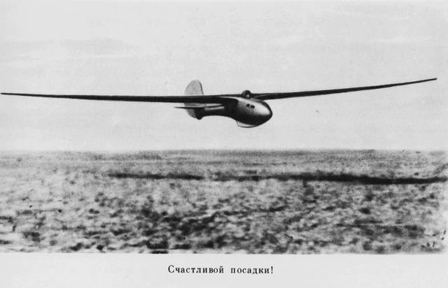

Сесть в МПШ? Вот позор! Ведь я обещал вернуться на свой аэродром, меня ждут!
Высота заметно падает. Хорошо вижу густой лес к юго-востоку от Первомайской.
Тень от гряды далеко за ним. Появляется неприятное чувство напроказившего
учлёта. Высота всё меньше. Уже 700 метров, 600. Но под грядой должен быть,
обязательно должен быть восходящий поток! Нужно стиснуть зубы и идти вперёд.

500 метров.

Облачная гряда уже почти надо мной. Планёр снижается: 400 метров, 300. Вперёд,
вперёд, только вперёд! А глаза уже невольно ищут площадку для посадки. Какие-то
незнакомые поля, перелески, дороги…

Сесть вдали от своего аэродрома? Оставить планёр на какой-то поляне, среди
сбежавшейся любопытной детворы, тащиться пешком до ближайшей дороги, потом
попутным транспортом возвращаться за планёром, разбирать, грузить, везти?
Впрочем, всё это не так страшно, как рассказывать потом снисходительной
аудитории, состоящей из заправских, видавших виды лётчиков и планеристов, как я
на планёре собственной конструкции «упал» за 40 километров от базы, не сумев
выпарить. И в такой-то день! Бррр… Планёр снижается. 250 метров. Качнуло…

Ага! Вперёд, вперёд, там спасение! Стрелка вариометра, наконец, оживает и из
уныло опущенного положения подходит к нулю. Вот она дрогнула еще раз, качнулась
вверх, вниз и наконец радостно задрожала около цифры «1». Закладываю разворот,
а подъём уже полтора метра в секунду. Исчезла тревога, на душе спокойно и
легко. Деревья становятся мельче, снова раскрываются подмосковные дали,
испещрённые, сколько хватает глаз, тенями облаков.

Как прекрасна наша страна!

Вот уже опять 500, 700, 1000 метров. Облака ближе, прохладнее воздух. Бс-5
легко и уверенно идёт по ветру под новой облачной грядой. Вот и родной аэродром
в голубой оправе двух ихлучин Москвы-реки.

- ...А мы уж заждались! Думали, не засел ли ты где-нибудь. Три с половиной часа
  летел.
- Ну что вы! Я ведь всего только слетал на Первомайскую и обратно. Держит хорошо!

И с независимым видом подающего надежды скромного молодого пилота я привязываю
тросом свой Бс-5 к крюку автомашины.

### НЕСМОТРЯ НИ НА ЧТО

1939

Планёрный завод, в течение восьми лет исправно снабжавший нашу страну планёрами
всех типов, был закрыт незадолго до Отечественной войны.

Парк планёров перестал пополняться новыми машинами, а старые постепенно
выходили из строя. С той весны 1937 года, когда неугомонный Расторгуев трижды
подряд побил абсолютный рекорд дальности полёта на планёре Г № 7 конструкции
Грошева, доведя его до 652 километров, а Виктор Ильченко пролетел с пассажиром
407 километров на «Стахановце» Емельянова, спортивная работа всё больше
замирала. Построен¬ные в последний год работы завода пять рекордных планёров
«Рот-Фронт-7» летали редко. Руководите¬ли аэроклуба проявили к планеризму
полное равнодушие.

— Тебе хорошо,—говорили пилоту, рвавшемуся в рекордный полёт,— ты разобьёшься —
с тебя и взятки гладки, а нам по выговору дадут!

Когда 18-летняя комсомолка Оля Клепикова подала заявление на рекордный полёт,
начальник аэроклуба совсем оторопел. Не знаю, какие меры он принял, чтобы
избежать перспективы возможных взысканий и утомительных хлопот по заказу
траурных венков и катафалка, но Оля стартовала и пролетела более 380
километров, установив новый женский международный рекорд дальности полёта на
планёре.

Прежний рекорд, принадлежавший немецкой планеристке Ганне Рейтш, личному пилоту
Гитлера, которую фашистская пропаганда произвела в «сверхчеловеки», был побит.

6 июля 1939 года Оля, проявив редкую напористость, вновь преодолела вязкое
сопротивление любителей спокойной жизни и, несмотря ни на что, в 10 часов утра
поднялась на буксире за самолётом П-5. Отцепившись на высоте немного менее 1000
метров над центром Тушинского аэродрома, она набрала ещё 300 метров и взяла
курс на юго-восток, по направлению господствующего ветра, вдоль редких гряд
зарождавшихся кучевых облаков. Проходил час за часом, а известий от Оли не
поступало. Ильченко, выпускавший её в полёт, сдержанно волновался.

- Чего вы беспокоитесь? — посмеивался начальник аэроклуба.— Ищите за
  Москвой-рекой, тут она и сидит где-нибудь!

Наступил вечер. Известий по-прежнему не было никаких. На другой день ясным
тёплым утром я шёл мимо неуклюжего здания Центрального аэроклуба. Навстречу —
сияющий Ильченко:

- Есть телеграмма! Хорошо пролетела, километров четыреста, а то и больше!
- А где села?
- Совхоз «Отрадное», близ хутора Михайловского, за Доном, в районе Волги.
- Как «за Доном, в районе Волги»? Так это все семьсот будет, а не четы-реста! А
  вы смотрели по карте?

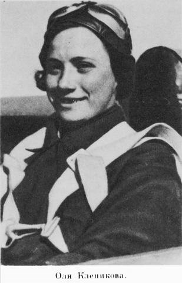

Ильченко бегом мчится обратно. Через минуту я слышу дробный стук сапог по
мраморной лестнице. Стеклянная дверь вестибюля распахи-вается, чуть не срываясь
с петель...

— Всем морду набила! И нам морду набила! Ай да молодец Оля! Ай да она! Больше
семисот километров прошла! Вот это здорово!

Точные расчёты, сделанные для утверждения рекорда, показали, что Ольга
Клепикова прошла за 8 часов 25 минут 749,203 километра, побив на этот раз
рекорд немецкой планеристки на целых 400 километров, то есть больше, чем вдвое.
Самое замечательное то, что при этом она побила и мужской рекорд дальности
полёта на планёре почти на 100 километров, осуществив, таким образом, свою
заветную мечту. Пришлось парням всего мира проглотить горькую пилюлю.

Только двенадцать лет спустя, в 1951 году, американцу Джонсону удалось
пролететь 861 километр и восстановить, хотя и с опозданием, подмоченную
репутацию «сильного» пола, а женский рекорд дальности так и остался непобитым
до сих пор. Особенное удовольствие всем нам доставило растерянно улыбающееся
лицо начальника аэроклуба, который с букетом цветов встречал Олю на аэродроме и
первый поздравил её с беспрецедентной победой. Что поделаешь — служба!

### УКРАДЕННЫЙ ПРОФИЛЬ

1939

В 1939 году заправилы третьего рейха во главе с бесноватым фюрером с целью
запугать советский народ решили показать нам подготовленный для «молниеносной
войны» свой бронированный кулак. На центральном аэродроме в Москве приземлились
«мессершмитты», «юнкерсы», «хейнкели», «арадо» и другие боевые самолёты. С ними
прилетел и трёхместный связной «Шторьх» — Fi-156. Самолёт отличался
замечательными взлётно-посадочными качествами. Высоко расположенное подкосное
крыло было снабжено предкрылками и закрылками. При опускании закрылков элероны
тоже немного опускались, увеличивая общую подъёмную силу крыла. Было принято
решение построить такой же самолёт у нас. В марте 1940 года я отправился в
Ленинград, куда вскоре прилетел и «Шторьх», который должен был послужить для
нас образцом.

Вернувшись из командировки в Москву, я нашёл самолёт уже стоящим в сборочном
цехе ОКБ. Самое интересное, конечно, крыло. Ведь именно оно обеспечивало, в
основном, этому самолёту необыкновенно высокие взлётно-посадочные качества. В
нём главный секрет! Предкрылки — во всю переднюю кромку. Закрылки и зависающие
элероны — во всю заднюю. Так всё и должно быть. Иначе из крыла не выжмем
высокого Су!

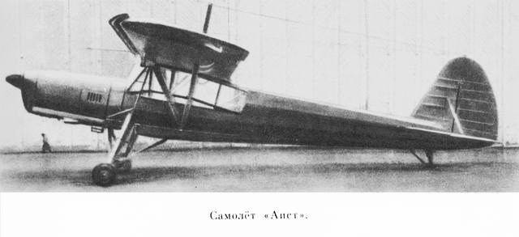

Но какой у него профиль? Становлюсь на табурет и бросаю взгляд вдоль крыла.
Профиль виден совершенно отчётливо.

- Товарищи! Так ведь это наш, советский профиль крыла, P-II, или, вернее, P-IIc
  Петра Петровича Красилыцикова — одного из старейших научных сотрудников ЦАГИ!

Вот так неожиданность! Создание этого профиля и эксперименты с ним описаны в
выпуске «Трудов ЦАГИ» № 103 за 1932 год. Профиль P-II использован на планёрах
Ус-3, Ус-4, «Упар», ДИП, Г-9, КИМ, «Стахановец» и на многих других. P-IIc (с
закрылком) — на планёрах «Рот-Фронт-1», «Рот- Фронт-2», «Рот-Фронт-4»...

- Не может быть! — шумят конструкторы. — Это невероятно! Чтобы фашисты,
  презирающие советскую науку, считающие нас недочеловеками, кичащиеся своим
  мнимым превосходством, втихомолку обкрадывали эту самую «презренную»
  советскую науку?!

Профили крыльев всегда считались в авиации чем-то вроде интернационального
достояния. Мы, планеристы, часто использовали, кроме профилей ЦАГИ, профили,
исследованные в лаборатории немецкого учёно¬го Прандтля: «Геттинген-426, 533,
534, 535» и др. Профиль «Геттинген-527» был использован С. П. Королёвым и С. Н.
Люшиным для крыла планёра «Коктебель». В ходу были профили лаборатории инженера
Эйфеля (создателя Эйфелевой башни), английские RAF и др. Описывая конструкцию
планёра, мы всегда давали сведения о профиле крыла. Позаимствовал — сообщи у
кого, откуда. Правило, существующее во всём цивилизованном мире...

— А ну-ка давайте измерим длину хорды крыла!

Приносят инструменты, измеряют. Она оказывается довольно странного размера —
1825 миллиметров. Видно, дотошные немецкие конструкторы ни одним миллиметром не
поступились против вычисленного ими «оптимального» размера.

— Подсчитайте ординаты профиля P-IIc при длине хорды 1825 миллиметров и
сделайте разъёмный шаблон.

Через два часа мне позвонили: «Шаблоны готовы, сейчас будем примерять».

Я быстро спустился в цех. Приставили нижнюю часть шаблона, приставили верхнюю.
Контур шаблона лёг на контур профиля крыла без всяких зазоров. Раздались
удивлённые восклицания, посыпались шутки, насмешливые комментарии. Досталось и
арийской науке, и фашистской фанаберии.

Теперь стало ясно, почему ни в каких описаниях самолёта мы не находили ни
малейших указаний на профилировку крыла. Ни малейших! Уже после разгрома
фашизма в Берлине среди дымящихся развалин библиотеки авиационного института
были найдены тщательно собранные по всему свету, в том числе и краденые,
советские научные книги и издания...

### КРЫЛЬЯ ТАНКА

1941-1942

Каждая сводка Информбюро, сообщавшая об огромном и всё возрастающем размахе
партизанского движения в тылу гитлеровской армии, вероломно обрушившейся на
нашу Родину, настойчиво будила всё одну и ту же мысль:

Как помочь нашим партизанам?

Как доставить им наряду с лёгким вооружением — мотоциклами, пулемётами, ручными
гранатами и миномётами — более мощное оружие?

Грузовые планёры ПЦ-3, Г-11 и А-7 перелетали по ночам линию фронта и везли всё,
что могли, но они не в состоянии были взять на борт даже самую лёгкую танкетку.

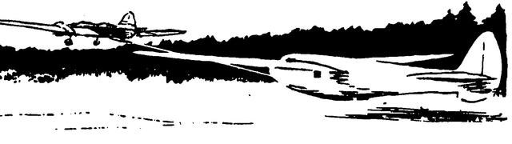

Для того чтобы вместить танк внутри фюзеляжа планёра, пришлось бы строить
аппарат такой величины, что его не поднял бы в воздух даже самый мощный
самолёт-буксировщик. Оставалось одно радикальное и простое решение: приделать
крылья к самому танку, сэкономив на габаритах и весе, а лётчика сделать и
танкистом, чтобы управлять этим гибридом и на земле и в воздухе с сиденья
водителя бронированной машины. Корпус танка необычайно прочен — выдержит любые
нагрузки. Крылья и хвостовое оперение как целый агрегат сбрасывать сразу после
посадки одним движением рычага. Лёгкий обтекатель корпуса танка можно и не
сбрасывать — он останется в первом же кустарнике.

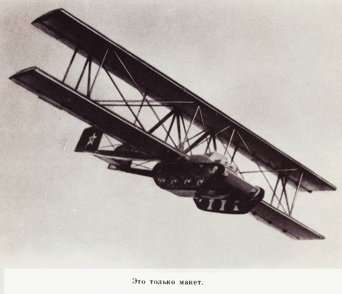

Так родился КТ — «крылатый танк». Родился в трудных условиях военного времени в
краткие сроки, диктуемые обстановкой яростного наступления врага. В Тюмени,
куда был эвакуирован Планёрный завод, на котором мы успели построить опытный
экземпляр грузового планёра А-7, в случайных, едва приспособленных помещениях
рынка, пивоваренного завода и складов небольшой коллектив, возглавляемый
Белковым, Эскиным, Шахатуни, Синягиным, с горсткой рабочих и мастером
Назаровым, недосыпая, недоедая, в холодных цехах в суровую зиму 1941 — 1942
года в кратчайший срок построил КТ. Неутомимый Саша Эскин, научившись управлять
лёгким танком Т-60, проехал на нём по улицам Горького до железнодорожной
платформы, до¬ставил его в Тюмень прямо во дворик наших мастерских. Сложной
задачей было просверлить в крепчайшей броне танка отверстия для узлов крепления
бипланной коробки крыльев с оперением. Преодолели и эту трудность. Наконец КТ
готов и доставлен на подмосковный испытательный аэродром.

Неизменный Анохин, уже известнейший к тому времени лётчик-испытатель боевых
самолётов, учится управлять танком, обживается на новом «пилотском месте»
внутри танка, осваивает управление рулями планёра, привыкает к непривычно
малому обзору.

Но выдержат ли гусеницы танка взлёт на скорости 115 километров в час? Ведь
максимальная скорость танка без крыльев всего 50 километров в час. При
увеличении скорости в 2 1/2 раза сильно возрастают центробежные силы,
разрывающие траки. Специалисты ЦАГИ проверяют наши расчёты.

Заключение: должны выдержать!

Буксировать КТ самолётом поручено лётчику-испытателю Нюхтикову, в прошлом —
участнику многих планёрных слетов, испытавшему в воздухе не один планёр, а
теперь выруливающему на дорожку на тяжёлом бомбардировщике А. Н. Туполева ТБ-ЗФ
с четырьмя мощными двигателями Микулина AM 34-РН. Самолёт величественно
разворачивается, слегка покачиваясь на неровностях аэродрома, и занимает место
на полосе. Попыхивая голубоватой дымкой, подкатывает КТ, ведомый человеком
новой, небывалой ещё профессии — лётчиком-танкистом Сергеем Николаевичем
Анохиным. ТБ-3 и КТ выстраиваются в кильватер в начале взлётной полосы.
Буксирным тросом служит толстенный, почти дюймового диаметра трос, добытый
Сашей Эскиным из лифта заброшенного дома. КТ без обтекателя. Решили в первый
полёт его не ставить, чтоб не задерживать эксперимент. Сигнал стартёра. ТБ-3
начинает разбег.

Сначала пробежки. 100 километров в час, 110 километров в час. Наконец 125
километров в час. Гусеницы надрывно визжат и гремят по бетону, как выстрелы
спарки из двух крупнокалиберных пулемётов.

Остановка. Всё в порядке, можно идти на взлёт. День ясный, видимость отличная.
Фашистская авиация не беспокоит. Совсем недавно Марк Галлай показал, как
лётчики-испытатели умеют при случае защищать свою лётную базу — спустил на
землю бомбардировщик «Дорнье-215».

Начинается разбег. Буксирный трос натянут, как струна. КТ отделяется от земли
раньше ТБ, и понятно, ведь у него нагрузка на квадратный метр крыла меньше, да
и закрылки приопущены.

Вслед за этим отделяется от полосы и буксировщик. Ревут двигатели, поезд
проносится мимо нас и, медленно набирая высоту, скрывается от наблюдателей за
высокими соснами близлежащего леса. Проходят минуты, проходит 10 минут, а
поезда не видно. Если бы всё было хорошо, Нюхтиков, подняв КТ на достаточную
высоту, уже вернулся бы на аэродром, а вслед за ним спланировал бы и Анохин на
КТ. Но их нет... Наконец минут через 20 появляется и заходит на посадку ТБ. А
где же крылатый танк?

Самолёт заруливает. Из него выходит Нюхтиков и докладывает руководителю
полётов.

— Тянуть КТ оказалось нелёгким делом. Набор высоты продолжался на взлётной
мощности двигателей. Скорость полёта с таким тормозом на хвосте, как КТ, была
небольшой. Двигатели начали греться. Скоро температура масла достигла предела.
В это время воздушный поезд про-летал невдалеке от соседнего аэродрома, и я дал
команду Анохину на отцепку. Мой ТБ как будто из хомута выскочил,— заметил
Нюхтиков.

Анохин отцепился, перевёл КТ в режим планирования и развернулся на аэродром.
Нюхтиков видел, что посадка произведена благополучно у посадочного «Т».
С точки зрения аэродромной команды это явление выглядело не столь идиллически.

Вот что рассказал Сергей Николаевич, вернувшись на базу:

— Взлетели нормально, прошли над лесом. Вижу, Нюхтикову приходится туго, ТБ
летит с трудом, разворачивается «блинчиком», с минимальным креном. Пролетели
километров пятнадцать, идём недалеко от другого аэродрома. Нюхтиков даёт
команду: отцепляйся!

Дёрнул рукоятку буксирного замка, отцепился. КТ спокойно планирует, нормально
слушаясь рулей и элеронов. Разворачиваюсь на аэродром, опускаю закрылки, целюсь
на травку рядом с полосой, подхожу как раз к началу, выравниваю машину и вдруг
вижу, как аэродромная команда опрометью бросается от посадочного «Т»
врассыпную, кто куда. Заканчиваю пробег, останавливаюсь, завожу двигатель и
своим ходом, не сбрасывая крыльев, иду к КП, а сам посмеиваюсь.

Команда, увидев планирующий на них крылатый танк, о существовании которого они,
естественно, ничего не знали, решила, что это аппарат вра-жеский, с виду весьма
не безобидный, и бросилась наутёк. Что же удивительного, ведь вооружённый до
зубов враг, хвалившийся разным «секретным оружием», в те дни был близёхонько от
Москвы. Всего можно было ожидать!

К концу рабочего дня ведущий инженер-испытатель Кузнецов обсуждал на совещании
у начальника испытательного института результаты первого полёта КТ и самый
сложный вопрос: как доставить его обратно? Соседний аэродром, на который сел
Анохин, был недостаточен для взлёта поезда.

Все способы доставки казались долгими, сложными и, конечно, трудоёмкими.

В это время под окнами кабинета послышалось урчание и лязг гусениц.

Александр Павлович Эскин, по полям, вокруг деревенек, задами, по берегу реки,
разобрав несколько заборов, своим ходом вернулся на КТ с крыльями и хвостом на
место взлёта.

Последовала немая сцена почти по Гоголю, а затем весёлые шутки и смех.

Итак, крылатый танк летал. Буксировка его за мощным самолётом была возможна,
тем более, что, стремясь поскорее проверить самую идею, мы выпустили КТ в
первый пробный полёт без обтекателей, которые должны были значительно снизить
воздушное сопротивление угловатого, плохо обтекаемого, увешенного гусеницами
танка. Крылатый танк летал и сослужил бы немалую службу нашим героическим
партизанам, если бы... Если бы не война. Тяжёлых бомбардировщиков ТБ-3 было
сравнительно немного, и, активно участвуя в военных действиях, они постепенно
вышли из строя. Буксировать КТ было нечем, и заманчивую идею пришлось оставить
из-за отсутствия тягла.

### НА «БЛАНИКЕ»

1960

Простой, хороший планер из народной Чехословакии. «Толковый», как говорят у нас
про ясно задуманную, отлично сработанную вещь.

Мы с рекордсменом Украины и Союза Вячеславом Ефименко кружим над нашим
аэродромом. Сразу же после взлета на буксире за самолётом Як-12 Вячеслав
передал управление мне и сидит в непривычном положении – без дела – и лишь
критически наблюдает, как я скоблю высоту, постепенно приближаясь к
Брест-Литовскому шоссе.

Молодцы товарищи из Чехословакии! Сделали прекрасный планер и продают его всему
миру. Покупаем и мы. Но где же планеры Емельянова, Грошева, Шереметева,
Пьецуха, Кузакова и десятков других конструкторов? Что случилось?

С 1923 и до 1939 года на слёты планеристов привозили планеры, построенные во
всех уголках страны. Строили инженеры, техники, студенты; строили рабочие,
любившие и изучавшие авиацию. Строили колхозники… Строили много и строили
правильно, разумно. Планеры летали порою очень хорошо. В Советском Союзе не
было ни одной катастрофы с планерами, построенными любителями.

С тех пор неизмеримо выросла культура советского народа. Огромные успехи
сделало техническое образование. Наша страна вышла на первое место в мире по
ряду главнейших направлений науки.

Даже на самой далекой окраине нашей необъятной страны, где когда-то, по
выражению Ленина, «господствовала полудикость и самая настоящая дикость»,
теперь летают самолеты и вертолеты, ходят теплоходы и вереницы машин. В
сельском магазине продают первоклассные радиоприемники, зубную пасту, книги
Толстого и Хемингуэя, географические атласы и справочники по инженерному делу.
А в крупнейшем индустриальном центре студенты авиационного ВУЗа не могут
построить не только маленький самолет, но и планер, так как, по мнению
отдельных чересчур осторожных людей, институт, выпускающий авиационных
инженеров, недостаточно оснащен, а его коллектив недостаточно опытен, чтобы
решать такие задачи.

Уж если быть последовательными, так надо из осторожности запретить и
мотоциклетные гонки, и альпинизм, и купанье в реках и морях, и бокс: могут ведь
свернуть нос на сторону!

А я за расквашенные носы! За ссадины на коленках! За мозоли на руках! И за
разорванные штаны!

Почему наше Добровольное общество содействия армии, авиации и флоту содействует
чему угодно, но только не массовому распространению любительского
конструирования в авиации – этой ничем не заменимой школе будущих авиационных
специалистов?

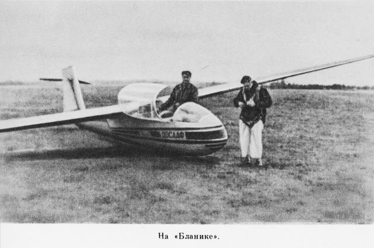

Давно пора устранить разные чересчур осторожные ограничения, решительно
упростить слишком сложные, граничащие с запретом технические требования к
самодеятельным инженерным сооружениям, организовать постройку планеров и лёгких
самолётов в кружках, клубах и на заводах, в вузах, в мастерских.

Ищите, стройте, ошибайтесь, исправляйте ошибки, оттачивайте своё умение
обращаться с материалом, инструментом, счётной линейкой и кистью! Учитесь быть
организаторами не только на собраниях, но и на работе, на деле!

Стройте, летайте! Не бойтесь борьбы и трудностей! Старайтесь летать дальше,
выше, быстрее всех! И пусть за вами семенят бледнеющие от страха
перестраховщики и пищат тоненькими голосами:

- На посадку! У вас не хватает одной заклепки в креплении кармашка для очков!

### СТОИЛО ЛИ СОЗДАВАТЬ АН-2?

1940

Сейчас этот вопрос может, пожалуй, показаться несколько праздным. В самом деле,
на Ан-2 лётчики, воздушные труженики Аэрофлота, производят 96 процентов всех
авиахимических работ в Союзе, обработав за время существования самолёта более
одного миллиарда гектаров; самолётом Ан-2 перевозят ежегодно 19—20 миллионов
пассажиров! Он продолжает работать на 3449 воздушных линиях СССР, доставляя
людей, грузы, почту, больных и врачей, геологов, полярников и исследователей.
До сих пор Ан-2 самый высокопроизводительный и, как заявили американские
эксперты,—лучший в мире сельскохозяйственный самолёт. Почему же Ан-2 получил
такое широкое распространение у нас и в ряде других стран?

Думаю, он обязан этим прежде всего своим лётным качествам: короткими взлётными
и посадочными дистанциями, простотой пилотирования и эксплуатации,
неприхотливостью к аэродромам.

Эти качества обеспечиваются высокой механизацией крыльев: подвижными
автоматическими предкрылками во всю переднюю кромку верхне¬го крыла, щелевыми
закрылками вдоль всей задней кромки верхних и нижних крыльев и щелевыми
«зависающими» элеронами. Когда все закрылки опускаются («зависают»), вместе с
ними, на несколько меньший угол, опускаются и элероны, участвуя в создании
«закрылочного» эффекта.

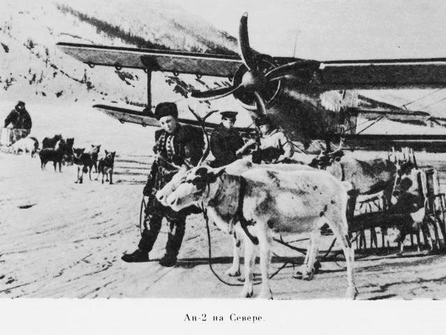

Вся эта схема долго вынашивалась и обсчитывалась мною ещё до войны, а потом
урывками по вечерам после напряжённой работы на заводе в трудные военные годы.
Я вновь перечитывал классические книги Б. Н. Юрьева «Индуктивное сопротивление»
и «Воздушные винты», «Динамика полёта» В. П. Ветчинкина и работы П. П.
Красильщикова по разрезным крыльям.

Как до, так и особенно во время Великой Отечественной войны шла битва за
скорость. Скорость, маневренность, огневая мощь определяли успех в яростной
схватке с врагом. КБ Александра Сергеевича Яковлева, где я работал в то время,
нередко посещали фронтовые лётчики с тёплыми словами благодарности за самолёты
«Як», за их всё возрастающую огневую мощь, высокую манёвренность, за крепкую
бронеспинку и прочные бронестёкла, не раз спасавшие их от пулемётного огня и
осколков снарядов. В их глазах, глазах людей, ежедневно видящих смерть,
светилось одно желание — победить! Одно стремление — догнать! Одна тоска —
тоска по ещё большей скорости. И скорость истребителей беспрерывно росла,
достигнув ко времени разгрома гитлеровского рейха 700 и более километров в час.
А с ними не переставая росли длины разбега и пробега самолётов, потребные
размеры взлётно-посадочной полосы.

Самолёт, который мог бы обслуживать в послевоенное время огромные просторы
нашей Родины, должен был пользоваться самыми скромными, наспех сооружёнными
аэродромами. Волей-неволей нужно было вернуться к малым скоростям полёта. Для
полёта на короткие расстояния скорость даже 200 километров в час по сравнению с
гужевым транспортом и даже автомобилем была не так уж плоха. Что касается
авиационно-химических работ, то там скорости свыше 160 километров в час даже
вредны.

Сравнивая схемы биплана и моноплана, я убедился, что моноплан той же
грузоподъёмности, обеспечивающий те же длины разбега и пробега, будет
громоздким и более тяжёлым. Ничем не опороченная схема биплана, позволяющая
получить большую суммарную площадь крыльев при умеренном размахе и весе,
казалась мне наиболее заманчивой. Из небольшой книжки «Трудов ЦАГИ» по
испытанию модели самолёта Р-5 с работающим винтом я узнал, какое большое
положительное влияние оказывает обдувка струёй винта на лётные качества
самолёта-биплана, что ещё более укрепило меня в правильности выбранной схемы.

По укоренившемуся после войны довольно широко распространённому поверхностному
суждению моноплан символизировал скорость и прогресс, а биплан отождествлялся с
«летающими этажерками» первых лет авиации. Однако в истории авиации биплан
сыграл выдающуюся роль. Была пора расцвета бипланов, приходящаяся на первую
мировую войну и последующую эпоху.

Длительное превалирование схемы биплана было не только исторически, но и
технически оправдано. Классический биплан «Брегэ XIX- А2» совершал в 20-х годах
перелёты дальностью до 6000 километров, расходуя всего по 400 грамм топлива на
километр.

Замечательные бипланы Н. Н. Поликарпова И-15, сражавшиеся в небе Испании, и,
наконец, По-2, просуществовавший в авиации 35 лет, были не только удачными
конструкциями; они отвечали определённым возможностям техники и потребностям
своего времени.

Но, может быть, их время прошло? Такой вопрос никогда не возникал у меня.
Инженер, создавая проект, не должен ничего принимать «на веру», отбросить
всякие ходячие предрассудки и даже собственные склонности и симпатии и, только
трезво анализируя задание, считать, сравнивать, хладнокровно и обоснованно
выбирать лучший вариант. Меня не смущало и то, что самый первый проект самолёта
типа Ан-2, сделанный мною ещё в Ленинграде, был забракован экспертами в феврале
1941 года.

> ...Проект самолёта в варианте транспортно-санитарного не удовлетворяет
> требований в части мотора и схемы.
>
> ...Для десантных целей самолёт не пригоден, т. к. не имеет вооружения и
> приспособлений для подвески военных грузов, а также малы грузоподъёмность,
> максимальная скорость и дальность...

Перед войной скорость даже 300 километров в час, обещанная мною в проекте,
казалась уже недостаточной. Скорость была чуть ли не единственным критерием при
оценке любого проекта.

Нет, меня это не смущало, скорее воодушевляло, т. к. жестокая военная
действительность внесла свои коррективы. Скорость 300 километров в час для
грузового самолёта с очень высокими взлётно-посадочными качествами показалась
экспертам недостаточной, а боевая обстановка заставила широко применять самолёт
По-2 с крейсерской скоростью 111 километров в час и очень небольшой
грузоподъёмностью. Поэтому, вскоре после окончания Великой Отечественной войны,
я, отпросившись в Новосибирск ради перспективы самостоятельной конструкторской
работы, вновь отправил на экспертизу проект грузового самолёта-биплана высоких
взлётно-посадочных качеств с двигателем АШ-62ИР со взлётной мощностью в 1000
л.с.

В октябре 1945 года я уже от другой группы специалистов получил снова
отрицательное заключение, некоторые пункты которого стоит привести:

Не предусмотрен планом опытного строительства; внеаэродромный самолёт
предусмотрен с мотором 200 л. с.; местные внеаэродромные линии не могут
обеспечить его систематическую полную загрузку (1000 кг или 10 пассажиров);
мотор АШ-62ИР не пригоден для эксплуатации во внеаэродромных условиях и слишком
дорог для массового типа самолёта...

Впрочем, в этом заключении был один пункт, с которым я согласился:
необходимость перехода от фюзеляжа из стальных труб с полотняной обтяжкой к
целиком металлической дюралевой конструкции. В остальном проект остался без
изменений, и мы с горсткой конструкторов, в которой не было и десяти инженеров,
с молодыми выпускниками Сибирского авиационного техникума продолжали работу над
проектом.

Я обратился за поддержкой к весьма уважаемому мною человеку — автору многих
остроумных и выдающихся исследований по аэродинамике и конструкции самолётов.
Увы.

13 февраля 1946 года пришёл очень дружеский, но неутешительный ответ:

> «...Сообщаю Вам своё мнение и замечания по поводу Вашего проекта грузового
> самолёта с высшими взлётно-посадочными качествами. Мне кажется, что вопрос
> состоит в том, целесообразно ли строить самолёт с особо высокими
> взлётно-посадочными качествами и коммерческой нагрузкой в 1000— 2000 кг.
>
> Высокие взлётно-посадочные качества покупаются не только аэродинамикой, а и
> большим запасом мощности или большим недогрузом самолёта. Мне кажется, было бы
> нецелесообразно и, может быть, нереально строить самолёты весом 5—6 т,
> рассчитанные на работу вне аэродромов...»

Далее следовали две страницы убедительных расчётов, основанных на обширной
статистике существовавших самолётов.

Существовавших. Но ведь авиация всегда развивалась за счёт появления самолётов,
не существовавших ранее. Конструктор всегда стремится не уложиться в статистику
прежних самолётов, а выйти за её рамки. Верно, что и предельно механизированные
бипланы до сих пор не имели практического применения. Но ведь это не абсолютный
закон природы! Исход дела решила краткая резолюция Генерального конструктора А.
С. Яковлева, руководившего тогда, как и во время войны, строительством опытных
самолётов: «Это интересный самолёт, его надо построить...»

Эти шесть слов решили дело. В мае 1946 года пришло задание правительства на
создание сельскохозяйственного самолёта, прекрасно вписывавшееся в концепцию
Ан-2. Правда, по настоянию мотористов от меня потребовали применить другой
двигатель в 720 л. е., вместо 1000 л. е., по соображениям чисто
производственного характера. На мои настойчивые просьбы сохранить нужную мне
мощность в 1000 л. с. я наконец получил в октябре 1946 года такой ответ:

> «Выпуск на заводские испытания вашей машины следует произвести мотором
> указанным утверждённом плане тчк изменение предлагаемого вами нового мотора
> может быть разрешено только после отработки основного варианта наличии времени
> на дополнительную работу».

Ничего не поделаешь, пришлось сделать два варианта самолёта: с мотором в 720 и
с мотором в 1000 л. с. Силовые установки были спроектированы взаимозаменяемыми.
В разгар постройки, в январе 1947 года, пришло ещё одно требование создать на
базе сельскохозяйственного самолёта другой вариант, иначе самолёт не будет
включён в план 1947 года.

Ничего не поделаешь, пришлось согласиться и проектировать ещё и другой вариант.

Наконец 27 августа 1947 года докладываю министру о готовности к лётным
испытаниям самолёта в сельскохозяйственном варианте с двумя сменными
винто-моторными группами: 720 и 1000 л. с. 31 августа 1947 года
лётчик-испытатель Павел Никитович Володин сделал первый вылет на самолёте СХ-1,
как он тогда назывался... В конце года самолёт прошёл государственные испытания
с обеими силовыми установками. Был без колебаний принят двигатель АШ-62ИР в
1000 л. с.

Вскоре самолёт был запущен в серию на заводе в столице Украины под
наименованием Ан-2. Теперь, 30 лет спустя, следовало бы поставить другой
вопрос: а не пора ли создать новый самолёт взамен Ан-2? Действительно, техника
за 30 лет шагнула далеко вперёд. Появились газотурбинные двигатели, работающие
на керосине, более лёгкие и надёжные, чем поршневые. Даже простая замена
силовой установки Ан-2 на газотурбинный двигатель может дать снижение расходов
на обработку одного гектара сельскохозяйственных угодий на 20—25 процентов и
более чем в полтора раза увеличить производительность самолёта. Значит, стоит
потрудиться. И наш коллектив снова работает вместе с создателями двигателя. Это
в сельском хозяйстве. А на чём возить пассажиров на местных воздушных линиях
Аэрофлота, в области, в районе, на селе? Новые населённые пункты растут по всей
стране, как грибы после дождя. Аэрофлот осваивает всё новые и новые аэродромы.
Часто в пересечённой местности, с ограниченной длиной. Травяные, снежные,
песчаные, иногда галечные. Нужен новый самолёт взамен Ан-2. Более
комфортабельный, более скоростной, более надёжный, с двумя силовыми
установками, способный садиться на те же аэродромы, на которые садится Ан-2.
Иначе не вытеснить старину Ан-2 из эксплуатации. И над этим тоже стоит
поработать...

Пока что вернусь ненадолго к довоенным похождениям планеристов, которые
поначалу в спешке просто пропустил, а потом продолжу о послевоенных работах в
большой и очень большой авиации.

### ВОЛШЕБНАЯ КРАСКА

1930

Известно, что маляр вершит дело. Как окрасить наше дорогое создание, наш первый
«рекордный» планёр, наш «Город Ленина»? Столько вложено труда и пыла в этот
конгломе¬рат дерева, стали и полотна! Хочется, чтобы он был прекрасен, как
мечта о полёте.

...Крылья обшиты упруго согнутой берёзовой фанерой, зашкурены до девственной
чистоты и притягивают взгляд причудливыми разводами древесных узоров. Покрытое
первыми слоями бесцветного аэролака, тугое, остро пахнущее грушевой эссенцией
полотно так и просится под краску, под широкую кисть, под флейц. Но где взять
её, ту единственно подходящую для этой цели, необыкновенную, волшебную краску?
Тридцатый год. Второй год первой пятилетки. Первые шаги советской химической
промышленности. Острая нехватка всего, что нужно для стройки, и красок,
разумеется, в том числе.

В магазине «Лакокраска», увы, ни красок, ни лака, сколько-нибудь подходящих для
нас, не оказалось. Коричневые, чёрно-зелёные, буро-красные, тускло-рыжие тона.
Знаменитая «слоновая кость», больше напоминавшая по цвету ощипанную курицу, чем
полированную поверхность бивней благородного животного. Как всё это не подходит
для обтекаемой, стремительной птицы-планёра, раскинувшего свои узкие крылья без
малого на двадцать метров! А хочется покрасить его в нежно-сизые, голубоватые,
кремовые цвета, проведя лишь вдоль фюзеляжа яркую нарядную полоску и строчку с
гордым названием «Город Ленина». Привитая революцией, всей атмосферой великой
стройки привычка всё делать своими руками и здесь сыграла свою роль. Собрав
всё, что казалось нам сколько-нибудь подходящим, приступаем к составлению
красочных смесей. Прибавляем к «слоновой кости» немного синей краски; голубого
цвета не получается, получается скорее что-то мышиное. Немножко подозрительного
краплака — и смесь приобретает грязно-фиолетовый оттенок. Добавив чуточку
жёлтого хрома, окончательно убеждаемся, что на основе пресловутой «слоновой
кости» нельзя получить того волшебного сизо-голубого цвета, который встаёт в
нашей памяти при воспоминании о каменных грядах страны голубых гор — заветной
страны планеристов.

В основу нужна белая краска, чистая белая краска! Но как её найти? После долгих
поисков где-то на задворках Гостиного ряда, в сомнительной лавчонке, у ещё
более сомнительного частника находим эмалевую краску, которую только на
радостях да в вечерних ленинградских сумерках можно признать за белую. — Первый
сорт, душа мой! Табурет покрасишь, стол покрасишь — жена не узнает! Доволен
будешь, бери, душа мой! Плати деньги, спасибо скажешь, не сомневайся, опять
придёшь!

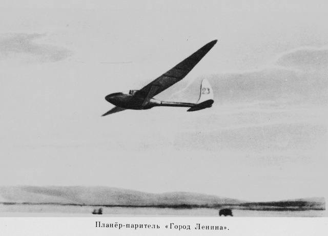

Оставив в лавочке припасённые на ужин деньги, мчимся в мастерскую и с бьющимся
сердцем снова приступаем к красочному пиру. На этот раз со дна жестяной банки
нам на-чинают улыбаться более светлые, более радостные оттенки. Наконец
вспыхивает та чудесная, единственно возможная сизо-сиреневая краска, которую мы
единодушно признаём достойной покрыть нашего первенца. Широкая кисть ныряет в
жидкую массу и сочным шлепком ложится на сухие упругие бока каплеобразного
фюзеляжа. Ломавшие форму темноватые стыки листов фанеры, полосы и пятна,
неизбежные следы долгой, порой ночной работы бледнеют, сглаживаются, пропадают
под ровным слоем голубиной краски. Разделённые фактурой и цветом, плохо
вязавшиеся между собою объёмы срастаются, приобретая чеканную выразительность
задуманного крылатого единства. Дрожа от возбуждения, мы кроем и красим. Ноют
плечи, деревенеет спина. Моргает сонными цыганскими глазами мой железный
помощник Володя Денисов. Подкошенный крепким сном, уткнул свой орлиный нос в
лежащий прямо на паркетном полупоходный тюфячок наш главный «доставала» Володя
Зархи. Тускнеет свет электрических ламп. В лучах занимающегося рассвета
вспыхивает золотом Адмиралтейская игла. В высоком двухсветном зале второго
этажа, в здании бывшего царского военного министерства, что рядом с Исаакием,
сереет стремительный силуэт планёра, вымахнувшего своё крыло через открытое
окно и дворик в соседнее помещение. Стоит пустой бидон из-под краски. Брошены
на лист бумаги измученные, взъерошенные кисти. В распахнутое окно начинает
пробиваться неяркое ленинградское утро. Лёгкий ветерок шелестит уголком плаката
«Что ты сделал для Воздушного Флота?».

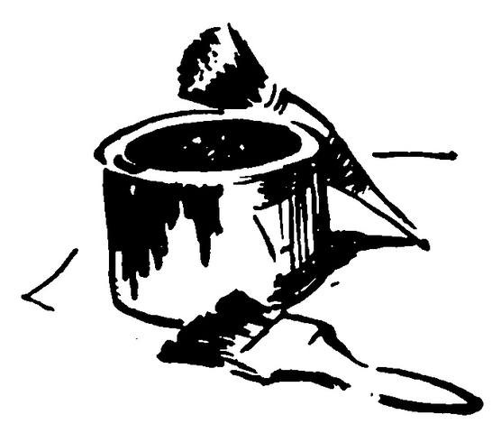

А в мастерской четверо друзей спят там, где застал их сон, спят крепко, как
львы после удачной охоты... Днём планёр оказался более розового оттенка, чем
при электрическом свете. А через три дня, когда вытащили его во двор, мы с
удивлением обнаружили, что он даже не розовый, а скорее бежевый, переходящий
местами в «кофе с молоком». В Москве крылья стали почти шоколадными, а фюзеляж
потемнел до серовато-синего.

В Харькове крылья неожиданно пожелтели, а на подходе к Феодосии под ярким южным
небом начали вдруг отсвечивать зелёным. Краска, которой был покрыт фюзеляж, как
будто не желая попасть в отстающие, бодро темнела, переходя в густо-синий.
Таким и испытал его пионер советского планеризма лётчик Арцеулов.

Следующие три недели принесли нам немало сюрпризов. Ложась спать, мы гадали и
спорили: какого цвета будет планёр завтра?

В последние дни слёта, когда уже терялась последняя надежда на ка¬кое-либо
достижение, в бурный октябрьский день наш пилот Адольф Карлович Иоост решился
на отчаянную попытку: обогнуть с юга, со стороны моря, гору Кара-Даг, с тем,
чтобы выйти на заветный «южный маршрут» вдоль Крымского побережья с целью
установить рекорд дальности полёта.

Стоя над крутым южным склоном горы Клементьева, наклонившись против упругой
громады, ветра, мы с волнением следили за схваткой че¬ловека с небом. Было
видно, как гнутся тонкие длинные крылья. Всё дальше, вот уже в десятке
километров от нас мерцает под катящимися с моря жёлто-серыми валами облаков, то
появляясь, то исчезая, тонкая родная чёрточка.

Там человек в тесной фанерной гондоле, поддерживаемый только лёгкими крыльями
из дерева и полотна, упрямо стремился вперёд, навстречу порывам осеннего
шторма. Вот чёрточка качнулась, наклонилась и решительно двинулась через залив.
Вот мелькнула ещё, вот ещё раз, последний раз на пределе зрения острых молодых
глаз.

Всё... Видны только рвущие пену свинцовые волны моря, сомкнутые валы хмурых
облаков да чёрная, насупившаяся громада Кара-Дага... Уже вечером мы узнали, что
Иоост, не найдя восходящих потоков, был прижат порывом ветра к скалам и
свалился в бурные волны прибоя. Скинув кожанку и сапоги, он бросился в море и
после основательного и опасного купания спасся на выступе отвесной стены
Чёртова ущелья. Оттуда он был снят катером научных работников Отузской
биологической станции.

Какого цвета стал наш планёр на дне моря, знают, может быть, только океаниды,
приплывшие сюда в незапамятные времена за красномедным килем легендарного
«Арго». Но ни у Золотых Ворот, ни в Сердоликовой бухте нам не удалось найти их,
чтобы выведать у них эту тайну.

### НОЧНОЕ ДЕЖУРСТВО

1930

В юности мы везде дома. Не нужно комфортабельной мебели, мягкой постели, не
нужно даже крыши и стен. Вся страна — мой дом. Над головой — тёплое, чёрное,
усеянное неспешно мерцающими звёздами небо. Там, где обрывается звёздная пыль,
угадывается могучая каменная спина Горы. Вдали толпятся огоньки Насыпкоя. Ещё
дальше — слабое-слабое свечение: это за ближайшими отрогами залитых лунным
светом Крымских гор спит Феодосия. Воздух вокруг меня звенит, про¬низанный
свистящими трелями цикад.

Я ночной дежурный слёта. Кончен бурный, напряжённый, натянутый, как струна,
лётный день. Шумная толпа планеристов — кто на грузовиках, кто просто пешком —
весёлой лавиной унеслась в Коктебель. Тихо. Длинные, узкие, тускло
поблёскивающие в лунном свете крылья, как огромные клинки, пересекают во всех
направлениях тени неглубоких балок северного склона Горы с замершими в них на
короткий ночной отдых планёрами.

Ниже по склону, в двадцати шагах от меня — наш «Город Ленина». За ним «Скиф»,
«Комсомольская правда», «Гамаюн», «Гриф», «Бриз», «Красная звезда», «Папаша» и
многие, многие другие. Дальше — большая брезентовая палатка-мастерская, полоса
пашни, увалы, безбрежная степь. Вдруг в бездумную трескотню цикад врывается
совсем иной, хлопотливый, ритмически нарастающий шум. Идёт машина. Вот блеснули
фары. Машина останавливается недалеко от палатки. Из неё выходит человек. Он
идёт по направлению ко мне. Конечно, это кто-то из наших, но кто? Подождём.

Неясно различимая, но такая знакомая-знакомая фигура приближается,
останавливается, видимо, пытаясь сориентироваться в сумерках среди крылатого
хаоса лагеря. Потом, наверное, найдя то, что нужно, решительно направляется к
нашему «Городу Ленина», обходит планёр вокруг и, остановившись у хвоста, слегка
толкает его вытянутой рукой в киль. Киль, расчаленный к крылу четырьмя тонкими
стальными тросами, не поддаётся нажиму. Фигура нажимает сильнее. «Б-б-у-у-
у-у...» — басово гудит задетый рукою трос.

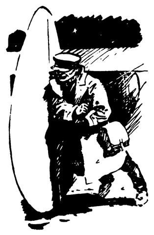

Ба! Да ведь это Сергей Владимирович Ильюшин, известный конструктор самолетов и
планеров, председатель техкома слёта! Теперь вспоминаю, как горел днём жаркий
спор в техкоме: жёстко или нежёстко укреплено оперение на нашем планёре? И
можно ли крепить оперение на длинной, небольшого сечения балке, работающей на
изгиб только в вертикальной плоскости, а от кручения и поворота в сторону
удерживаемой четырьмя тонкими тросами, идущими к заднему лонжерону крыла?
Спорили, переходили к другим вопросам, спорили снова, спорили, видимо, и по
пути из лагеря в Коктебель, пока, наконец, очередной особенно бурный всплеск
спора не вынес в начале ночи председателя техкома в лагерь, к килю «Города
Ленина».

Сергей Владимирович стоял около киля, как бы оценивая и размышляя. Вся его
фигура выражала какую-то неуловимую степень недоумения, несогласия с
очевидностью прямого и непосредственного опыта. Но вот, как будто что-то
взвесив, Сергей Владимирович решительно наваливается плечом на верхний узел
киля. Снова ворчат тросы. На этот раз от решительного толчка качнулось поднятое
к небу крыло. Раздумье. Поворот. И характерной походкой волевого человека,
обдумывающего что-то на ходу, Сергей Владимирович возвращается к машине.
Фыркает мотор, автомобиль подаёт назад, разворачивается и, отмахнувшись от
лагеря жёлтыми лучами фар, скрывается за складкой горы так же неожиданно, как и
появился. Снова тихо. Снова огромное, бесконечно глубокое небо над ещё тёплой
землёй. Как легко дышится в степи! А глаза слипаются, клонит ко сну. И сквозь
дремоту мне чудится лёгкая улыбка на рябоватом лике луны.

...На другой день, под авторитетным напором председателя, техком открыл дорогу
в воздушные просторы длиннокрылому «Городу Ленина».

### В ПОСЛЕДНЮЮ МИНУТУ

1931

Борис Николаевич совсем приуныл: наступил ноябрь, работа школы подходила к
концу, последние курсанты сдавали экзамены на звание инструктора, погода
становилась всё хуже, моросящие дожди сменялись туманами, а его новое детище —
учебный планёр Ш-3 - так и не побывал в воздухе.

Правда, «учебным» его можно было назвать только условно. Задавшись целью
создать предельно лёгкий двухместный планёр, Борис Николаевич перестарался.
Получился такой корабль, что передвинуть его с одного места на другое без
помощи пары добрых коней представляло серьёзную задачу.

Лётчик Васянин, безуспешно пытавшийся поднять это внушительное сооружение в
воздух на небольшой складке горы, у подножья Коклюка, выжидал более сильного
ветра. Но ветер то дул вдоль склона, то стихал совсем, то была плохая
видимость, и первый полёт всё откладывался и откладывался.

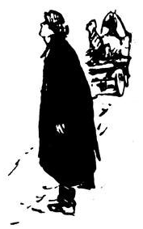

Становилось ясным, что испытания придётся перенести на будущий год. Васянин
уехал, собирался в дорогу и Борис Николаевич. Лагерь пустел. Осталась только
небольшая группа планеристов во главе с Жорой Журавлёвым, начальник школы —
душа всего коллектива, неутомимый А. А. Сеньков и я — начальник техчасти школы.

Наконец, когда серое свинцовое небо, ветер с дождём и густая грязь, прилипавшая
к обуви вместе с травой так, что ноги становились похожими на огромные грачиные
гнёзда, довели нас до мрачного исступления, вдруг посветлело. Тоскливые,
набухшие белёсою влагою облачные валы приподнялись, стали прозрачнее, и после
нескольких пробных порывов задул ровный северный ветер метров 6—7 в секунду.

Мы с Журавлёвым стояли около мокрого, насупившегося Ш-3. Жора посмотрел на
подобревшее небо, на планёр, скользнул взглядом вдоль северного склона и,
наконец, весело и хитро улыбнувшись, заглянул мне в глаза.

Как начальник техчасти, путёвку планёрам в воздух давал я. Правда, не было
конструктора — хозяина планёра, он только что покинул лагерь,— не было
лётчика-испытателя Васянина, следовало бы испросить разрешения и у начальника
школы, но...

Но истекали последние часы нашего пребывания на Горе, ветер мог в любую минуту
измениться, а Ш-3 оставался неиспытанным. М-да... — Полетели? — спросил меня
Жора. Не ожидая команды и понимая всё с полуслова, как стайка воробьёв,
налетели на планёр оставшиеся ещё на Горе планеристы. Тяжёлая машина в их руках
на диво легко скользит по грязи и камням к краю северного склона. Быстро
разворачивается невесть откуда взявшийся амортизатор. Жора занимает место на
втором сиденье под крылом, я — перед ним.

— Натягивай!

Под действием растянутого в четыре конца амортизатора тяжёлый Ш-3 резво прыгает
в воздух.

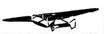

Как же он летает? Какова его устойчивость, управляемость? Хватает ли рулей, элеронов?

На десятки подобных вопросов в первые же секунды полёта планёр даёт ясный,
недвусмысленный ответ. Да, рулей и элеронов хватает. Да, планёр устойчив,
послушен. Жора легко и уверенно вводит его в разворот, и мы летим на хорошей
скорости вдоль склона. Высота быстро растёт. Вот уже пятьдесят, вот уже около
ста метров над склоном. На душе весело и хорошо. Казавшийся на земле тяжёлым и
неуклюжим, в воздухе Ш-3 спокойно и уверенно несётся вперёд, мягко реагируя на
малейшие движения опытного пилота. Внизу лагерь, выгиб потемневшего от сырости
склона Энергичный разворот, и снова вперёд...

Жора уже явно прочувствовал машину и летает всё смелее и смелее. Сверху хорошо
видна дорога на Феодосию, вьющаяся по хребту Горы. По дороге медленно движется
запряжённая лошадью телега. Вот она останавливается. Высокий человек с
медленными, осторожными движениями сходит на дорогу. Лицо человека поднято
кверху. Оно всё время обращено к планёру, как подсолнух к солнцу.

Ну, конечно, это Борис Николаевич, конструктор планёра! Вот так сюр¬приз
приготовили мы ему в последнюю минуту отъезда! Жора покачивает крыльями и лихо
разворачивается, чтобы порадовать конструкторское сердце. Сгущаются ранние
сумерки. Пора идти на посадку. Журавлёв даёт себя снести к ангарам. У ангаров
планёр попадает в «мёртвую зону» и, неожиданно быстро потеряв последние метры
высоты и не закончив полностью разворота, грубовато, со сносом садится у
большой палатки лагеря. Сбегаются ребята. Шагает с воинственным видом начальник
школы Сеньков.

— По выговору бы вам обоим дать! Что за безобразие! Кто разрешил испытывать
планёр?.. Лыжу-то не повредили? Но в общем здорово! И как это вас угораздило?
Тоже мне тихони...

Мы знаем: выговора не будет. Разве не в такт с нашими бьётся его большое
партизанское сердце?

### ПРЕДСЕДАТЕЛЬ ТЕХКОМА

1923-1935

Трудно представить себе Планёрный слёт на горе им. Клементьева без технического
комитета — техкома — во главе с его неизменным председателем Сергеем
Владимировичем Ильюшиным.

Мне довелось впервые встретиться с Сергеем Владимировичем на Горе в 1924 году,
а затем и учиться под его руководством на нескольких слётах в качестве члена и
секретаря техкома.

Работа техкома на слётах была сложной. Если на первых всесоюзных испытаниях в
1923 году было 9 планёров, то на вторые, в 1924 году, их прибыло уже 48! Каждый
год создавались всё новые и новые конструкции.

Планёры привозили со всех концов Союза. Порою за день на Горе появлялось до
десятка новых планёров, а то и больше. Конструкторы и строители планёров,
лётчики горели нетерпением как можно скорее начать летать. Техкому приходилось
разбираться в этой массе конструкций, как правило, совершенно оригинальных,
часто невиданных форм, нередко построенных людьми, впервые взявшимися за
создание летательного аппарата, в условиях только зарождающейся авиационной
науки и промышленности.

В этих сложнейших условиях решающую роль неизменно играл председатель техкома
Сергей Владимирович Ильюшин. Нужно было иметь его обширную эрудицию и
безошибочную интуицию в соединении с фантастической работоспособностью, чтобы
успешно справляться с этой труднейшей задачей, но главное — нужно было иметь
предельно благожелательное отношение к людям — творцам этой ещё полукустарной
техники, затратившим на неё так много сил, времени, энергии и живших одной
мыслью: полететь, летать... Эту неизменную заботу, поддержку, добрый совет в
сочетании с требовательностью все молодые конструкторы при любом затруднении
всегда находили у Сергея Владимировича. Развитие планеризма в первые годы
носило взрывной характер. Новые планёры строились и появлялись там, где,
казалось, нет никаких авиа¬ционных специалистов, никаких условий для создания
даже простейшей конструкции. Норм прочности планёров ещё не было, они только
создавались. Обоснованных рекомендаций, руководств, учебников не было. Всё было
в созидании, в движении. Сборы планеристов не были только спортивными
событиями. Они были своеобразной практической лабораторией рождающейся
советской авиации. Планёр был удобным и недорогим летающим стендом для проверки
новых идей, новых конструкций. Не удивительно, что слёты привлекали
конструкторов, лётчиков, учёных, организаторов промышленнос¬ти, много
поработавших впоследствии над становлением и развитием советской авиации.
Достаточно назвать наряду с самим Сергеем Владимировичем Ильюшиным имена С. П.
Королёва, А. С. Яковлева, М. К. Тихонравова, В. С. Пышнова, В. С. Вахмистрова,
А. А. Дубровина, А. В. Чесалова, М. А. Тайца, Н. Н. Фадеева, В. Ф. Болховитино-
ва, К. Н. Яковчука, В. П. Ветчинкина, Д. JI. Томашевича, С. Н. Люшина, К. К.
Артамонова, А. Б. Юмашева, В. К. Грибовского, А, А. Сенькова, С. Н. Анохина, Б.
Н. Шереметева, В. А. Степанченко, И. К. Костенко, П. В. Цыбина, П. Г. Головина,
Б. В. Белянина и многих других. Благодаря спокойному, твёрдому
высококвалифицированному руководству председателя Техкома и его ближайших
помощников проделывалась в короткий срок огромная, кропотливая работа.

Собирались чертежи всех прибывших планёров. Если их не оказывалось, они
составлялись на месте. Проверялись расчёты прочности конструкции. Иногда
производились импровизированные прочностные испытания. Оценивались ожидаемая
устойчивость и управляемость, способность планёра летать, давались рекомендации
по доработке слабых мест конструкции. Несмотря на то, что жизнь ставила перед
техкомом всё новые и новые задачи, граничащие с головоломками, случаи
забракования целой конструкции были очень редки. Как, не имея продувок,
выпустить в полёт бесхвостую «Параболу» Черановского? Как обставить первый
подлёт так, чтобы не разбить машину, не погубить пилота? Как будет вести себя
крыло, имеющее расчалки только снизу? Как выпустить в полёт «Тандем»?
«Треугольник»? Парусный планёр? Гидропланёр? В палатках, где размещены планёры,
кипит работа. Это не просто временные ангары, это скорее мастерские, где пилят,
строгают, клеят, слесарничают, ставят заплаты, помогают друг другу, обсуждают,
спорят иногда до хрипоты, но во всех затруднительных случаях находят неизменную
твёрдую опору в Техкоме — высшем авторитете для всех участников слёта. Сергей
Владимирович дал путёвку в жизнь и моему учебному планёру «Стандарт»,
выпущенному впоследствии на Планёрном заводе Осоавиахима в тысячах экземпляров
под на званием Ус-3 и Ус-4, учебному парителю «Упару», парителю «Город Ленина»
и многим другим планёрам.

С благодарностью и глубоким уважением я неизменно вспоминаю заботливое
отношение, деловую, дружескую критику, отеческую поддержку Сергея
Владимировича, старшего товарища и друга, поддержку, столь необходимую
начинающему конструктору.

Золотая пора расцвета планеризма в нашей стране прочно и навсегда связана с
именем замечательного конструктора, руководителя, общественного деятеля и
Человека — Сергея Владимировича Ильюшина.

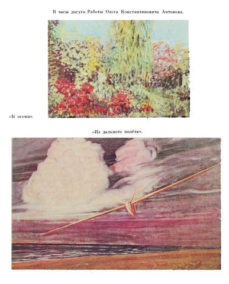

### ДВИГАТЕЛИ ОСТАНАВЛИВАЮТСЯ В ПОЛЁТЕ

1958

Четыре двигателя — это хорошо. Отказал один двигатель — самолёт летит на трёх
других, практически не теряя ни высоты, ни скорости. Безопасность полёта очень
высокая, так как отказ двигателя в полёте — явление крайне редкое. Тем не менее
заказчики всегда требуют, чтобы четырёхдвигательный самолёт мог летать даже при
двух остановленных двигателях. Как ни невероятен такой случай, но считаются и с
такой редчайшей возможностью. Поэтому самолёт рассчитывают и на этот случай и
придирчиво строго проверяют в полёте. Это одно из самых сложных испытаний.
Особенно когда двигатели остановлены на одном крыле. Например, оба правые
работают, а оба левые остановлены. Самолёт тогда сильно тянет влево. Лётчик
даёт почти предельное отклонение руля поворота и борется с кренением.

Всё это пунктуально проделал лётчик Иван Егорович Давыдов при испытаниях нашего
Ан-10. А если остановить три двигателя? Расчёты показывают, что и это возможно.
Устойчивость и управляемость самолёта сохраняются. Правда, полёт будет уже не
строго горизонтальным. Самолёт будет медленно снижаться по очень пологой
траектории, но сумеет выбрать аэродром для посадки. Ну что ж, попробуем. Это
будет отличной проверкой надёжности пассажирского самолёта уже сверх всякой
мыслимой программы.

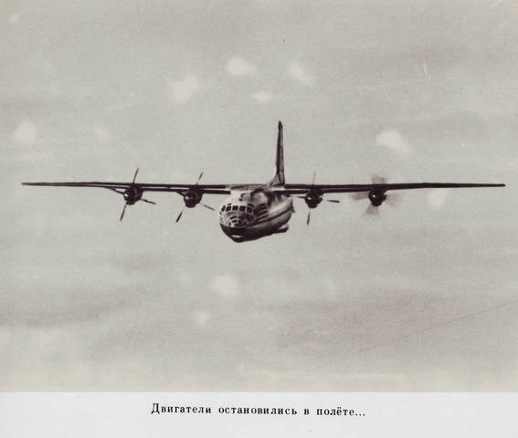

Вылетаем. На соседнем самолёте фотографы и кинооператор. Вот выключается первый
двигатель. Второй. Четвёртый. Самолёт уверенно продолжает устойчивый полёт.
Наконец Давыдов вновь запускает крайний, четвёртый двигатель, а останавливает
третий, расположенный ближе к фюзеляжу. Большой самолёт устойчиво летит с одним
работающим двигателем на конце крыла.

Странно видеть столько остановленных винтов. Перед крылом медленно-медленно,
как бы нехотя, вращаются вхолостую двенадцать лопастей. А воздушный корабль
спокойно плывёт в осеннем небе. Десять, пятнадцать, двадцать минут. Опыт удался
вполне.

Мы поздравляем Ивана Егоровича со своеобразным рекордом безопасности полёта.
Такого в авиации ещё не было...

### «САМОЛЁТ СТАЛ ПАДАТЬ,,,»

1963

В лётной школе во время тренировочного полёта Ан-24 инструктор, командир
корабля Арам Богдасаров выключил согласно программе один из двигателей.

Винт «отказавшего» двигателя немедленно вошёл во флюгер. Небольшое отклонение
рулей, чтобы парировать возникшие моменты крена и рысканья. Руль высоты чуть от
себя. Всё протекает нормально. Но тут происходит неожиданное. По команде
инструктора слушатель школы вместо того, чтобы расфлюгировать винт и запустить
остановленный двигатель, по ошибке флюгирует винт другого, работающего
двигателя. Итак, высота три тысячи метров, оба двигателя остановлены, тяги нет.
Запустить двигатели не удаётся. До аэродрома двадцать два километра...
Богдасаров переводит самолёт на режим планирования. В молодости Арам летал на
планёрах, и для него безмоторный полёт не новинка. Пригодилось юношеское
увлечение! Правда, этот «планёр» весит не двести килограммов, а двадцать тонн.
Да и качество Ан-24 на планировании примерно вдвое ниже, чем на длиннокрылых
изящных игрушках из дерева и полотна. Но штурвал в руках опытного пилота.
Машина послушна его воле и летит, снижаясь со скоростью 4 метра в секунду. Два
разворота, и самолёт точно нацелен на полосу школьного аэродрома. По радио было
сообщено, что самолёт будет садиться на полосу прямо с первого захода.

С неработающими двигателями в случае «промаза» на второй круг ведь не уйдёшь!

Точный расчёт, хладнокровие и умелые действия командира корабля — и вот уже
Ан-24 катит по родной земле. Полёт завершён благополучно. Все горячо
поздравляют экипаж, и особенно Арама Богдасарова. Журналисты требуют:

- Расскажите, как это было? ...Богдасаров терпеливо рассказывает. Скрипят
  ручки, шелестят странички блокнотов.

Зная повадки некоторых охочих до сенсаций журналистов, любящих сочные,
леденящие душу подробности, беру слово и я.

- Товарищи, прошу запомнить, что любой современный самолёт с остановленными
  двигателями не падает, а плавно переходит в режим планирования. Пожалуйста,
  не сгущайте красок! Экипаж сработал отлично, но самолёт — это планёр с
  двигателями. Понимаете: пла-а-а-нёр! Ясно?

Журналисты хором:

- Это же элементарно. Это ясно, это понятно...

Ну, слава богу, кажется, дошло. Назавтра разворачиваю газету. И первое, что
бросается мне в глаза,— краткая и выразительная фраза: «Самолёт стал падать...»

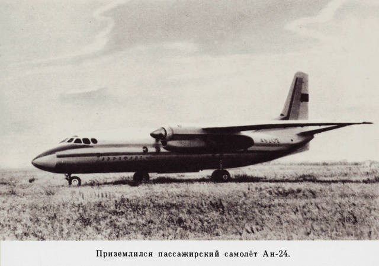

### «АНТЕЙ» В ПАРИЖЕ

1965

- Как хорошо, мсьё, что ваша страна выставила только мирные самолеты,- говорит
  мой собеседник простой механик компании «Эр Франс», в аэропорту Ле-Бурже, в
  западном углу которого разместился ХХVI Парижский салон авиации и
  космонавтики.
- Поверьте мне, мы, простые французы, очень рады этому. Война мсье,- это
  ужасно. Я воевал в Алжире… Надо жить мирно!.. А вот эти - он кивнул головой в
  сторону стендов некоей державы,- выставили самолёты, которые сейчас воюют во
  Вьетнаме…

Я проследил за его неодобрительным взглядом. На большой площадке были
расставлены хищные истребители, уродливые истребители-бомбардировщики,
горбатые, вооружённые до зубов разведчики. Вокруг них аккуратными рядами были
разложены ненавистные народам орудия войны. фугасные и напалмовые бомбы всех
калибров и мастей, управляемые и неуправляемые ракеты с электромагнитными и
тепловыми головками самонаведения, пулемёты, пушки, снаряды... Рядом на
складных стульчиках одиноко сидели двое военных в хаки с сигаретами в зубах.
Кругом — пустота, как вокруг зачумленного места. Добрые французы, кто с
опаской, а кто и с неодобрением, обходили сторонкой эту площадку смерти.

Наши советские стенды, напротив, кишели любопытными, доброжелательно
настроенными, оживлёнными зрителями. Большие очереди в три, пять, шесть рядов
выстраивались с утра перед входами в огромный 186-местный Ил-62, в элегантный
Ту-134, в наш воздушный грузовоз Ан-12 и маленький Ан-24. Особенное восхищение
вызывали самые большие в мире вертолёты конструктора Миля — Ми-6 и «Летающий
кран» Ми-10. Даже наш спортивный цельнометаллический планёр А-15 был почти
всегда окружён толпой любителей воздушного спорта. Взглянув издали, можно было
подумать, что в нашем павильоне занимаются электросваркой, так часто вспыхивали
блицы вокруг модели сверхзвукового пассажирского самолёта Ту-144. Открытие XXVI
салона было главной темой всей прессы, а советская техника — сенсацией номер
один.

Первый космонавт мира Юрий Гагарин, обаятельно улыбаясь, с железным терпением
подписывал миллионный автограф.

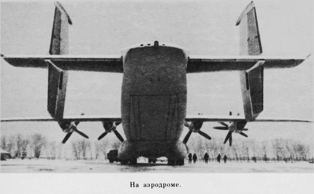

На третий день после открытия салона по выставке потекли слухи, что прилетит
ещё один «очень большой» советский самолёт. Всем нам хотелось сделать сюрприз
посетителям и организаторам салона, поэтому мы до поры до времени ничего не
сообщали о существовании «Антея». 13 июня вечером ко мне в отель явился высокий
молодой человек с рыжими усиками, назвавшийся сотрудником агенства Рейтер, и
спросил:

- Правда ли, что у вас есть самолёт на 350 мест?

Советские люди стараются быть всегда очень точными в своих сообщениях.
Дезинформация нам претит. Но при всём при том поступаться задуманным сюрпризом
не хотелось. Не кривя душой, я ответил ему:

- Нет, такого самолёта у нас нет.
- Но позвольте,— удивился англичанин,—Би-Би-Си ещё вчера передала сообщение о
  советском самолёте на 350 мест?
- Ну что ж, могу сказать только, что Би-Би-Си ввела в заблуждение своих слушателей.

Я наблюдал, как недоумённо взлетели брови моего собеседника, как он моргал
своими белёсыми ресницами, пытаясь осилить эту очередную «русскую загадку». Я
спокойно ждал, догадается ли он задать мне единственный, простой и естественный
вопрос: «А может быть, у вас есть самолёт не на 350 мест, а ещё большего
размера?» Это был интересный психологический опыт. Нет, такая мысль не пришла
ему в голову. Приученный с детства к мысли о превосходстве британской техники,
с трудом приспособившийся с годами к постепенному проигрышу Англии в
технико-экономическом соревновании с США («Но всё-таки они говорят хоть на
плохом, но на английском языке»), он, воспринявший цифру 350 как обычное
рекламное преувеличение, не мог и подумать о том, что советский самолёт может
взять на борт ещё значительно большее число пассажиров.

Даже спина удалявшегося журналиста выражала озадаченность. Утром 15 июня в 9
часов 05 минут, точно в заявленное время, лётчик Юрий Курлин приземлил «Антея»
в Ле-Бурже.

Газета французских коммунистов «Юманите» первая сообщила данные самолёта:

> Грузоподъёмность самолета — 80 тонн... В пассажирском варианте он может
> вместить 720 пассажи¬ров... Лётчик Юрий Курлин посадил гигантский самолёт
> прямо перед зрителями без малейшего толчка...

«Франс суар»:

> Драма в салоне Ле-Бурже. Через два часа после прилёта советского
> самолёта-великана Ан-22 (720 пассажиров, или 80 тонн груза) бомбардировщик
> Б-58 (США) разбивается на глазах у толпы...

«Фигаро»:

> Вашингтон, 17 июня. Бывший начальник штаба ВВС США генерал Томас Уайт заявил
> по поводу советского самолёта «Антей», что СССР внезапно обошёл США в области
> технологии.

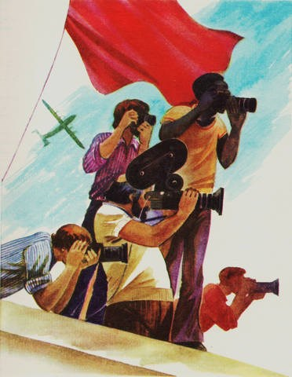

...На западных авиационных специалистов, присутствовавших на парижской выставке
произвело сильное впечатление техническое совершенство советских самолетов. Но
приятнее всего было, смешавшись с толпой посетителей, проходивших бесконечной
чередой сквозь чрево «Антея», слышать добрые слова о нашей великой Родине, об
успехах советской техники, о необходимости мира и дружбы между народами.

### СТО МИЛЛИОНОВ

1967

В 1946 году нашему коллективу выпала счастливая доля: по решению правительства
нам поручили создать сельскохозяйственный самолёт. На работу набросились с
жадностью. Так хотелось после длительной, самой кровопролитной в истории
человечества войны поработать для мира, внести свою скромную долю в общее дело
поднятия благосостояния советского народа, одержавшего в тяжёлой борьбе полную,
сокрушительную победу над фашизмом! Работали запоем. Не хватало всего. Вдоволь
было только сибирского солнца, снега, бьющей через край молодой энергии.

...1947 год. Лётчик Володин поднимает самолёт СХ-1 в воздух. Вскоре под
названием Ан-2 он был запущен в серийное производство. Случилось, однако, так,
что самолёт получил боевое крещение не в степях Украины, а в суровой Арктике.
Полярным лётчикам нужен был как раз такой самолёт: неприхотливый, с мощным
двигателем, способный взлетать с небольших площадок, с хорошим обзором из
пилотской кабины, отоплением и просторным грузовым отсеком.

В метельный зимний день на маленьком подмосковном аэродроме лётчик Володин
поднял самолёт в воздух после пробега всего в 18 метров. Опытные полярники
прекрасно учитывали, что самолёт был не загружен, а встречный ветер достигал
10—12 метров в секунду. Но тихая погода в Арктике — редкость, а от способности
самолёта сесть в случае нужды на небольшую льдину иди на полоску ледяного
припоя в суровых условиях Заполярья нередко зависит жизнь человека. С этого дня
началась крепкая дружба и долгое плодотворное сотрудничество нашего коллектива
с замечательным отрядом советских людей — мужественными и скромными
полярниками. Такие выдающиеся лётчики, как Мазурук, Каминский, Михаленко,
своими смелыми, мастерскими полётами в Арктике и Антарктике, в районах
дрейфующих полярных станций и побережья Ледовитого океана дали самолёту путёвку
в жизнь.

Вскоре оценили машину геологи. Потом — лесники и пожарники. Рыбаки.
Лётчики-спортсмены и парашютисты. Почтовики. Пришлось кое- где возить на ней и
пассажиров. Потребность в воздушном сообщении была огромная. Очень хорошие для
своего времени самолёты Ил-12 и Ил-14 всё-таки требовали хоть каких-нибудь
аэродромов. А нужда в перевозках часто возникала как раз там, где не то что
аэродромов, но и дорог ещё не было. Применение Ан-2 для перевозок пассажиров
незаметно, но неуклонно расширялось. Самолёт стал входить в быт советских
людей. Несмотря на отсутствие комфорта, пассажиры предпочитали посидеть 30—40
минут на неудобных штампованных сиденьях, чем шесть часов тащиться в автобусе
по ухабистой дороге из райцентра в какой-нибудь затерянный среди холмов и
перелесков Пыщуг.

Одновременно росло применение самолёта в сельском хозяйстве. Рассеивание
удобрений с воздуха оказалось намного выгоднее наземного способа, особенно в
лучшее для этого время, когда снег кончает таять и земля обильно пропитана
влагой. В это время по полю никакая машина не пройдёт, даже ступить страшно. А
если всё-таки и пойдёшь, с усилием выдёргивая при каждом шаге ноги из
чмокающей, клейкой благодати, то повредишь нежные, слабенькие, не успевшие как
следует укорениться ростки озими. Вот тут-то в самый раз и воспользоваться
самолётом, опирающимся своими крыльями только на воздух. Гранулы удобрения
падают, ложатся на сырую землю, увлажняются и, медленно растворяясь, долго и
обильно питают тянущиеся к свету и теплу растения. Один самолёт за год успевает
внести удобрения на площадь от трёх до десяти тысяч гектаров. Каждый гектар при
этом даёт прирост урожая, по сравнению с наземным способом внесения, от
двух-трёх до пяти центнеров зерна. Перемножьте эти цифры — и вы увидите, что
самолёт — это летающая фабрика зерна. Постепенно, по мере развития агро¬техники
и химии, круг обязанностей самолёта расширялся. К работе по борьбе с
вредителями полей и лесов прибавилась работа по уничтожению вредных
растений-сорняков. Лётчики стали пропалывать поля. Спрыснет гербицидами нужной
концентрации поле, и — о чудо! — все сорняки полегают, а культурные растения
стоят и зеленеют, как ни в чём не бывало, а то ещё и прибавляют в росте!

Вручную один человек может прополоть за день 0,1—0,2 гектара. Самолёт на
прополке может обработать за день до 600 гектаров. Даже, если, кроме лётчика,
самолёт обслуживают ещё четыре человека, производительность труда на этой
тяжёлой, утомительной работе возрастает в тысячу раз.

Стали опрыскивать хлопковые плантации составом, от которого опадают листья с
куста. Это облегчило применение машин для сбора хлопка и повысило сбор волокна.
В 1968 году самолёты обработали с воздуха 79 миллионов гектаров, значительно
обогнав США. В ближайшие годы в СССР авиация будет обрабатывать сто миллионов
гектаров. Незаметно подкатил 1962 год. Аэрофлот продал на самолёт Ан-2
двадцатипятимиллионный билет. В коллективе праздник. Вручаем обладательнице
счастливого билета, сельскому врачу Евдокии Ивановне Лебедюк с лучшими
пожеланиями памятные подарки, поздравляем, провожаем. А трудяга Ан-2 летает,
намолачивает километры, принимает пассажиров — простых советских людей —
колхозников, рабочих, партийных и советских работников, озабоченных
командированных с портфелями, хозяек с кошёлками, беспокойных снабженцев с
чемоданами и ящиками, школьников и стариков и даже разную живность в виде кур и
поросят. Случались и забавные истории. Рассказывают, карабкается как-то раз в
самолёт старушка и тянет за собой козу. Коза упирается. Благожелательные
пассажиры начинают кто подталкивать козу, кто тянуть за рога.

- Ты что, бабуся, впервой летишь, что ли?
- Да нет, милый, я-то не впервой, а вот коза впервой...

А темп жизни всё ускоряется. Нужда в воздушных сообщениях растёт. Аэрофлот
открывает в глубинке всё новые и новые линии и за неимением других самолётов,
пригодных для полётов с небольших, малоподготовленных аэродромов, вынужден
ставить на них всё тот же Ан-2.

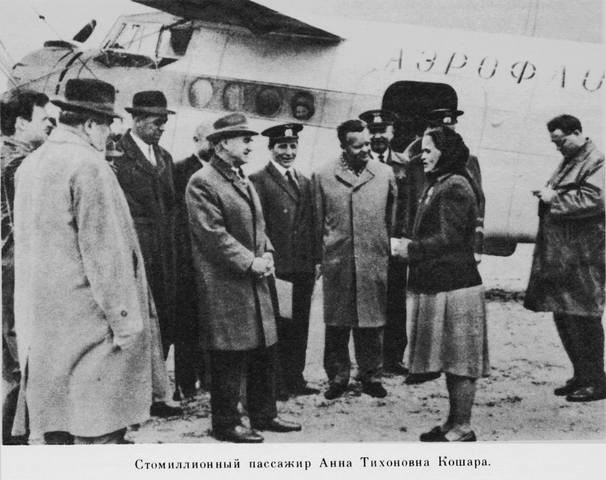

Перевозки на местных линиях становятся массовыми. Наконец 24 апреля 1967 года
на Ан-2 продан стомиллионный билет. Летим в Чернобыльский район Киевской
области, где его обладательница собирается в полёт. Это бригадир передовой
бригады колхоза имени Ленина, отмеченная высокой правительственной наградой за
свой честный самоотверженный труд,—Анна Тихоновна Кошара. Поздравить её
приехали и партийные и советские руководители района, и аэрофлотовцы, и просто
друзья и знакомые. Поздравляем и мы. Желаем счастья, здоровья и новых трудовых
успехов. Вручаем маленькую модель самолёта Ан-2 и памятный адрес от коллектива.
Провожаем, машем руками и шапками, садимся в «Пчёлку» и улетаем домой.

Радостно? Да. Но и совестно. Ну какой же Ан-2 пассажирский самолёт? Ведь это,
честно говоря, большая консервная банка с крыльями, «комфорт» на уровне трудных
военных лет. А уровень жизни повышается. Требования возрастают. Да что там
требования, мы просто обязаны позаботиться о советском человеке, который своим
трудом создаёт всё, что мы видим вокруг нас, преобразует страну, преобразует
самого себя. Для этого труженика, скромного и старательного, всё больше
ценящего время, мы должны создать лучший, более комфортабельный самолёт.
Маленький «аэробус», как называют его аэрофлотовцы.

Ну что ж! Задача ясна... «Задел» тоже есть. Итак, за работу!

### ПОДАРОК ОКТЯБРЮ

1967

Испытания «Антея» шли успешно.

Лётчики-испытатели Юрий Курлин и Иван Давыдов всё более овладевали самолётом,
постепенно выявляли резервы конструкции, открывали всё новые возможности
самолёта. Из расчётов мы знали, что наш большой самолёт способен поднять
значительные грузы, но на то и испытания, чтобы подтверждать и уточнять
расчёты. Ещё в 1958 году американский лётчик Томсон поднял на тяжёлом
военно-транспортном самолёте «Дуглас» груз в пятьдесят три с половиною тонны.
«Самый большой груз, поднятый в истории авиации»,— так писала американская
пресса об этом действительно не малом техническом достижении.

Самым привлекательным из всех рекордов, которые можно установить на самолётах,
являются, конечно, абсолютные рекорды скорости, дальности, высоты и
грузоподъёмности. Всем нам очень хотелось отвоевать для Родины самый «весомый»
из этих рекордов. Но установление рекорда — дело совсем не простое. Нужна
серьёзная, длительная техническая подготовка и выполнение ряда формальностей,
подчас довольно обременительных, но совершенно обязательных. Наконец, с трудом
выкроив время между двумя испытательными программами, лётчик-испытатель Иван
Давыдов перелетел на аэродром, где нас ждала судейская коллегия Центрального
аэроклуба, и 27 октября 1966 года с экипажем из восьми человек поднял груз в 88
тонн и 103 килограмма на высоту в 6600 метров. Мировой рекорд грузоподъёмности
перешёл к Советскому Союзу, поднявшись сразу на 34,6 тонны.

Испытания самолёта продолжались. Он изучался, совершенствовался, летал всё
лучше и лучше, выполняя всё более сложные задания. Накануне 50-летия Октября
«Антей» был уже вполне в форме. В форме были и Иван Давыдов, и его напарник
Владимир Терский, и весь дружный, слаженный экипаж. Как достойно отметить
великую годовщину? Надо было закрепить рекорд за Советским Союзом, поднять его
ещё выше. «Хозяин» самолёта Саша Эскин проявлял чудеса оперативности. Не
отставали от него и рабочие, техники, прибористы — все, от кого зависело
правильное, безотказное функционирование техники. Чтобы загрузить самолёт,
изготовили несколько бетонных плит, похожих на гигантские плитки шоколада,
весом от 6 до 12 тонн каждая. Часть из них перевезли на аэродром вылета на
самолёте Ан-12, часть взяли с собой. • Утро 26 октября выдалось погожее.
Инженеры Радауцан и Порва, борт-электрик Федоренко, бортрадист Дробышев
методично проверяли все жизненные системы самолёта. Штурман Тихомиров уточнял
расчёт времени и наносил маршрут на карту. Топлива решили взять побольше, так
как самолёт оно мало обременяло, зато экипаж мог быть уверен, что если аэродром
«закроет», то можно будет выбрать для посадки любой другой в европейской части
Союза. Судьи закончили последние формальности. Груз тщательно взвешен и
опломбирован. Опломбированы баки. Инженер Нетудыхата включает все осциллографы,
справедливо считая, что рекорд рекордом, а полёт всегда должен приносить
максимум информации.

«Антей», неторопливо покачиваясь, занимает на полосе осевую линию. Длинные
белые крылья, подрагивая под напором мощных струй от винтов, чётко отделяют
неяркое осеннее небо от рыжеватой земли. Давыдов отпускает тормоза. Самолёт
трогается и бежит, поглаживая полосу двенадцатью колёсами диаметром в рост
человека. Крылья всё с большей силой врезаются в прозрачный утренний воздух. Их
провес уменьшается, постепенно они принимают на себя тяжесть самолёта и
огромного, уложенного в его чреве груза. «Антей» отрывается от матери-земли и
быстро растворяется в сизой дымке.

Теперь связь с самолётом только по радио. Командир кратко докладывает о ходе
полёта:

— Всё в порядке. Скороподъёмность хорошая. Высота две тысячи метров.- Три
тысячи. Четыре. Подъём продолжается. Всё в порядке. Шесть тысяч. Семь. Около
восьми. Идём на посадку.

Стоим, посматриваем по сторонам, Ждём самолёт. Как это часто бывает, самолёт,
которого ждут, появляется совершенно неожиданно и бесшумно из-за близлежащего
леса. Шасси выпущено, закрылки в посадочном положении. Иван Давыдов сажает
самолёт так мягко, как будто в нём лебяжий пух, а не огромный груз в сто тонн.

100 тонн 444,6 килограмма поднял экипаж во главе с Иваном Давыдовым и
Владимиром Терским на высоту 7848 метров, установив за один полёт один мировой
и 14 международных рекордов. Но главное, что нас радовало,— кругленький груз в
сто тонн впервые поднят в воздух в нашей, Советской стране, великой авиационной
державе. «Самый большой груз, поднятый в истории авиации»,— но уже сто тонн —
таков был подарок нашего коллектива к пятидесятилетию Великого Октября.

### РОЖДЕНИЕ СКВ

1951

Создание самолёта, которому для взлёта и посадки достаточно самой маленькой
площадки, всегда привлекало меня, так как, решив эту технически очень трудную
задачу, можно было бы резко расширить возможности применения самолёта,
превратить его в действительно массовый вид транспорта, как бы низвести его «с
небес на землю». Приехав в Киев, где завод осваивал производство нашего Ан-2, я
взялся за карандаш и счётную линейку и вечерами (весь наш коллектив ещё
находился тогда в Сибири) составил эскизный проект под названием СКВ, что
означало: «самолёт короткого взлёта».

Тогда в 1951 году ещё не существовало этого термина, получившего теперь такую
широкую популярность.

Четырёхместный самолёт, имевший по проекту чёткую ферменную силовую схему,
обеспечивавшую лёгкость и жёсткость конструкции, при двух радиальных двигателях
Ивченко по 260 л. е., должен был иметь взлётный вес 2100 килограммов. Разбег по
расчёту получался всего в 30 метров, пробег при посадке — того же порядка.
Такой самолёт был бы близок по своим возможностям к вертолёту. Первый ответ
специалистов на моё предложение был краток и выразителен: «Этого самолёта мы
строить не будем».

С большим трудом я добился рассмотрения проекта экспертной комиссией, которая
дала в общем положительное заключение, но с двумя оговорками:

> «Отсутствие предкрылка на центроплане может привести к преждевременному срыву
> потока с крыла; вопрос об устойчивости и управляемости на малых скоростях
> полёта требует обширных продувок и исследований»

Обрадованный хорошим заключением с двумя лишь несущественными замечаниями, я
был сильно озадачен, прочитав документ, в котором проект начисто отвергался по
следующим мотивам:

> 1) отсутствует предкрылок на центроплане, что может привести к
> преждевременному срыву потока с крыла;
> 2) вопросы устойчивости и управляемости на малых скоростях полёта неясны и
> потребуют обширных исследований...

Только в 1956 году удалось, наконец получить задание и начать работу по
созданию самолёта.

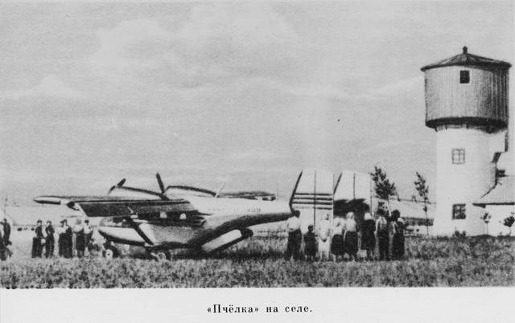

По требованию Аэрофлота количество мест было увеличено с четырёх до шести:
лётчик и пять пассажиров Не трудно сообразить, что при тех же двигателях и
сохранении основных размеров самолёта стоимость одного часа полёта
увеличивается незначительно, но на то же расстояние будет перевезено не 3, а 5
пассажиров. Стоимость перевозки одного пассажира снизится в отношении 3:5, т.
е. на 40 процентов. Выгодно? Конечно. Но с феерическими взлетно-посадочными
качествами пришлось распрощаться, хотя они и оставались ещё очень хорошими.

Работа над «Пчёлкой», как мы прозвали самолёт, шла не очень быстро. Главной
нашей заботой было в то время создание первого двухдвигательного турбовинтового
транспортного самолёта Ан-8, а затем и четырёхдвигательных Ан-10 и Ан-12. Когда
проект «Пчёлки» был завершён, новое руководство Аэрофлота обратило внимание на
тот неоспоримый факт, что перевозка семи пассажиров вместо пяти снижает
стоимость билета примерно в отношении 5:7, т. е. почти на 30 процентов...
Пришлось снова переделать проект и построить «Пчёлку» в восьмиместном варианте.
Взлётный вес самолёта повысился до 3260 килограммов. Тяги двигателей уже не
хватало для выполнения всех требований по безопасности полёта. Конструктор
двигателя Александр Ивченко поднял его мощность до 350 л. с.

Когда дело дошло до государственных испытаний, специалисты предъявили к
«Пчёлке» такие же требования, что и к орлу, то бишь к реактивному лайнеру.
Кончилось это тем, что самолёт забраковали из-за малой скороподъёмности при
отказе на взлёте одного из двигателей, а также и из-за относительной
дороговизны перевозок. Ну что я?, подумали мы, придётся пока по-прежнему возить
пассажиров на Ан-2. У него двигатель один, и поэтому для него отказ одного из
двигателей просто не рассматривается.

Тем временем «Пчёлку» всё-таки запустили в серию. Как это произошло, стоит
рассказать.

### НЕ ПО ИНСТРУКЦИИ

1962

Мы, закладывая новый вариант самолёта, обещали дать разбег при взлёте и пробег
при посадке в 60 метров. На официальных испытаниях получили около ста. Почему
же? Мы хорошо знали, что на «Пчёлке» можно показать эти 60 метров! Но
испытатели были неумолимы и летали только по стандартной методике взлёта,
созданной в основном для тяжёлых многомоторных самолётов.

—  Но ведь это «Пчёлка»! —  возражали мы. —  На ней надо летать не так, как на
тяжёлом корабле. Надо дать полный газ, отдать тормоза и просто потянуть штурвал
на себя.

Тогда и получится разбег в 60 метров, а то и меньше.

—  У нас инструкция, — возражали испытатели.— Сперва нужно отдать тормоза,
выдержать на малом газе направление по оси полосы, потом «плавным, но
энергичным движением» дать газ обоим двигателям, набрать скорость до взлётной,
отделиться от земли, выдержать самолёт в горизонтальном полёте до набора
безопасной скорости и, «плавно, но энергично» потянув штурвал на себя,
перевести самолёт в режим набора высоты...

Мы «плавно, но энергично» возражали, указывая на то, что самолёт отрывается от
земли раньше, чем можно прочесть первую фразу этой «плавной» инструкции.

—  Ну, что ж,— отвечали нам испытатели,— тем хуже для самолёта, если он
отрывается раньше, чем успеваешь отпустить тормоза. Это не по инструкции. При
взлёте по инструкции получается 110 метров, не меньше...

Так и записали —  110. А нам надо было 60. И обещали мы 60, и были готовы когда
угодно и где угодно доказать, что машина может подняться с полным полётным
весом после разбега в 60 метров. Осталось только одно: показать, на что
способна «Пчёлка», самым авторитетным деятелям авиации, которых мог
заинтересовать такой самолёт.

Показали машину командующему ВВС, убелённому сединами герою Великой
Отечественной войны маршалу Вершинину. Показали взлёт вдоль, а потом и поперёк
полосы. Взлёт с травяного поля. Полёт с одним отказавшим двигателем. Маршал
наблюдал полёты с интересом и спокойной серьёзностью, характерной для людей с
обширным жизненным и боевым опытом, и остался, в общем, доволен «Пчёлкой».
Решено было показать самолёт министру обороны Родиону Яковлевичу Малиновскому.

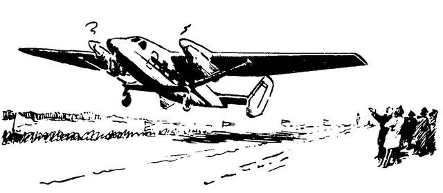

...Тихое, солнечное утро на Центральном аэродроме. «Пчёлка» стоит, готовая к
показу. В пассажирской кабине оставлено всего четыре кресла. Между ними
складной столик. Пятое сиденье — справа от лётчика — с отличным обзором вперёд
и в стороны.

Подходит группа военных во главе с Родионом Яковлевичем. Здороваемся. Показываю
«Пчёлку».

- У, да это не «Пчёлка», а пчелище! — шутит маршал. — Я думал, она куда меньше.
  Ну что ж, посмотрим, — как-то невесело говорит он, — как она летает...—
  Видимо, специалисты по инструкциям ему уже докладывали, что самолёт не блещет
  лётными качествами...

Мы направляемся в сторону, где она должна взлететь.

- Послушайте, — обращается к одному из сопровождающих его лиц Родион Яковлевич,
  - был ведь у нас во время войны такой небольшой самолёт, как его?..
- По-2, — подсказывает кто-то.

Вот, вот, этот самый По-2! Вот это был самолёт! С любой поляны взлетал. Что мы
на нём только не делали! И в разведку летали, и к партизанам, и на ночную
бомбёжку... Слушайте, а нельзя ли его опять начать делать?

- Видите ли,— замечает стоящий рядом генерал ВВС,— если теперь запустить,
  придётся по современным нормам всю конструкцию пересмотреть и усилить. Новые
  приборы и оборудование поставить, добавить противообледенительную систему, и
  будет уже не тот самолет...
- Да, жалко, жалко,— с грустью говорит Родион Яковлевич. — Хороший был самолёт!
  Ну что ж, посмотрим, как летает эта «Пчёлка»...

Среди зелёной травы белеют флажки, поставленные нашими ребятами че-рез каждые
десять метров. На отметке «О» — «Пчёлка». С места, где стоит наша группа, будет
отлично видно, сколько десятков метров она пробежит перед взлётом. Наш лётчик
Владимир Калинин хорошо знает машину, любит её и любит на ней летать. Запущены
двигатели, полный газ, полные обороты... Отданы тормоза. «Пчёлка» срывается с
места. Десять метров, двадцать, тридцать, сорок...

- Машина в воздухе! — говорю я маршалу.
- Здорово! — восклицает он.— Э-э-э, да ведь она у вас пустая! Вы покажите, как
  она с людьми взлетает! Наши товарищи по моему знаку бегут к машине, чтобы
  занять в ней места.
- Нет, нет,— замечает маршал,— вы не худеньких посадите, а товарищей
  посолиднее! — И, обращаясь к стоящим рядом генералам: —А ну-ка, занимайте
  места в машине!

Солидные, в летах, боевые командиры входят в самолёт. Справа от лётчика на
место второго пилота садится самый требовательный человек в ВВС генерал
Александр Николаевич Пономарёв.

Полный газ. Полные обороты. «Пчёлка» срывается с тормозов. Десять, двадцать,
тридцать, сорок метров...

- Машина в воздухе! — снова говорю я, обращаясь к маршалу.
- Позвольте,— оборачивается к окружающим маршал,— а кто же мне докладывал, что
  она слабовато летает? Кто испытывал машину?

На свой вопрос маршал получает чёткий и обстоятельный ответ: «Самолёт имеет
отличную управляемость и устойчивость, прощает грубые ошибки в пилотировании,
прост в эксплуатации, нетребователен к аэродромам, отлично... хорошо...
прекрасно... надёжно...»

- Послушайте, — прерывает докладчика Родион Яковлевич, — вы что, у Антонова
  работаете, что ли? Разве у самолёта нет недостатков? — И, не слушая тут же
  появившегося перечня недостатков, говорит: — Ну что ж, надо запускать самолёт
  в серию...

### ЗОЛУШКА

1962-1976

Запустили в серию, но на этом злоключения «Пчёлки» не кончились. Мы были
убеждены, что «Пчёлка» нужна нашему народному хозяйству, нашей огромной стране.
Чтобы показать, на что она способна, взяли карту Киевской области, обвели
кружочками 63 населённых пункта и предложили лётчику Владимиру Калинину
посетить все 63 точки, садясь не далее 300—500 метров от околицы.

Владимир Антонович в три круга облетел все города, городки, посёлки и сёла без
единого происшествия. Какие ещё нужны доказательства появления везделёта?
Пригласили корреспондентов «Смены» В. Бута, В. Мишина, Б. Семёнова, В. Сажина,
Г. Новожилова в перелёт по Советскому Союзу на «Пчёлке».

Стартуем из Киева и через юг Украины, Краснодар, Адлер, Тбилиси, Баку,
Астрахань, Урал, Холмогоры, Петрозаводск, Ленинград, Прибалтику, сделав 53
посадки, в том числе 14 на площадки, выбранные с воздуха, возвращаемся в Киев.
Провели новые испытания, получили ещё полторы-две сотни замечаний и пожеланий,
вплоть до самых незначительных, вроде: «переноса тумблера на пять миллиметров
левее». Ну что ж, замечания в общем правильные, полезные, улучшают машину.
Передвигаем, улучшаем, поправляем, налаживаем, доводим... Все? Нет, не всё.
Семь пассажиров мало, говорят заказчики. Надо одиннадцать-двенадцать.

Судите сами: расходы почти те же, а пассажиров больше. Стоимость перевозки
одного пассажира уменьшится почти в том же отношении 7:11, почти на 35
процентов. Нет, не годится машина. Мала. Нерентабельна. Вот если бы дали такую
машину на 11 пассажиров, да скорость не 200 километров в час, а 300 — 320, вот
это было бы то, что нужно. А ваша «Пчёлка» — это, извините, «не то». Вздохнули
конструкторы, закручинились и вспомнили сказку про белого бычка. А потом,
подумав, решили: одиннадцать — это ведь не последнее нечётное число на нашей
числовой оси. Не сделать ли, минуя цифру И, сразу скачок до 13 — 15? Так
сказать, несколько забежать вперёд?

Посчитают экономисты, покачают головами и скажут: «Маловато 11 мест. Вот бы
13...» А мы тут как тут: «А у нас 15! Получайте машину!» Тут и будет конец
сказке про белого бычка. На этом и поладим с экономистами Аэрофлота. Ведь
маленький самолёт для местных воздушных линий остро необходим. И тогда начнётся
новая сказка, сказка про трудолюбивую «Пчёлку». Ведь подумать только! Кое-как
приспособленный к пассажирским перевозкам сельскохозяйственный и грузовой
самолёт Ан-2 уже перевёз к началу 1976 года только в СССР более 250 миллионов
пассажиров!

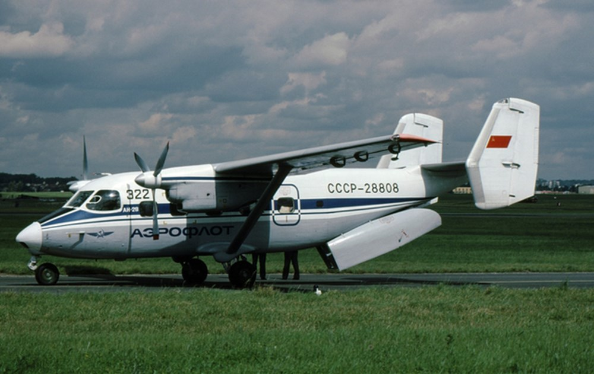

Можно ли сомневаться, что более комфортабельная двухдвигательная «Пчёлка» будет
работать ещё интенсивнее, исправно служа нашим непоседливым согражданам? Идут
испытания. Лётчик-испытатель Владимир Терский летает попеременно то на «Антее»,
то на «Пчёлке». Диапазон весов огромный. «Пчёлка» весит почти в 40 раз меньше
«Антея». Но Владимир методически и с увлечением пестует «Пчёлку». Полёт за
полётом, программа за программой. Взлёты, посадки. Прерванные взлёты.
Продолженные после отказа одного из двигателей. С убранными закрылками, с
опущенными на 15, 25, 40 градусов. На наборе высоты, на снижении. На потолок,
на дальность. Проверяет силовые установки, системы: противообледенительную,
топливную, электрическую.

Испытали с одними двигателями, потом с другими. Изменили вертикальное оперение.
Применили щелевой стабилизатор. Отработали кресла, которые за две-три минуты
складываются к бортам, освобождая место для груза. Расширили хвостовой люк.
Улучшили профилировку щелей между крылом и закрылками. Создали автомат для
уменьшения крена самолёта при отказе двигателя.

Добились того, что при любом положении закрылков, на любой мощности от
полётного малого газа до взлётного, при любом положении штурвала самолёт не
сваливается. Лётчик тянет штурвал на себя, тянет, тянет, доводит его до
крайнего положения, а самолёт плавно опускает нос и набирает скорость.
Воздушный ванька-встанька. Важное свойство самолёта, обеспечивающее
безопасность полёта! Ведь не все лётчики, которые будут водить этот массовый
самолёт, будут иметь первый класс...

Отказались от уборки шасси в полёте, так как исследование показало, что средняя
дальность полётов Ан-2 с пассажирами в СССР составляет всего 111 километров. Не
успел взлететь — уже надо садиться. А в ниши убирающегося шасси может набиться
при взлёте грязь или мокрый снег. Надо садиться, выпускать шасси, да не тут-то
было. На высоте всё смерзлось, шасси не выпускается! В результате посадка «на
брюхо», поломка, ремонт, убытки. Оказалось, что убирающееся шасси для самолёта,
летающего на такие короткие расстояния, вещь невыгодная. Сделали простое, очень
надёжное фиксированное шасси.

Так, претерпевая ряд последовательных изменений, «Пчёлка» из четырёхместного
самолёта стала шести, потом восьмиместной и наконец пятнадцатиместной.

Но мы, конструкторы, знаем, что «растягивать» самолёт очень выгодно. Каждое
увеличение числа пассажиров, полезной нагрузки заставляет высасывать из
конструкции все резервы. Ненужный, обременяющий конструкции «жир» постепенно
исчезает. Остаются только мускулы, кости и связки. Получается очень лёгкий
самолёт. По сравнению с первым образцом «Пчёлка» изменилась неузнаваемо.

А длительная доводка и многолетние испытания, стремление выполнить непрерывно
усложняющиеся технические условия требовательного заказчика, активно
способствующего шлифовке конструкции, дало свои плоды.

У каждого самолёта своя судьба. Одни рождается легко, при всеобщем одобрении,
под аплодисменты. Это баловни судьбы. Другие пробиваются с трудом, доказывая
своё право на существование ежедневной тяжёлой борьбой, выпадая из планов,
ютясь на задворках цехов. Им достаются иронические улыбки, снисходительные
остроты приверженцев устоявшейся классики. Однако как раз эта борьба закаляет,
требует всё новых подтверждений высоких качеств машины, всё более высоких
характеристик. Самолёт совершенствуется, избавляется от отдельных дефектов,
приближается к совершенству.

И, наконец, обнаруживается, что только Золушке подходит хрустальный башмачок...

И когда мимо окон конструкторского бюро пролетает серая с белым верхом «Пчёлка»
с газотурбинными двигателями и комсомольским значком на двойном стреловидном
оперении, верится, что кончается сказка про гадкого утёнка и начнётся скоро
добрая сказка про трудолюбивую «Пчёлку».

### РАЗДУМЬЯ С СЕКАТОРОМ В РУКЕ

Всю жизнь я жил на стройке. Всегда вокруг были щебень, песок, траншеи с
переброшенными через них зыбкими мостиками, брёвна и цемент. Редко мы работали
в законченных цехах. Как только стройка затихала и площадка благоустраивалась,
работа влекла меня на новое место. И опять всё сначала: штабеля бетонных
блоков, разъезженные донельзя дороги с увязающими в них грузовиками, доски и
мотки проволоки, первозданный хаос...

Всю жизнь как-то подсознательно я тосковал о зелёных лужайках, цветах,
деревьях. Теперь, наконец, я просыпаюсь не от скрежета экскаватора, а от шума
листвы за окном. Наверное, только садоводам знакомо особенное чувство
удовлетворения, которое возникает в окружении зеленеющего сада, где знаешь
историю каждого заботливо посаженного деревца, каждого куста. Нередко мне
задают вопрос: как вы успеваете при вашей занятости ещё и возиться с садом?
Забавно, что вопросы в таком роде мне задавали и тогда, когда не было ни сада,
ни завода с большим коллективом, ни многочисленных общественных обязанностей.
Например: как вы успеваете учиться, строить планёры, летать и заниматься
спортом? Вероятно, для этого нужно прежде всего не терять времени напрасно.
Ведь всё это я делаю не быстрее других. Секрет быстроты заключается в том,
чтобы, как некогда говорил один инструктор парашютного спорта, «делать
медленные действия без промежутков между ними».

Что касается работы в саду, то после самой небольшой практики она приобретает,
как и управление автомашиной, характер автоматизма. Работают руки, держащие
лопату, секатор или косу, а голова работает сама по себе, да ещё на свежем
воздухе, особенно производительно. Немало конструктивных находок было сделано
между яблонями и кустами черноплодной рябины, между орешником и облепихой.
Работа в саду повышает общую работоспособность, поэтому сад в итоге не отнимает
время, а экономит его. Разумеется, и в этой работе, как и во всякой другой,
чтобы успеть сделать за короткий отрезок времени побольше, нужна высокая
производительность. Нужен набор инструмента, известная организация, и, я бы
сказал, некоторая расторопность. Инструмент я не раскидываю по саду и не
сваливаю его в кучу в углу сарая. Я храню его в ящике, установленном на дне
удобной лёгкой тележки, вместе с садовой замазкой, рукавицами и многим другим.

Пока зашедший ко мне корреспондент расспрашивал на ходу о перспективах машущего
полёта, я успел обрезать несколько лишних побегов на яблоне, отпилить сухую
ветку у рябины, замазав ранку мастикой, подтолкнуть гнилое яблоко по
на¬правлению к компостной яме, подпереть рогульками две ветки, гнувшиеся от
тяжести зреющих слив, и, не останавливаясь, выдернуть на ходу побег лебеды из
клумбы с флоксами.

Провожая посетителя к выходу, я по дороге закрыл кран поливного шланга,
отбросил поближе к кострищу сухую ветку, лежавшую на дороге, и закрыл на крючок
дверь кладовки для хранения удобрений. Корреспондент ничего этого не заметил.
Он был поглощён «перспективами». Засовывая блокнот в карман, он спохватился и
снова задал тот же вопрос: как вы успеваете? Я рассмеялся и, пожимая ему руку,
уже совсем машинально отшвырнул ногой гнилое яблоко ещё дальше по направлению к
компостной яме.

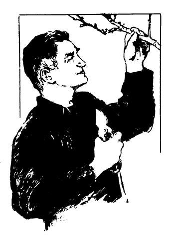

### ДЕСЯТЬ РАЗ СНАЧАЛА

Организация в 1923 году. Общества друзей Воздушного флота была большим событием
в жизни Советской страны. Для молодёжи, бредившей авиацией, оно открыло двери в
небо. Летом того же года в Саратове при губотделе ОДВФ были организованы
спортсекция и кружок планеристов. Не имея никакого опыта, группа молодых ребят
всё же была уверена, что сможет построить планёр сама, без чьей-либо помощи. Да
и кто мог тогда помочь? В Саратове никакой авиационной промышленности и никаких
авиаспециалистов не было. Спросить совета было не у кого. Не было в то время ни
руководств, ни литературы по авиации. Все нужные сведения приходилось собирать
по крохам. В книжных развалах на Верхнем базаре искали старые книги по авиации,
иллюстрированные журналы, содержащие хотя бы одну фотографию или рисунок
самолёта. Попадались издания 1908, 1911 годов и, в лучшем случае, 1915 — 1916
годов. Начавший выходить в 1920 году первый советский авиационный журнал
«Вестник Воздушного флота» был для нас настоящим откровением.

Откуда же бралась у совсем молодых ребят — комсомольцев, школьников, даже
пионеров — такая уверенность в своих силах? Уверенность порождалась всем духом
эпохи. Всё кругом: новые общественные отношения, промышленность, сельское
хозяйство, наука, искусство — всё строилось заново. Должно быть, пример
старших, смело решавших эти небывалые всемирно-исторические задачи, расцвет
народных талантов, с жадностью приобщавшихся к мирному творческому труду после
отчаянно тяжёлых лет гражданской войны и интервенции, воодушевляли и нас,
создавая атмосферу всеобщей огромной уверенности в своих силах. С постройкой
дело было проще. Почти все ребята были рабочими, знавшими два-три ремесла.
Занятия моделизмом ещё крепче подружили нас с рубанком, дрелью, паяльником и
кистью, с тонкой работой, привили аккуратность, чувство материала, глазомер.
Дело кипело. Постепенно, по мере того как вырисовывались отдельные части
планёра: ажурные лонжероны крыльев, каркаса фюзеляжа, оперения,— в мастерской
стали появляться всё новые ребята, невесть каким образом пронюхавшие, что
строится что-то интересное, что должно полететь.

В 1924 году наш планёр «Голубь» побывал на слёте в Коктебеле, а на следующий
год я уехал учиться. В Ленинграде пришлось всё начинать сначала. Конечно, было
легче. Был аэроклуб-музей, завязалась дружба с другими планеристами, лётчиками.
В мастерских, организованных при ленинградском Осоавиахиме, вместе с Павлом
Цыбиным, братьями Лосевыми, Яковом Зархи, Володей Денисовым, Ребанэ и другими
замечательными товарищами стали строить учебные планёры. Работали с
энтузиазмом. Никто никогда не думал о зарплате, отдыхе, удобствах. Жили только
одним стремлением: построить! Полететь! Планёры пекли, как блины. И «блины»
летали совсем неплохо. Когда построили планёр-паритель «Город Ленина» и
отправили его на слёт в Коктебель, это было настоящее торжество.

По окончании института меня назначили руководителем КБ по планёрам в Москве.
Бюро и мастерские помещались в подвале дома № 19 по Садово-Спасской. Главной
задачей было обеспечить чертежами учебного планёра типа «Стандарт» строившийся
в Тушине Планёрный завод. С пуском завода вся наша маленькая группа перебралась
в Тушино. Жить пришлось вначале в фанерных бараках, зато какие возможности для
работы! Завод, как магнит, притягивал к себе всех, кто мечтал о планёрах.
Многие конструкторы: Грошев, Емельянов, Сиркен, Кочеткова, Шереметев создавали
самостоятельные конструкции отлично летавших планёров.

Однако в 1938 году Планёрный завод прекратил своё существование. Конструкторы
разбрелись кто куда, а я пошёл работать в большую авиацию. В 1940 году мне
поручили наладить в Ленинграде производство самолётов типа «Аист». Не успели мы
с помощью дружной! коллектива опытного отдела завода построить самолёт, как я
был переведён на вновь создаваемый на базе бывшего трампарка завод, где всю
конструкторскую работу пришлось налаживать с самого начала. В январе 1941 года
передо мной поставили новую задачу — начать в Каунасе серийное производство
санитарного варианта нашего самолёта, успешно выдержавшего к тому времени
государственные испытания. На новом месте с небольшой группой старых товарищей
мы быстро наладили работу и уже собирались начать выпуск самолётов, но началась
война, и под пулями преследовавших нас «Дорнье» мы за три дня еле добрались на
случайно подвернувшейся пожарной машине до посуровевшей, насторожившейся
Москвы. Здесь мы снова сколачивали КБ, собирали конструкторов, опять налаживали
работу, на этот раз в условиях военного времени. Строили опытный экземпляр
семиместного десантного планёра А-7. Октябрь. Эвакуация. Едем в Тюмень. Планёр
А-7 запущен в серийное производство. Люди работают неистово. С необыкновенной
быстротой различные помещения — пивоваренный завод, бывший крытый рынок, мелкие
склады — превращаются в цехи и мастерские. Живём у местных жителей, «в порядке
уплотнения», спим часто прямо на полу. Строим КТ — крылья для буксировки
самолётом лёгкого танка по воздуху. В 1942 году с подмосковного аэродрома наш
старый друг, лётчик и планерист Сергей Анохин, поднимает шеститонный танк в
воздух на буксире за самолётом ТБ-3. Но тяжёлых самолётов становится всё меньше
и меньше. Из-за отсутствия мощных самолётов-буксировщиков идею пришлось
оставить. Снова возвращаюсь в большую авиацию, а после Победы ради
самостоятельной работы уезжаю в Сибирь. Собираем заново опытно-конструкторский
коллектив. После внедрения в серию нашего сельскохозяйственного и транспортного
самолёта Ан-2 с группой конструкторов едем в возрождающийся из руин Киев. Завод
в зародыше. Размещаемся в полуразвалившемся бараке. Мыши грызут книги и
чертежи. Сыро, холодно. Но завод постепенно отстраивается. Год за годом у нас
прибавляется площадей, станков, лабораторий, а главное — растёт коллектив. На
этот раз как будто прочно приросли к месту.

Десять раз пришлось всё начинать сначала. Десять раз собирать людей, налаживать
работу, по крохам накоплять необходимый инвентарь, оборудование. Нелёгкий труд,
порой досадный. Организуешь, налаживаешь, хлопочешь. Собираешь, размещаешь,
приводишь в порядок. Бросаешь, опять начинаешь сначала... Сколько раз можно
начинать сначала? Бросить, уйти? Да разве можно бросить любимое дело, уйти от
самого себя?

И каждый раз снова с головой в организацию, в хлопоты. А когда же работать?
Ведь есть, и не малая, часть работы, которую главный конструктор должен
выполнить обязательно сам. Аэродинамический расчёт сделает аэродинамик. Расчёт
на прочность — прочнист. Электросхему разработает электрик-схемщик. Механизм
уборки и выпуска шасси — шассист.

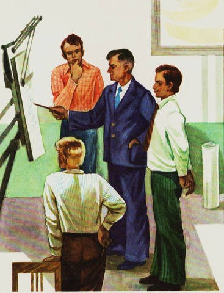

Но когда аэродинамика, прочность, условия применения, размеры аэродрома,
экономика, надёжность и выполнение других, обычно противоречивых требований
сплетаются в один тугой узел, развязать его не могут даже все опытные и
изобретательные специалисты, собравшись вместе. В этом случае изучить вопрос,
выслушать всех, взвесить по возможности всё, внести, если нужно, новые элементы
и принять решение должен главный конструктор. А для этого нужно непрерывно
учиться. Развитие новой техники и науки носит теперь почти взрывной характер.
Приток информации огромный. Его надо осваивать, перерабатывать. А тут вдруг
перемена места.

Новое задание, новые люди, обстановка. В условиях нашей высокоорганизованной
социалистической промышленности можно довольно быстро построить здания,
лаборатории, получить станки и оборудование. Но создание дружного,
работоспособного коллектива — это труд особый, труд высшего порядка. Недаром
Владимир Ильич Ленин говорил, что организационная работа самая важная.
Коллектив не создаётся приказами, хотя они и нужны. Не создаётся только
собиранием и перестановкой людей. Коллектив объединяет не здание, в котором он
работает. Главное, без чего коллектива не может быть,— это единство цели,
стремление внести свой вклад в великое дело создания справедливого общества на
земле, общества без угнетения, без эксплуатации, общества, где владыкой мира
будет труд. Это стремление и есть конкретная форма любви к своей Родине.

КОЛЛЕКТИВ — вот истинный творец всего, что создаётся в нашей стране в любой
отрасли деятельности, достойной человека.

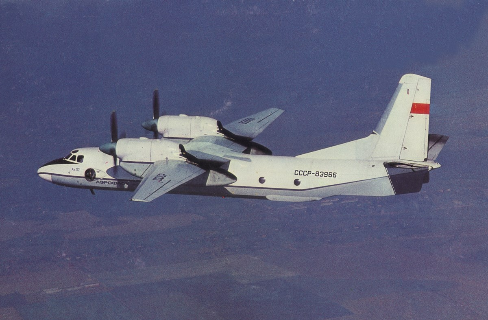

### ПЕРВОЕ ЗНАКОМСТВО С ПОГРАНИЧНЫМ СЛОЕМ

1927

Должен ли очень лёгкий учебный планёр с нагрузкой всего 8,5 кило¬грамма на
квадратный метр взлетать, если шесть молодых, здоровых саратовских ребят тянут
его на верёвке под горку, против ветра силой 5—6 метров в секунду? Разумеется,
должен!

Но планёр с солидным названием OKA-II не взлетал... Подъёмная сила Y крыла
выражается известной каждому школьнику формулой:

где
Су —  коэффициент подъёмной силы крыла, зависящий от его профиля и угла атаки;
S —  площадь крыла (v нас — около 19,8 м2);
р —  массовая плотность воздуха; V — скорость полёта.

В середине жаркого лета при температуре у земли в 30 градусов на «Жареном
Бугре» под Саратовом на высоте около 180 метров над уровнем моря, где мы с
ребятами испытывали планёр, она равнялась при¬мерно 0,115 кг. сек2/м4.

Скорость планёра относительно воздуха, если сложить скорость ветра — метров
семь в секунду — со скоростью бега ребят, запускавших планёр,— уж никак не
меньше 6 метров в секунду,— равнялась по крайней мере 13 метрам в секунду. Во
время разбега я полностью брал ручку на себя, прижимая хвост к земле, отчего
угол атаки планёра доходил до предельного, при котором коэффициент подъёмной
силы должен был дойти по крайней мере до 1,2—1,3. Подставим эти величины в
формулу (1) и получим:

Y = 1,20 X 19,8 X 0,115 X 13^2/2 = = 230 кг

230 килограммов — это значительно больше, чем весил планёр (102 килограмма) и
пилот в трусах и тапочках (64 килограмма), то есть вместе 166 килограммов.

Но он не взлетал! Это противоречило даже тому маленькому опыту, который был у
меня, видевшего полёты на Вторых всесоюзных планёрных испытаниях.

Мы выждали ещё более сильного северо-западного ветра. Под его ударами ковыль
ходил волнами и кузнечики пулями пролетали мимо наших носов.

Ещё одна попытка. Ребята бегут так, как будто от этого зависит спасение их
жизни. Сверкают подошвы, до блеска натёртые сухой травой. Планёр быстро катится
под уклон на своих деревянных колёсах, сделанных из кругов венских стульев. Я
стремлюсь облегчить разбег, давая ручку от себя, потом резко беру полностью на
себя. Планёр вяло отделяется от земли и, пропланировав десяток метров, тяжело
плюхается, со скрипом и стуком прыгая по щербатому склону «Жареного Бугра».
Обессиленные, мы возвращаемся к палатке. Ни разговоров, ни смеха. Просто
недоумение. Мне, как конструктору планёра, и досадно, и стыдно. Но ведь планёр
построен правильно! Он должен летать! В чём же дело?

Уже осень, последние дни каникул, пора возвращаться, чтобы успеть к началу
занятий в Политехнический. Уезжаю в Ленинград с тягостным ощущением не
состоявшегося по моей вине события. Весной, ещё до моего возвращения, ребята
вновь вытащили планёр на «Жареный Бугор». Всё было так, как прежде. Однако на
этот раз редкий мадаполамчик, которым был обтянут планёр, они покрыли раствором
крахмала, не обращая внимания на то, что в прошлом году мы бросили эту затею,
так как полотно от этого провисало между нервюрами, будто кожа на рёбрах худой
лошади. Памятуя, что планёр взлетает плохо, выждали ветра покрепче и, посадив
на пилотское место Гришу Васильева, пустились во всю прыть с концами верёвок в
руках. Каково же было их удивление, когда с первых метров планёр легко
отделился от земли, набрал два-три десятка метров высоты и пошёл, и пошёл
планировать в долину! Пролетев 150— 200 метров, Гриша благополучно сел в
низине. С восторженными криками вся ватага бросилась вниз за планёром. Гришу
качали, как героя. Стали летать по очереди. Сделали шестнадцать полётов. На
семнадцатом четырнадцатилетний пионер Боря Урлапов подскользнул на вираже и,
ткнув крылом в землю, поломал планёр, отделавшись лёгким испугом да несколькими
ссадинами.

Замечательно то, что молодые ребята, никогда до этого ни на чём не летавшие,
летали без всякого инструктажа, делали развороты вдоль склона, пытались даже
парить. Учиться-то было не у кого!

Но почему же планёр, не желавший раньше даже оторваться от земли, теперь стал
таким летучим?

Клейстер закупорил поры лёгкой, довольно редкой ткани, которой был обтянут
планёр. До этого воздух проходил сквозь поры нижней и верхней обтяжек, как
сквозь решето, и быстро утолщал пограничный слой воздуха, ухудшая работу крыла.
В этих условиях нельзя было получить достаточной подъёмной силы. Вместо
лабораторной кривой Су nod, полученной при продувке деревянной модели крыла,
наше крыло, надо думать, характеризовалось кривой, примерно изображённой
пунктиром на графике. Поэтому при угле атаки даже в 10 градусов коэффициент
подъём¬ной силы был не 1,2 - 1,3, а где-то около 0,6 - 0,5.

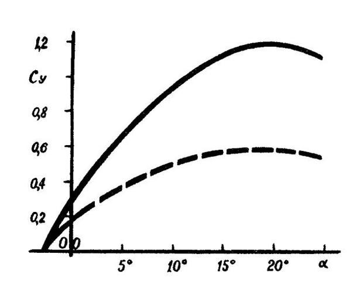

Всё было, и р, и S, и V2. только вот Су не было!

Так из-за неуважения к пограничному слою я лишился удовольствия первым испытать
свой планёр.

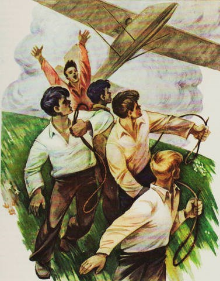

### ВТОРОЕ ЗНАКОМСТВО С ПОГРАНИЧНЫМ СЛОЕМ

1935

Прозрачным осенним утром мы с известным планеристом-спортсменом Никодимом
Симоновым вылетели с Тушинского аэродрома на почтовом биплане П-5 на Волгу. Там
мой старый друг Гриша Васильев, с которым мы ещё в Саратове в 1927 году
строи¬ли планёр, соорудил авиетку с мотоциклетным мотором в 7—8 лошадиных сил.
По заданию техкома я должен был познакомиться с расчётами, осмотреть готовую
машину и дать заключение о её пригодности к полётам.

Отойдя от Москвы на юго-восток примерно на 250 километров, мы над рязанскими
лесами догнали хмурую, облачную погоду. ...Передо мной — прочно сидящая на
переднем пилотском месте плотная широкоплечая фигура Бати, как полушутя, но
почтительно окрестили друзья ветерана планёрного спорта Никодима Симонова. Его
спокойная неподвижность ясно показывала не то чтобы решимость, а скорее даже
некоторую нечувствительность к начинавшей усложняться обстановке.

Скоро серые клочья облаков сперва отдельными бородами, а затем стая¬ми и цепями
стали проноситься слева и справа от нас. Они всё чаще смыкались под самолётом,
закрывая нахмурившиеся леса и потемневшие, напитанные влагой поля, пересеченные
прихотливо изогнутыми, блещущими серебром лентами мокрых дорог. Вскоре наш П-5
вошёл в полосу сплошного мелкого дождя. Кругом серо-белое аморфное
пространство. Мы пригибаемся, чтобы избежать горизонтально летящего в нас роя
мелких водяных капель. Мне хорошо видны нижние, окрашенные в тёмно-зелёный
«защитный» цвет крылья нашего самолёта. Они уже совсем мокрые.

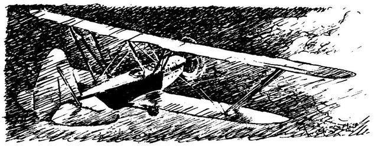

Но что это? На передней кромке крыла, приблизительно до 15 про¬центов хорды,
вода образует сплошную плёнку, точно лаком покрывающую полотняную обтяжку
крыла. Дальше, примерно за первым лонжероном, по полотну, вибрирующему с
частотой, задаваемой двигателем или винтом, водяная плёнка разрывается и
собирается в круглые капельки диаметром около 1-2 миллиметров. Водяные шарики
начинают забавный танец, подпрыгивая на вибрирующем полотне, постепенно
увеличиваются в диаметре и медленно, со скоростью 10-20 сантиметров в секунду,
движутся по на-правлению потока, обтекающего крыло, к его задней кромке. Пройдя
почти всю ширину плоскости и сделав последний прыжок, капли расплющиваются и
вновь прилипают к задней кромке крыла. Я как зачарованный смотрю на этот танец
водяных шариков в пограничном слое воздуха, обтекающего крыло. Ведь скорость
самолёта 180 километров в час, то есть 50 метров в секунду, - это скорость
урагана! А капельки-шарики еле продвигаются по поверхности крыла, танцуют,
подпрыгивают, скачут и двигаются, совсем не торопясь!

На мокрой задней кромке вода собирается снова, образуя капли. Сперва появляется
внизу маленькая опухоль, напоминающая по форме перевёрнутую кривую вероятностей
Гаусса, и, набухая, пульсирует со всё большей и большей амплитудой. Капля
оформляется: у неё образуется шейка, она некоторое время как бы раздумывает,
оторваться ей или нет. И наконец, отделившись от породившей её водяной плёнки,
падает вниз. Только пролетев 15-20 миллиметров, капля подхватывалась по-током и
мгновенно исчезала из поля зрения.

Впервые я так ясно, так непосредственно наблюдал увлекаемый крылом, окутывавший
его, как бы прилипший к его поверхности пограничный слой воздуха. Лишь на
некотором расстоянии от поверхности крыла обтекающий его поток при¬обретал
скорость, равную скорости полёта.

Я смотрел, смотрел и не мог насмотреться на это удивительное явление: летим со
скоростью 50 метров в секунду, а на задней кромке крыла спокойно качается на
тоненькой ножке прозрачная капелька воды, не обращая внимания на бушующий
кругом ураган. Я сидел, затаив дыхание, так тихо, что Батя даже обернулся: уж
не выпал ли я из самолёта, или мне только плохо?

Мне было хорошо. Я был страшно доволен. Я воочию увидел, почти потрогал руками
таинственный пограничный слой…

### ТРЕТЬЕ ЗНАКОМСТВО С ПОГРАНИЧНЫМ СЛОЕМ

1942

Во время Отечественной войны пошёл в серию планёр А-7. Служил он вместе с
планёрами Г-10 Грибовского и ПЦ-3 Цыбина для переброски партизанам через линию
фронта снаряжения, боеприпасов, медикаментов, продовольствия и, в нужных
случаях, людей.

Планёр, благодаря небольшой посадочной скорости и крутой траектории при
опущенных щитках-закрылках, мог сесть на небольшую площадку в лесу.

Посадки, как правило, совершались ночью при свете костров.

После посадки и выгрузки недорогой планёр обычно сжигался. Тренировка лётчиков
на десантных планёрах проводилась на небольшом подмосковном аэродроме.
Буксировщиками служили двухмоторные самолёты СБ. Как-то раз в суровую зиму 1942
года меня срочно пригласили на аэродром.

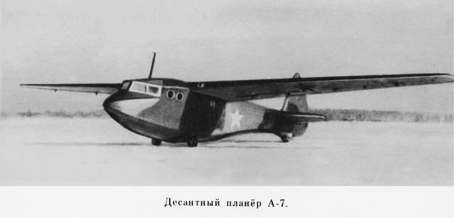

Миша Романов, служивший там инструктором, с тревогой рассказал мне о
происшедшей накануне непонятной истории, едва не вызвавшей гибель планёра и его
экипажа. Взлёт, как всегда, производился вдоль аэродрома, окружённого со всех
сторон лесом. Обычно планёр, имевший меньшую по сравнению с самолётом нагрузку
на квадратный метр крыла, отрывался значительно раньше и, удерживаемый пилотом
от взмывания, начинал набирать высоту только после отрыва от земли самолёта.

Вчера всё происходило не так. Планёр после обычного пробега не взлетал, а
тянулся по снегу за самолётом, продолжавшим разбег. Вот, наконец, достигнута
скорость отрыва самолёта. СБ отделяется от земли, набирает скорость на
«выдерживании». Планёр не взлетает. Уже скоро край аэродрома. Перед воздушным
поездом встает стена леса. Всё ближе и ближе.

Планёр как пришибленный волочится по глубокому снегу, тормозя разбег самолёта.
Остановиться поздно, так как успеть затормозить на такой скорости на таком
коротком участке уже невозможно. Выбора нет. Лётчик самолёта резко берёт ручку
на себя и, едва не задев верхушки ближайших сосен и берёз, взмывает над лесом.
Планёр, продолжая тянуться на тросе, нехотя отрывается, наконец, от наста и, в
свою очередь, чудом переползает через край леса. Мучительный круг над
аэродромом. Планёр летит за самолётом на большом угле атаки, ниже обычного
положения, вяло реагирует на движения рулей и, подойдя к посадочному «Т»,
бессильно плюхается на снег.

Куда девалась летучесть планёра? Почему в два-три раза удлинился разбег, чуть
не приведя к катастрофе? Не может ли явление повториться снова?

Расспрашиваю про все обстоятельства полёта. Чем был нагружен планёр? Какой был
ветер по силе и направлению?

Опять были и S и V2. Значит, не было Су!

- Можно взглянуть на планёр?
- Да вот он стоит —- крайний слева.
- Пойдём!

Наст похрустывает и колется под нашими ногами, перемешиваясь со снежной мукой,
намолотой лыжами планёров и ногами людей. Наконец подходим к планёру. Всё
крыло, особенно передняя его кромка, покрыто острыми иголками инея высотой в
10—15 миллиметров. Не крыло, а бобрик.

- А вчера тоже так было?
- Да, пожалуй, побольше. Немного обветрило.
- Ну что ж, дело ясное. Надо крыло чистить! С таким ёршиком никакой подъёмной
  силы не получишь. Ты представляешь себе, Миша, какой тут образовался слой
  заторможённого воздуха, как изменилось обтекание крыла? Это уже был не
  пограничный слой, а слоище. Счастье, что так обошлось. Надо принять швабру и
  тряпку на вооружение!
- Есть принять швабру на вооружение! — отвечает повеселевший Миша Романов.

Страшно ведь только непонятное!

### НАУЧНЫЙ ЗАСТЕНОК

1964

Лётчик прибавляет газ до полного. Пятидесятиместный самолет Ан-24 начинает
разбег. Лёгкие толчки, тряска: колёса всё быстрее бегут, прыгая по траве.
Сильный толчок - колёса перешли через небольшую канавку. Ещё толчок, встряхнуло
в последний раз. Мы в воздухе.

Через окно пассажирской кабины хорошо видно, как шасси прячется в открывающиеся
створки мотогондолы.

Набор высоты. Горизонтальный полёт. В хорошую погоду, в плохую. В облаках,
между облаками, в грозу. На севере, на юге, на востоке. Днём, вечером. На
рассвете, ночью. По траве, по бетону, по гальке. Сотни датчиков, как щупальца,
размещены в самолёте. Они дают сведения о напряжениях в элементах конструкции.
Показания записываются на километрах лент, накапливаются, анализируются. В
итоге снова подтверждается вывод, сделанный нашими прочнистами ещё на
предыдущих испытаниях самолёта Ан-10.

Конструкция самолёта изнашивается не в полёте, а главным образом при взлёте и
посадке. Самолёт "стареет", пока есть контакт с землёй. Когда самолёт находится
в воздухе, в своей стихии, его конструкция работает в более лёгких, с точки
зрения усталости условиях.

Конечно, и в воздухе бывает тряска. И в воздухе есть свои ухабы в виде
горизонтальных и особенно вертикальных воздушных течений, которые иногда
создают большие нагрузки на конструкцию самолёта. Эти нагрузки хотя и велики,
но сравнительно редки. Гораздо опаснее нагрузки, меньшие по величине, но часто
повторяющиеся. С другой стороны, наши самолеты Ан-10 и Ан-24 созданные для
работы на коротких линиях, не столько летают, сколько взлетают и садятся. Эти
условия особенно тяжелы для конструкции.

Самолёт, который делает в среднем трёхчасовые полёты, должен за время срока
своей службы, скажем, в 30 тысяч часов, сделать 10 тысяч посадок, а самолёты,
совершающие полёты в среднем по часу - 30 тысяч посадок.

Нужно добиться, чтобы самолёт и после 30 тысяч взлётов и посадок был совершенно
надёжен.

Никакие расчёты, опыт конструкторов и технологов, умение рабочих не могут
гарантировать полную надёжность всей конструкции до последней детали. Здесь
необходим эксперимент.

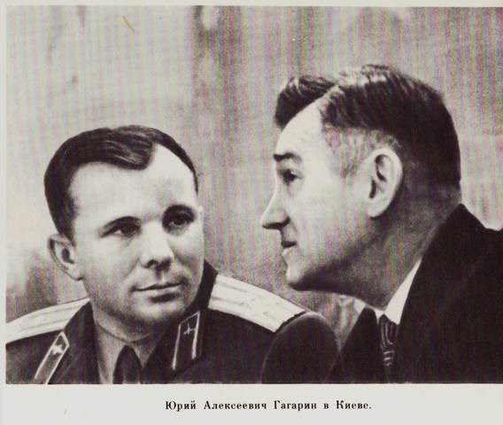

Проще всего было бы взять самолёт и сделать на нём 30 тысяч взлётов и посадок.

Но, во-первых, этого мало. Надо учесть ещё и "коэффициент разброса". Даже
совершенно стандартные изделия не одинаково выносливы, а в такой сложной
конструкции, как самолёт, может встретиться неблагоприятное сочетание качества
материала, небольшого отступления в размерах, в технологии и другие
незначительные дефекты, которые вместе могут заметно снизить выносливость
конструкции.

Поэтому число испытательных полётов нужно увеличить для полной гарантии ещё в
два-три раза.

А на такое число полётов надо затратить времени столько, что результаты
испытаний станут известны тогда, когда последний самолет этого типа выйдет с
завода на аэродром, то есть к шапочному разбору. Результатами испытаний не
удастся воспользоваться, не удастся внести в конструкцию нужные улучшения.

Ускорить эти важнейшие испытания можно, если поместить самолёт в лабораторию и
там подвергать его в ускоренном темпе искусственно созданным нагрузкам, по
возможности точно воспроизводящим действительные, испытываемые самолётом на
всех стадиях полёта.

...Фюзеляж самолёта погружают в наполненный водой бассейн. Герметический
фюзеляж при каждом "полёте" подвергается изнутри действию избыточного давления
воды. Воздухом надувать нельзя, так как сжатый воздух аккумулирует такую
энергию, что при случайном разрушении может разнести на куски не только
самолёт, но и всю лабораторию.

Чего греха таить, было и такое, когда из-за неготовности бассейна пришлось
рискнуть: надувать воздухом переднюю часть фюзеляжа Ан-12. Обошлось это нам,
несмотря на предусмотрительно открытые настежь огромные ангарные ворота, в 112
стёкол, вылетевших из окон цеха наружу при взрывном разрушении кабины.

Итак, фюзеляж погружён в бассейн. на крылья и оперение наклеены лямки, к
которым присоединена сложная рычажная система, распределяющая строго заданным
образом "воздушные" нагрузки по всем поверхностям самолёта. Приложены с помощью
тех же лямок и систем уравновешивающие инерционные нагрузки. На вертикальном
оперении воспроизводятся ещё и вибрационные нагрузки. К рычажным системам
присоединены гидравлические силовозбудители, создающие нагрузки в десятки тонн.

Всё объединено в сложную автоматическую систему, действующую по заданной
программе и контролируемую с центрального пульта.

Система отлажена, проверена и запущена. Начинаются циклы. Один цикл - один
условный полёт от взлёта до посадки. Шумят электромоторы и насосы центральной
гидравлической станции, поставляющей энергию силовозбудителям. Рычажные системы
напрягаются, тросы вытягиваются, изгибаются крылья, киль и стабилизатор
самолёта. Кажется, что гигантская рука тянет самолёт за волосы, выросшие по
всему телу.

Тяжёлый вздох - это начинает снижаться давление в кабине. Теперь нагрузки на
мотогондолы, на шасси. Гигантская рука ослабляет поводья. Провисают рычажные
системы. Журчит вода. Надсадно стучит вибратор на оперении. Ещё один цикл. Ещё
десять. Сто. Тысяча. Три тысячи. Остановка для осмотра. Всё цело, разрушений
нет.

И опять циклы, десятки, сотни, тысячи циклов. Это настоящая камера пыток для
конструкции самолёта. Самолёт с пристрастием допрашивают: сколько ты выдержишь?
Не подведёшь ли?

Скрежет металла, шум воды, вздохи гидравлики, стрельба клапанов, стук
вибратора. И бесшумная, бесстрастная работа самопишущих приборов. Записана
каждая нагрузка каждого цикла.

Сперва испытывают новенький "с иголочки" самолёт, только что вышедший из цеха
завода. Нагоняют такое количество циклов испытаний, которое обеспечивает
усталостную прочность самолёта на много лет вперёд.

Потом, после нескольких лет эксплуатации, берут самолёт, имеющий наибольшее
число взлётов и посадок, и испытывают снова.

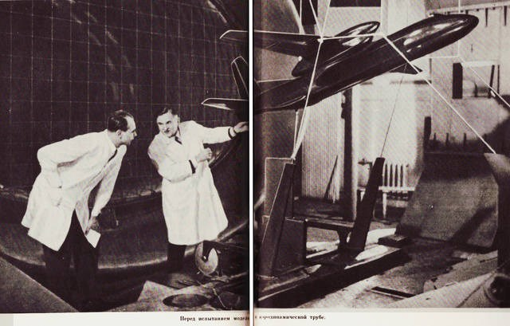

Самолёт Ан-24, сделавший 29972 полёта, был взят в лабораторию и доведён на
испытаниях до 96 тысяч "полётов": конструкция выдержала и это.

Закрылок центроплана, находящийся в струе винтов, нагружали 495 тысяч раз,
механизм управления передней ногой прошёл 755 тысяч циклов нагружений, руль
направления - сто тысяч...

А какой богатый опыт дают эти испытания! Малейшие ошибки конструктора,
расчётчика, исполнителя становятся ясно видимыми и исправимыми.

Но зато самолёт служит надёжно. Ан-24 уже заработал право эксплуатироваться в
течение 25 тысяч полётов и 30 тысяч лётных часов.

Сто тысяч раз вздёргивали на дыбу старину Ан-2, уже пролетавшего несколько лет
в Аэрофлоте. Вынес старик, хотя и жалко было на него смотреть после этой
многомесячной пытки.

И что же? Успокоились наши прочнисты на этой методике? Ничего подобного. Теперь
во время испытаний на крылья накладывают ещё и колебания с "собственной
частотой".

На очереди испытания на акустические нагрузки. Сотни миллиардов циклов...

Пожалуй, пора уже повесить у входа в этот застенок, то бишь в лабораторию, надпись:
НЕРВНЫХ ПРОСЯТ НЕ ВХОДИТЬ!

### 16 И 16 ТЫСЯЧ

1932-1957

Почему-то мощность в 16 лошадиных сил, именно 16, а не 15 и не 20, казалась нам
самой подходящей для создания лёгкого спортивного самолёта типа авиетки.

С одной стороны, расчёты показывали, что с двигателем примерно такой мощности
можно летать человеку на очень лёгком, аэродинамически совершенном аппарате. С
другой стороны, цифра 16 нравилась нам, может быть, потому, что много раз
делилась на 2, да и вообще почему-то близка сердцу русского человека.

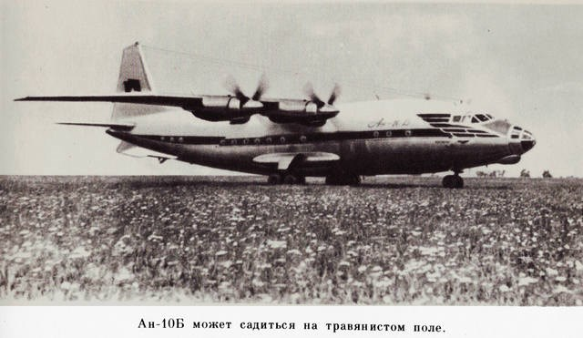

Но в ту пору молодая советская авиационная промышленность направляла свои силы
в первую очередь на создание техники, нужной для укрепления обороны Советского
государства, на создание образцов боевых самолётов, не уступающих по своим
качествам самолётам возможного агрессора.

Конструкторы-мотористы работали над повышением мощности двигателей, переходя от
200-300 лошадиных сил к 400-500 и даже к 800 силам.

Спортивная авиация в ту пору была для нас ещё едва доступной роскошью,
существовавшей главным образом за счет отходов учебной авиации или потерявших
боевое значение "старичков". Массовым воздушным спортом был только планеризм -
на модели ведь не полетишь!

Но как хотелось построить авиетку с лёгким, экономичным двигателем! Самым
маленьким двигателем в ту пору был М-11 конструкции Швецова мощностью в 110
лошадиных сил и с устрашающим весом в 160 килограммов. Хорошенький вес для
самолёта, который сам вместе с мотором и горючим должен был, по нашим замыслам,
весить не более 100 килограммов!

Помню, как-то раз в детстве я попал на паровую мельницу.

Конечно, самое интересное для меня были не жернова, сита и мешки с мукой, а
машина. Громадная машина, оснащенная блестящими металлическими частями, кранами
и трубками из красной меди, пускающая свистящие струйки пара - воплощение силы
и мощи.

Цилиндр машины был обложен дубовыми дощечками, схваченными сверкающими обручами.

В цилиндре летал взад и вперёд круглый поршень, толкавший длинный и толстый,
как бревно, блестящий шатун.

Шатун то плавно взмывал вверх, то проваливался вниз, вращая огромный
непостижимо тяжёлый маховик, наполовину утопленный в глубокой выемке кафельного
пола машинного зала.

Механик в чёрной замасленной кожаной куртке подливал масло в какие-то
таинственные отверстия из маслёнки с длинным-предлинным изогнутым носиком.

- Двадцать пять лошадиных сил! - важно заявил усатый механик. - Двадцать пять!

Эта цифра меня поразила.

Как! Это огромное, пышущее жаром чудище величиной с дом - и двадцать пять сил?!

Я уже знал в то время, что на аэроплане Блерио, первым перелетевшим через
Ла-Манш стоял двигатель в 25 сил. Это был маленький трёхцилиндровый
четырёхтактный двигатель конструктора Анзани. Весь двигатель можно было
спрятать в тумбочке письменного стола.

Этот великан и тот карлик - и оба двадцать пять лошадиных сил?! Нет, этого не
может быть, логично заключил я, это, конечно, какие-то д р у г и е лошадиные
силы!

Силы, как я убедился впоследствии, были, конечно, одни и те же, но только на
мельнице они добывались на малых оборотах паром низкого давления.

Сама возможность полёта на аппарате тяжелее воздуха появилась тогда, когда был
создан многооборотный двигатель внутреннего сгорания, развивавший необходимую
мощность при умеренном весе. Двигатель братьев Райт весил около трёх
килограммов на одну лошадиную силу.

Двигатель М-11 - около полутора килограмма на силу.

А нам хотелось иметь двигатель ещё более совершенный по формуле: 16 сил - 16
килограммов.

Вот почему, несмотря на то, что М-11 был прост и надёжен, установить его на
одноместный спортивный самолёт мне и моим друзьям-планеристам казалось просто
чудовищным.

Энтузиасты пытались переделывать мотоциклетные двигатели. Конструктор Спасский,
работавший в нашем коллективе на планёрном заводе, взялся самостоятельно
сконструировать маленький двигатель воздушного охлаждения "на базе существующих
мотоциклетных". В конце концов оказалось, что использовать от двигателей этого
класса удастся разве что свечи да наконечники клапанных тяг.

Маленьких двигателей не было.

Шли годы. Отбушевала Великая Отечественная война. Страна вздохнула, расправила
плечи и с новыми силами взялась за строительство своего будущего, за создание
лучшей жизни для всех.

И вот он стоит - первый опытный экземпляр самолёта Ан-10 с четырьмя двигателями
украинского конструктора Ивченко по 4 тысячи лошадиных сил каждый, стоит среди
проталин в весеннем снегу с желтеющими в них стеблями прошлогодних трав.

16 тысяч сил... Они несут в трёх комфортабельных, с кондиционированным
воздухом, герметических салонах 100 пассажиров на высоте 8-10 тысяч метров со
скоростью 650 километров в час. К услугам пассажиров - все удобства. Мягкие
кресла, тщательно подогнанные по фигуре сидящего человека. Свет, тепло,
радио...

16 тысяч сил... Двигатели ревут, лётчик отпускает тормоза. Самолёт трогается с
места. Кресло давит в спину. Скорость быстро нарастает, земля бежит под машиной
и проваливается вниз. Через десяток минут мы на высоте 8 тысяч метров. Под нами
безбрежное море белых клубящихся облаков, ярко освещённых солнцем. По облакам
бежит тень самолёта, окружённая радужным кольцом.

Хорошо!..

А всё-таки я доберусь до тебя, малышка в 16 лошадиных сил, даже если до этого
доведётся построить самолёт в 160 тысяч лошадиных сил! Непременно доберусь!

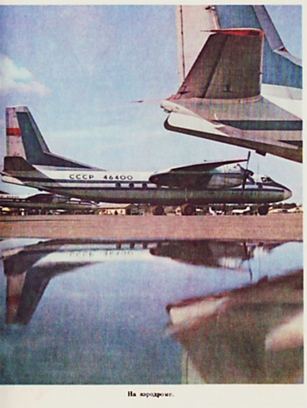

### НИИЧАВО

1965

К концу пребывания советской делегации на XXVI Парижском салоне авиации и
космонавтики, устроители выставки пригласили нас на заключительную встречу. На
втором этаже небольшого особняка на улице Галилэ наша делегация во главе с
министром авиационной промышленности СССР Петром Васильевичем Дементьевым была
принята не только вежливо, но и дружески. По-видимому, присутствующие понимали,
какие выгоды могут извлечь для себя обе стороны из широкого делового
сотрудничества.

Встреча закончилась в обстановке сердечности. Все встали из-за стола и,
разбившись на небольшие группы, спешили досказать то, что считали важным.
Ещё сидя за столом, я заметил на боковых стенках зала две большие фотографии в
рамках, из которых левая особенно привлекла моё внимание. Она изображала отлёт
большого числа воздушных шаров.

...Уже почти все шары полны газом. Экипажи занимают места, проверяют балласт,
снасти. Суетливая обстановка больших состязаний. Кругом возбуждённая толпа
любителей воздухоплавания и просто охотников до интересных зрелищ. Я подхожу
ближе. Сомнений нет - это состязание воздушных шаров в Париже в 1908 году!

Вокруг меня несколько французов, в основном конструкторов, руководителей
авиационных фирм, людей бывалых, несомненно, хорошо знающих историю авиации и,
как все французы, любящих весёлую шутку к месту.

Я нащупываю рукой во внутреннем кармане пиджака заветный кусочек тонкого
картона и обращаюсь к группе окружающих:

- Господа! Я немного волшебник. Позвольте вручить вам пригласительный билет на
  это состязание воздушных шаров 1908 года!

Удивлённые восклицания:

- О! Невероятно! Не может быть! Откуда он у вас? Позвольте посмотреть!
- Да, несомненно, это подлинный пригласительный билет 1908 года! Вот дата... Дайте взглянуть...

Билет переходит из рук в руки, рассматривается на свет, чуть ли не пробуется на
зуб, пока им не овладевает самый страстный коллекционер из присутствующих.

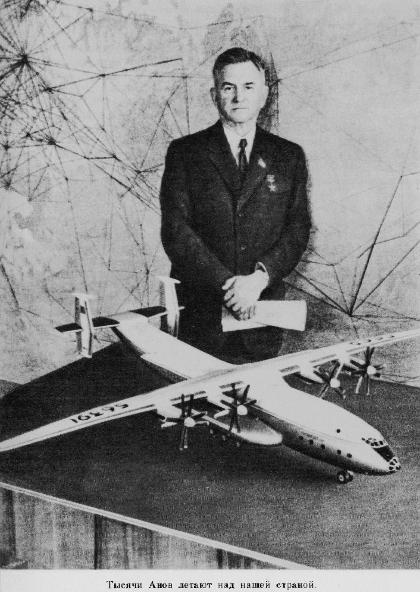

В прощальной суматохе я не успеваю сказать, что не являюсь сотрудником НИИЧАВО
(Научно-исследовательского института чародейства и волшебства), созданного
братьями Стругацкими, и могу открыть секрет. В молодости, когда наша работа
страдала от острого недостатка информации, я собирал всё, что относилось к
авиации. Книги, брошюры, фотографии и вырезки из всевозможных журналов и газет.
Много раз я переезжал из города в город, теряя порой всё или почти всё, но
коллекция переезжала со мной и пополнялась из года в год.

То, что эта коллекция оказалась у меня, не случайность. Я не случайно взял этот
билет с собой, собираясь во Францию. Мне хотелось оставить скромный сувенир
французским коллегам. Не случайно носил я его с собой до последнего дня. Но то,
что на стене резиденции синдиката французской авиационной промышленности
оказалась, к моему собственному удивлению, фотография состязания воздушных
шаров, а не самолётов, и именно 1908 года -это чистая и приятная случайность,
которая помогла мне озадачить наших гостеприимных хозяев.

А в общем, на ловца и зверь бежит.
