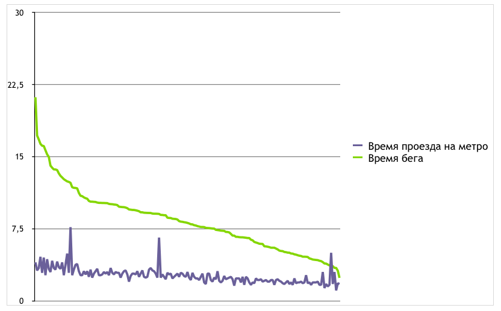

## #RaceTheTube in Moscow Underground

Скрипт составляет таблицу вида:
название линии метро, станция отправления, станция назначения, продолжительность, ссылка (вида http://metro.yandex.ru/moscow?from=140&to=139&route=0), расстояние между станциями для *пешехода*, ссылка на маршрут на карте

Данные позаимствованы из сервисов [Яндекс.Метро](http://metro.yandex.ru/moscow) и [Яндекс.Геокодер](https://tech.yandex.ru/maps/doc/geocoder/desc/concepts/About-docpage/), [карты глубин заложения станций метро](http://www.alexeygoncharov.com/index1.html) и сервиса прокладывания маршрутов [YOURS](http://www.yournavigation.org/about.html),
[Спутник.Карты](https://github.com/sputnik-maps/subwayshapes/blob/master/geojson/Moscow.geojson).

Автор: Sergey Bronnikov [@estet](https://twitter.com/estet) (estetus@gmail.com)
[#RaceTheTube](https://twitter.com/search?q=RaceTheTube)

* [Full interview with Race The Tube creator, James Heptonstall](https://www.youtube.com/watch?v=cRzUfZZOUuI)
* Moscow #RaceTheTube calculations https://bronevichok.ru/blog/2015/11/19/racethetube.html
