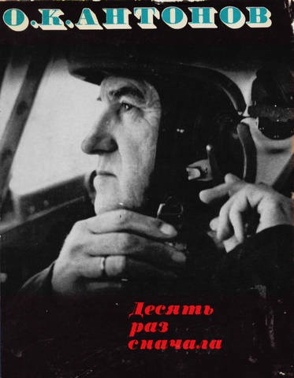

## Десять раз сначала

Имя автора этой книги - генерального конструктора авиации, Героя
Социалистического Труда Олега Константиновича Антонова - известно всем. Тысячи
Анов летают над нашей планетой, они перевозят в нашей стране почти половину
всех авиапассажиров, почту и грузы. К славному отряду Анов относится и малый
самолет - работяга Ан-2, и великан "Антей". Что же это за книга? Это небольшие
рассказы автора о своих товарищах, о своем давнем увлечении планеризмом, о
работе в большой авиации. Это книга воспоминаний. Но главное в ней то, что дает
она интересный материал для раздумий вокруг очень важной для всех нас темы,
которую коротко можно сформулировать так: человек и его профессия, его любимое
дело. На одной из страниц книги читатель находит интересную деталь.
Оказывается, самолет "стареет", "устает" лишь при беге по земле и тогда, когда
набирает высоту. Там, в небе, в родной стихии, самолет не знает устали. А может
быть, самолеты этим и похожи на людей? Человек, увлеченный своей работой,
человек, достигший своего "неба", своей стихии, тоже чувствует себя сильным,
неутомимым, счастливым. Наконец, полнота человеческого счастья зависит от того,
насколько гармонично сочетание: человек - работа.
